# Recursos

- El libro de texto disponible en Mediacion Virtual
- Las diapositivas de cada clase, disponibles en Mediacion Virtual
- https://evolution.berkeley.edu/ -- Mis diapositivas se basan en este recurso
- Lecturas, videos, actividades y otros recursos adicionales disponibles en Mediacion Virtual

# Historia de la vida {background-color="#E8F5E9"}

## Evolución biológica y diversidad 

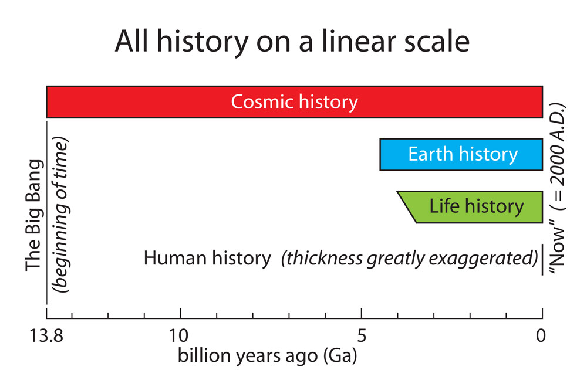

## Evolución biológica y diversidad 

::: {.callout-tip title="Ojo!"}
**La evolución biológica explica la diversidad a largos periodos de tiempo**
:::

::: {.columns}
::: {.column}
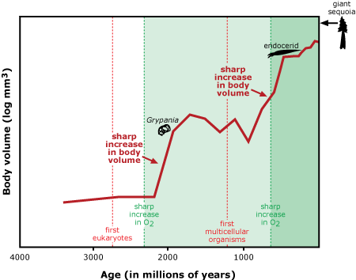
:::

::: {.column}
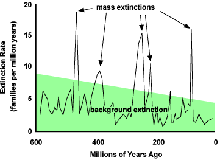
:::
:::

## Evolución biológica y diversidad 

::: {.callout-tip title="Ojo!"}
**A través de miles de millones de años de evolución, las formas de vida han seguido diversificándose con un patrón ramificado, desde ancestros unicelulares hasta la diversidad actual en la Tierra**
:::

::: {.columns}
::: {.column}
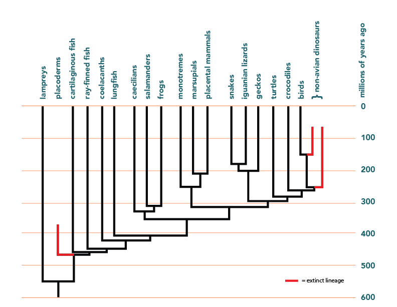
:::

::: {.column}
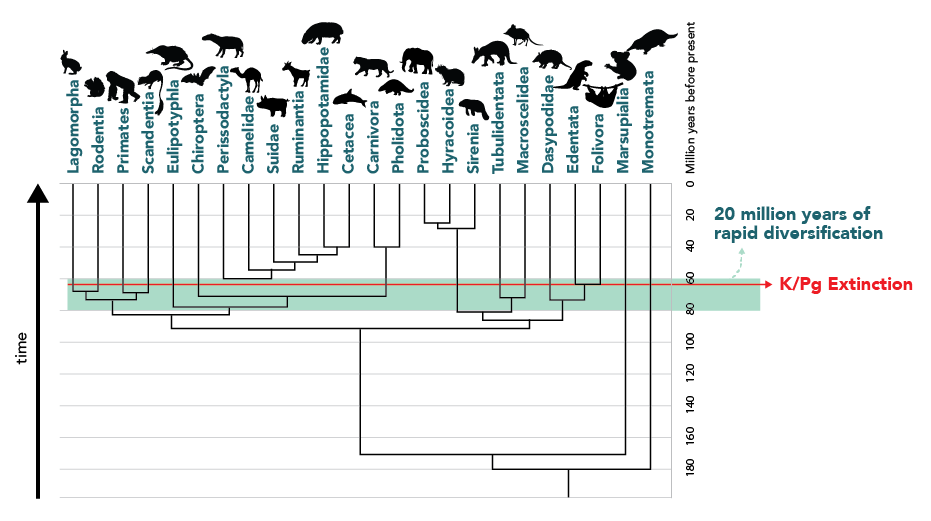
:::
:::

## Evolución biológica y diversidad 

::: {.callout-tip title="Ojo!"}
**Las formas de vida del pasado eran en algunos aspectos muy diferentes de las actuales, pero en otros aspectos muy similares**
:::

::: {.columns}

::: {.column}
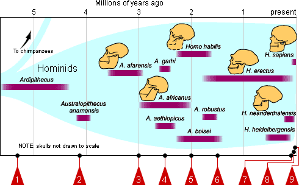
:::

::: {.column}

:::

:::

## Parentesco y divergencia

::: {.callout-tip title="Ojo!"}
**Las especies actuales evolucionaron a partir de especies anteriores; el parentesco entre organismos es resultado de un ancestro común** 
:::

## Parentesco y divergencia 

::: {.callout-tip title="Ojo!"}
**Toda la biodiversidad actual tiene un ancestro común** 
:::

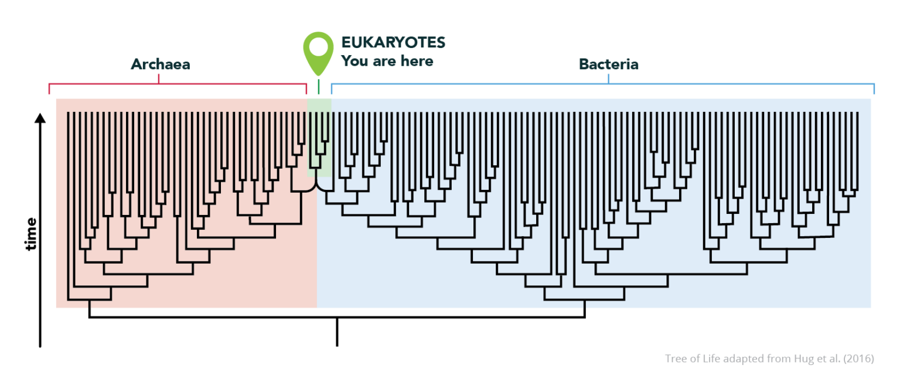

## Parentesco y divergencia 

::: {.callout-tip title="Ojo!"}
**Toda la biodiversidad actual y extinta está relacionada en un árbol (o red) anidada** 
:::

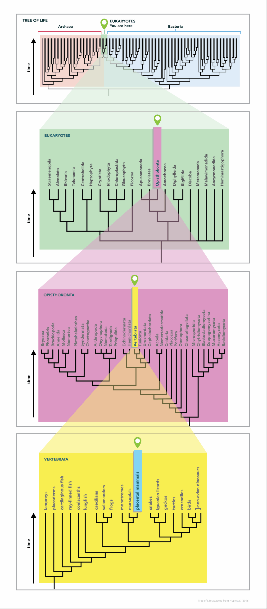

## Parentesco y divergencia 

::: {.callout-tip title="Ojo!"}
**El proceso evolutivo temprano de los eucariotas incluyó la fusión de células procariotas** 
:::

::: {.columns}
::: {.column}
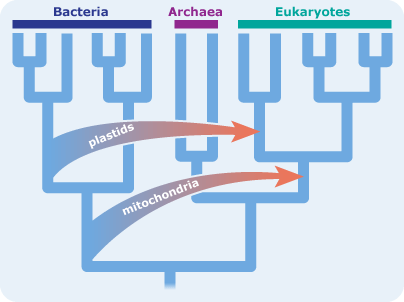
:::

::: {.column}
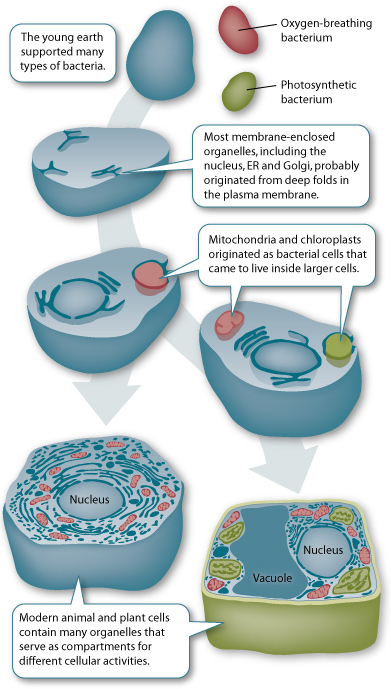
:::
:::

## Cambio geológico y evolución

::: {.callout-tip title="Ojo!"}
El cambio geológico y la evolución biológica están vinculados 
:::

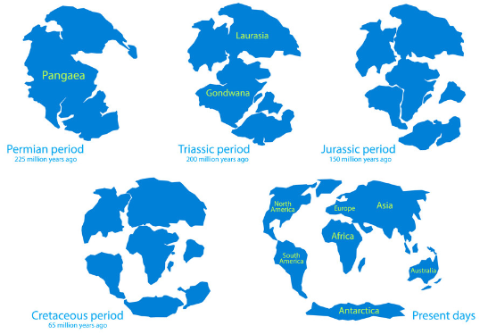

## Cambio geológico y evolución 

::: {.callout-tip title="Ojo!"}
El movimiento de las placas tectónicas ha afectado la evolución y la distribución de los seres vivos
:::

## Cambio ambiental y evolución 

::: {.callout-tip title="Ojo!"}
El cambio ambiental ha afectado la evolución y la distribución de los seres vivos
:::

::: {.columns}
::: {.column}

:::

::: {.column}
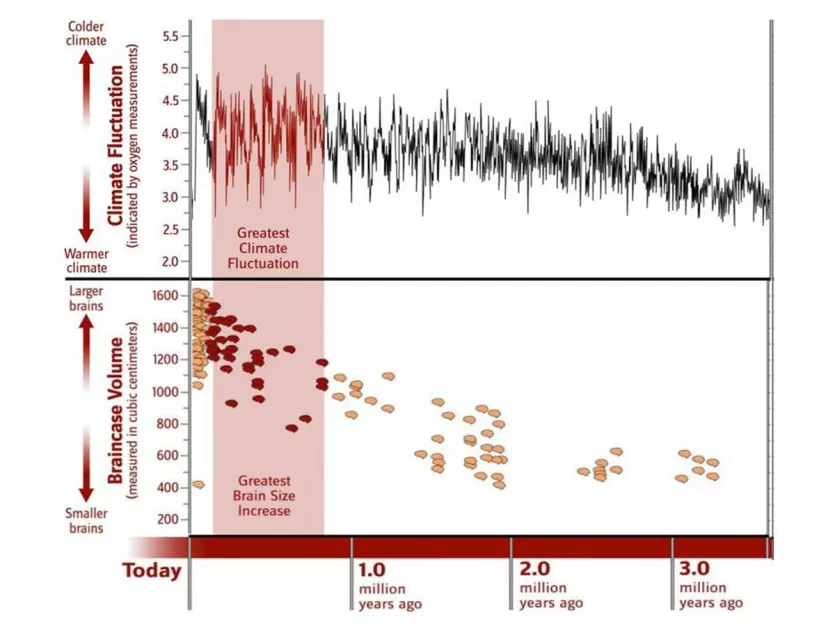
:::
:::

## Ritmos de la evolución

::: {.columns}

::: {.column width="70%"}
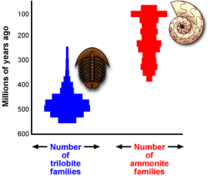{width="100%"}

:::

::: {.column width="30%"}
::: {.callout-tip title="Ojo!"}
**Las tasas de evolución varían**
:::

:::
:::

## Ritmos de la evolución

::: {.columns}

::: {.column width="30%"}
::: {.callout-tip title="Ojo!"}
**Las tasas de especiación varían**
:::

:::

::: {.column width="70%"}
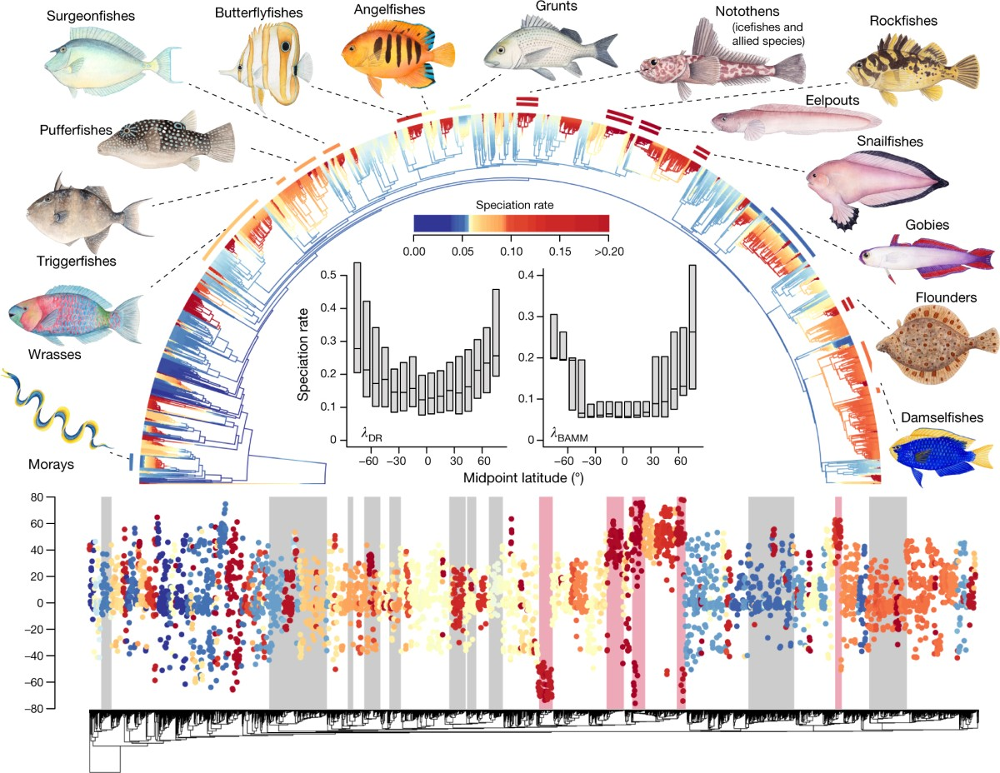
:::

:::

## Ritmos de la evolución

::: {.columns}

::: {.column width="30%"}
::: {.callout-tip title="Ojo!"}
**Las tasas de extinción varían**
:::

:::

::: {.column width="70%"}
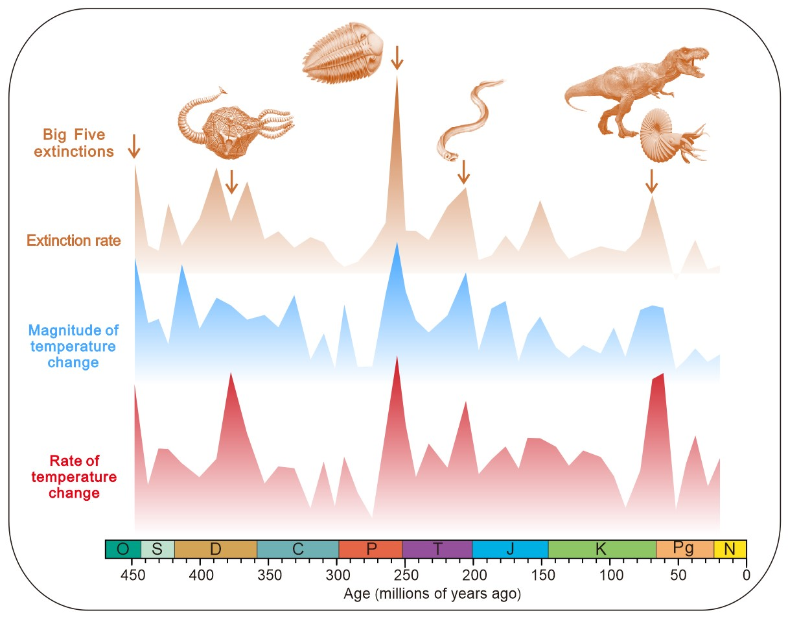

:::
:::

## Ritmos de la evolución

::: {.columns}

::: {.column}
::: {.callout-tip title="Ojo!"}
**El cambio evolutivo a veces puede ocurrir rápidamente** 
:::
:::

::: {.column}
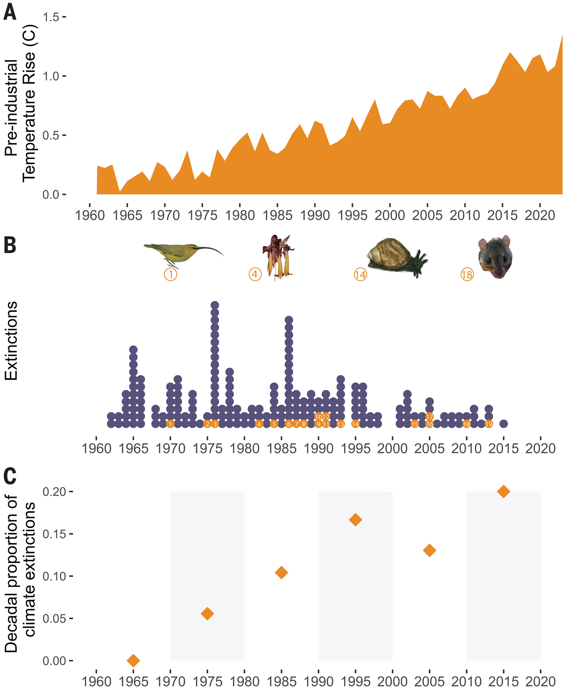
:::
:::

## Ritmos de la evolución

::: {.callout-tip title="Ojo!"}
**Algunos linajes permanecen relativamente sin cambios durante largos periodos de tiempo**^[Aunque 'estasis' evolutiva no significa que no haya cambios genéticos o ecológicos, sino que estos no se reflejan en cambios morfológicos durante largos periodos de tiempo.] 
:::

::: {.columns}

::: {.column width="33%"}
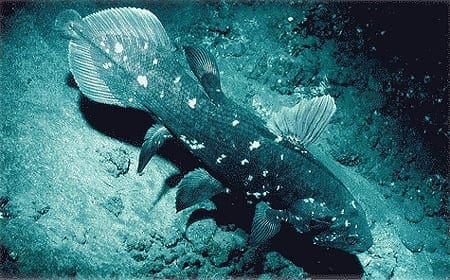
:::

::: {.column width="33%"}
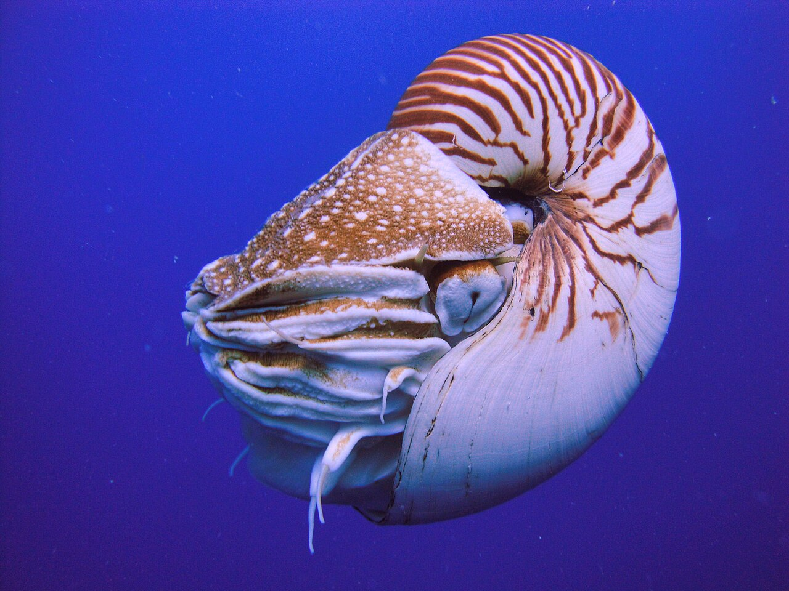
:::

::: {.column width="33%"}

:::
:::

---

# Evidencia de la evolución {background-color="#FFF3E0"}

## Evidencias de la evolución: visión general 

- Los patrones de diversidad de la vida a través del tiempo aportan evidencia de la evolución.
- A veces la evolución puede observarse de manera directa.
- Las características de un organismo reflejan su historia evolutiva.

## Evidencias en rasgos y adaptación 

- Existe ajuste entre los organismos y sus ambientes, aunque no siempre es perfecto.
- Existe ajuste entre la forma de un rasgo y su función, aunque no siempre es perfecto.
- Algunos rasgos de los organismos no son adaptativos.
- En ocasiones, ciertos rasgos adquieren nuevas funciones por selección natural.

## Evidencias del registro fósil 

- El registro fósil proporciona evidencia de la evolución.
- El registro fósil documenta la biodiversidad del pasado.
- El registro fósil contiene organismos con rasgos transicionales.
- El registro fósil documenta patrones de extinción y la aparición de nuevas formas.
- La secuencia de formas en el registro fósil se refleja en la secuencia de capas rocosas donde se encuentran, e indica el orden en que evolucionaron.
- La datación radiométrica puede usarse con frecuencia para determinar la edad de los fósiles.

## Otras líneas de evidencia evolutiva 

- Existen similitudes y diferencias entre fósiles y organismos vivos.
- Las similitudes entre organismos actuales (morfológicas, del desarrollo y moleculares) reflejan ancestro común y aportan evidencia de evolución.
- No todos los rasgos similares son homólogos; algunos resultan de evolución convergente.
- La distribución geográfica de las especies suele reflejar cómo el cambio geológico ha influido en la separación de linajes.
- La selección artificial ofrece un modelo para comprender la selección natural.
- Las personas seleccionan rasgos en plantas y animales domesticados para producir descendencia con características preferidas.

# Mecanismos de la evolución {background-color="#E3F2FD"}

## Mecanismos de la evolución: concepto base 

- La evolución suele definirse como un cambio en las frecuencias alélicas dentro de una población.
- La ecuación de Hardy-Weinberg describe las expectativas del acervo génico de una población que no está evolucionando: muy grande, con apareamiento aleatorio y sin mutación, selección natural ni flujo génico.

## Mecanismos principales de cambio evolutivo 

- La evolución ocurre mediante múltiples mecanismos.
- La evolución resulta de la selección natural actuando sobre la variación genética de una población.
- La evolución resulta de la deriva genética actuando sobre la variación genética de una población.
- La evolución resulta de mutaciones.
- La evolución resulta del flujo génico.
- La evolución resulta de la hibridación.

## Variación, genotipo y fenotipo 

- La selección natural y la deriva genética actúan sobre la variación existente en una población.
- La selección natural actúa sobre el fenotipo como expresión del genotipo.
- El fenotipo es producto tanto del genotipo como de las interacciones del organismo con el ambiente.
- La variación de un carácter dentro de una población puede ser discreta o continua.
- Los caracteres continuos generalmente están influidos por muchos genes distintos.

## Mutación y aparición de rasgos heredables 

- Nuevos rasgos heredables pueden surgir a partir de mutaciones.
- La mutación es un proceso aleatorio.
- Los organismos no pueden producir intencionalmente mutaciones adaptativas en respuesta al ambiente.
- Estructuras complejas pueden producirse de manera incremental por acumulación de mutaciones ventajosas más pequeñas.

## Supervivencia, reproducción y adaptación 

- Las características heredadas afectan la probabilidad de supervivencia y reproducción de un organismo.
- Con el tiempo, puede aumentar la proporción de individuos con rasgos ventajosos y disminuir la de rasgos desventajosos, según su probabilidad de sobrevivir y reproducirse.
- Los rasgos que confieren ventaja pueden persistir en la población y se llaman adaptaciones.
- Rasgos complejos pueden surgir por cooptación de otro rasgo.
- El número de descendientes que sobrevive para reproducirse exitosamente está limitado por factores ambientales.
- Dependiendo de las condiciones ambientales, las características heredadas pueden ser ventajosas, neutras o perjudiciales.

## Modos de selección natural I 

- La selección natural puede actuar sobre la variación de una población de diferentes maneras.
- Puede favorecer individuos con un valor extremo de un rasgo y desplazar el valor promedio de ese rasgo en una dirección durante muchas generaciones.
- La selección que favorece un valor extremo de un rasgo reduce la variación genética en la población.
- También puede favorecer individuos con rasgos en ambos extremos del rango de variación.
- La selección que favorece ambos extremos mantiene la variación genética en la población.

## Modos de selección natural II 

- La selección natural puede favorecer individuos con un valor intermedio de un rasgo.
- La selección que favorece un valor intermedio reduce la variación genética en la población.
- A veces la selección natural favorece heterocigotos sobre homocigotos en un locus.
- La ventaja del heterocigoto preserva la variación genética en ese locus (mantiene múltiples alelos en la población).
- A veces la selección natural favorece rasgos raros y actúa contra rasgos demasiado comunes.
- La selección dependiente de la frecuencia preserva la variación genética en una población.

## Selección sexual y aptitud biológica 

- La selección sexual ocurre cuando la selección actúa sobre características que afectan la capacidad de conseguir pareja.
- La selección sexual puede producir diferencias físicas y conductuales entre sexos.
- La aptitud biológica (fitness) de un individuo es su contribución al acervo génico de la siguiente generación, en relación con otros individuos.
- La aptitud depende tanto de la supervivencia como de la reproducción.
- La aptitud suele medirse con indicadores indirectos (masa, número de apareamientos, supervivencia), porque el éxito reproductivo es difícil de medir directamente.

## Niveles de selección y factores aleatorios 

- La selección natural puede actuar en múltiples niveles jerárquicos: genes, células, individuos, poblaciones, especies y clados mayores.
- Factores aleatorios pueden afectar la supervivencia de individuos y poblaciones.
- Las poblaciones pequeñas están más afectadas por la deriva genética que las grandes.
- La deriva genética puede causar pérdida de variación genética.

## Efecto fundador y cuellos de botella 

- El efecto fundador ocurre cuando una población se origina a partir de un número pequeño de individuos.
- El efecto fundador puede alterar la composición genética de una población recién establecida (y reducir su variación) por error de muestreo.
- Los cuellos de botella ocurren cuando el tamaño de una población se reduce drásticamente.
- Los cuellos de botella también pueden alterar la composición genética de una población (y reducir su variación) por error de muestreo.

## Especie y especiación 

- Una especie suele definirse como un grupo de individuos que se cruzan real o potencialmente en la naturaleza.
- Existen múltiples definiciones de especie.
- La especiación es la división de un linaje ancestral en dos o más linajes descendientes.
- La especiación suele ser resultado de aislamiento geográfico.
- La especiación también puede ocurrir sin aislamiento geográfico.
- La especiación requiere aislamiento reproductivo.
- El aislamiento reproductivo puede surgir por mecanismos que impiden la fecundación.
- También puede surgir por mecanismos posteriores a la fecundación, cuando el cigoto (o el individuo resultante) tiene baja aptitud.
- Ocupar nuevos ambientes puede generar nuevas presiones de selección y nuevas oportunidades, promoviendo la especiación.

## Hibridación y dirección evolutiva 

- En ocasiones, la descendencia híbrida surge del cruce entre especies distintas o entre formas parentales distintas.
- Algunos híbridos tienen mayor aptitud que sus progenitores.
- Algunos híbridos tienen menor aptitud que sus progenitores.
- La evolución no consiste en un progreso en una dirección particular.
