## Metas

1. Establecer qué es evolución.
2. Construir intuición sobre poblaciones, variación y aptitud.
3. Evitar el pensamiento teleológico (**no teológico**).

## Ser capaces de {.smaller}

::: {.incremental}
- Definir evolución como cambio en poblaciones a lo largo de generaciones.
- Distinguir cambios en individuos de cambios en poblaciones.
- Explicar por qué la variación entre individuos es importante.
- Reconocer que la aptitud depende del entorno.
- Identificar errores comunes:
  - los individuos no evolucionan.
  - los organismos no evolucionan porque "necesitan" rasgos.
  - la evolución no está dirigida hacia una meta.
:::

# Variación biológica {background-color="#E8F5E9"}

---

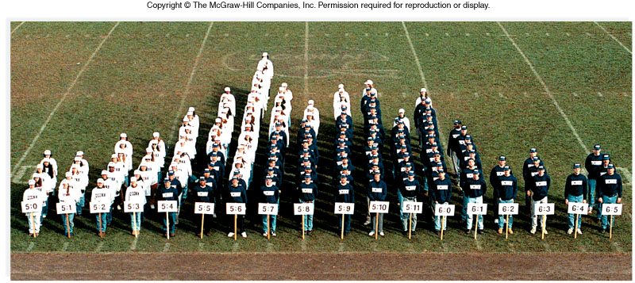

---

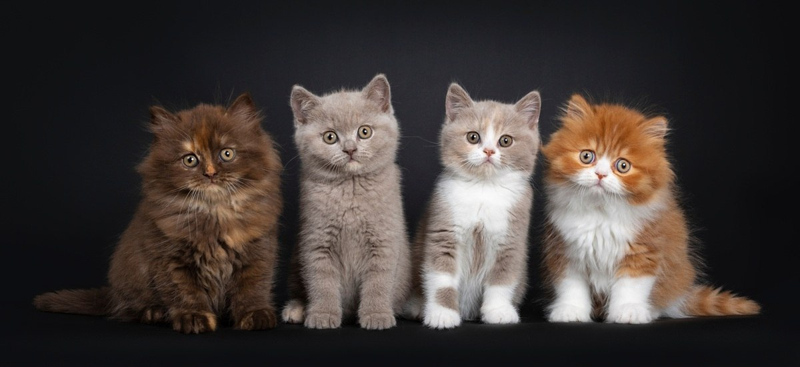

---

---

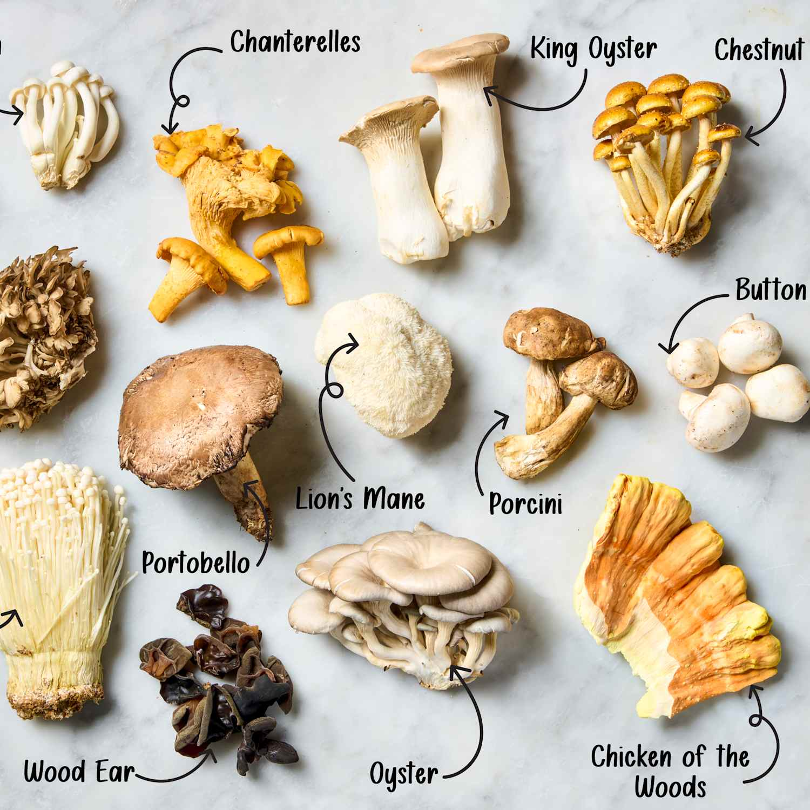

---

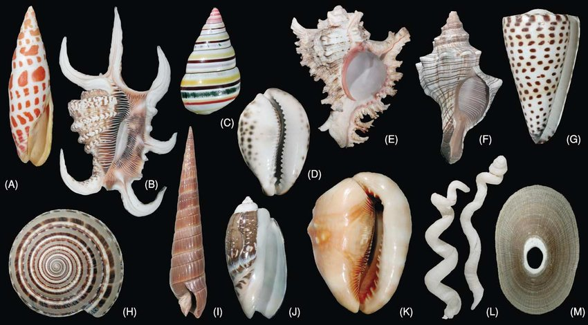

## Variacion adentro y entre especies

::: {.incremental}
- La variacion es lo normal en la biologia
- No existen especies ni poblaciones perfectamente uniformes
- La variacion es la materia prima (raw material?) para la evolucion
- Pero no toda variacion es hereditaria (genetica)
- La variacion no hereditaria no contribuye a la evolucion
:::

## Que es lo que varia?

> **Fenotipo** - el conjunto de características observables de un organismo

> **Genotipo** - la información genética de un organismo

> **Rasgo** - una característica del fenotipo especifica que puede variar entre individuos

## Ejemplos 

- Cualquier rasgo puede variar entre individuos, incluyendo:
  - Rasgos físicos (altura, color, forma)
  - Rasgos fisiológicos (metabolismo, resistencia a enfermedades)
  - Rasgos de comportamiento (agresividad, cuidado parental)

## ¿Por qué los organismos son diferentes?

Genetica: Diferentes combinaciones de alelos (genotipos) entre individuos.

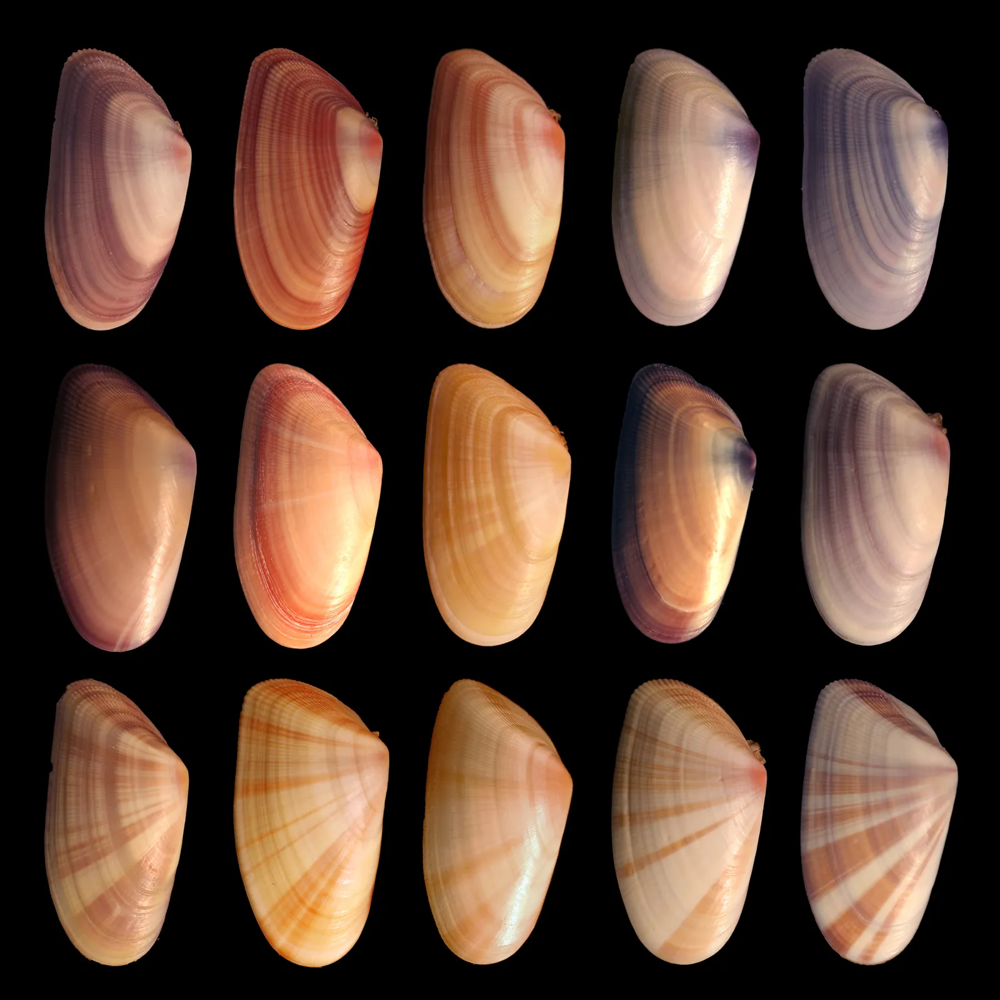

## ¿Por qué los organismos son diferentes?

- Ambiente: Diferentes condiciones ambientales pueden afectar el desarrollo y apariencia de los organismos.

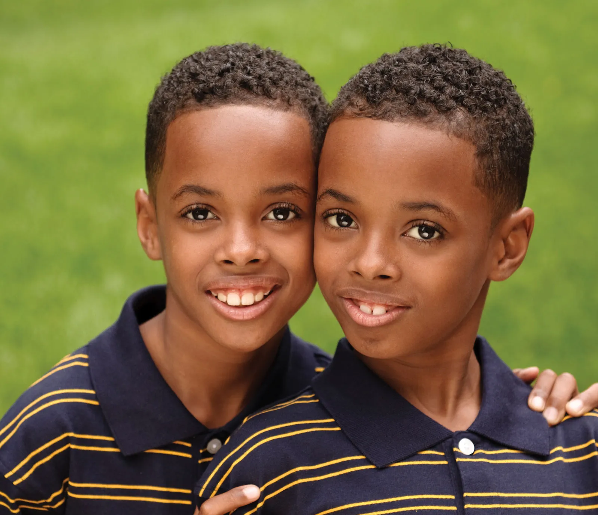

## ¿Por qué los organismos son diferentes?

- Interaccion genetica-ambiente: La expresion de los genes puede depender del ambiente.

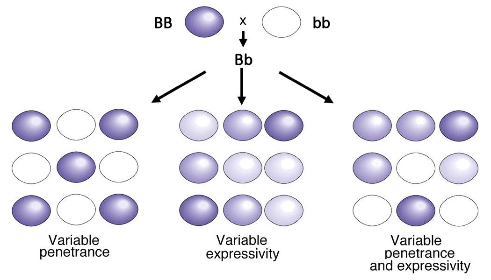

## Relacion entre genotipo, fenotipo y ambiente

$$
\begin{aligned}
\text{Fenotipo} &= \text{Genotipo} \\
                &\quad + \text{Ambiente} \\
                &\quad + \text{Interacción genotipo-ambiente}
\end{aligned}
$$

## Resumen variacion biologica

- La variacion es ubicua en la biologia, incluso dentro de especies.
- Los fuentes de variacion incluyen genetica, ambiente e interaccion genetica-ambiente.
- La variacion hereditaria es necesaria para la evolucion, pero no toda variacion es hereditaria.

Ver mas: https://www.bbc.co.uk/bitesize/articles/z6s26yc#zm33f82

# Que significa 'Evolucion' {background-color="#E8F5E9"}

## Definicion

> Evolucion = cambio en las características **hereditarias** de **poblaciones** a lo largo de **generaciones**

---

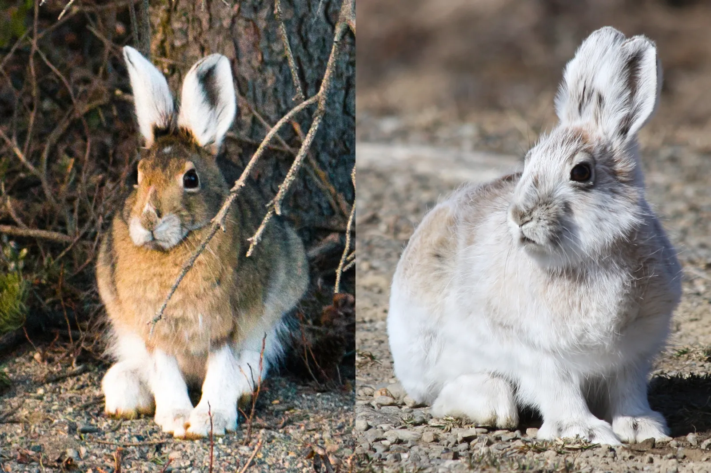

::: {.incremental}
- Evolucion? Si o no?
- Pista: ¿Las crias de esta liebre naceran con pelaje blanco en la siguiente generacion?
-  **No.** Cambio en un individuo entre estaciones.
:::

---

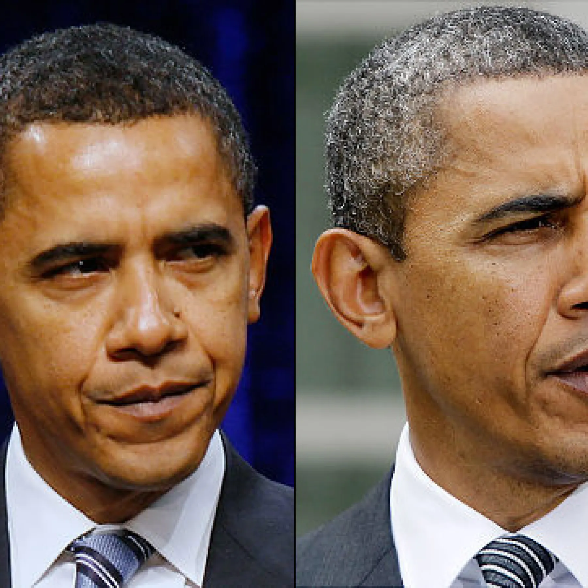

::: {.incremental}
- Evolucion? Si o no?
- Pista: ¿Este cambio se hereda a su descendencia o solo ocurre durante la vida del individuo?
-  **No.** Cambio en un individuo a lo largo de su vida.
:::

---

::: {.incremental}
- Evolucion? Si o no?
- Pista: ¿Cuales individuos estan mas probables para sobrevivir y reproducirse en presencia de antibioticos?
-  **Si.** Cambio en la frecuencia de individuos resistentes a antibioticos entre generaciones.
:::

---

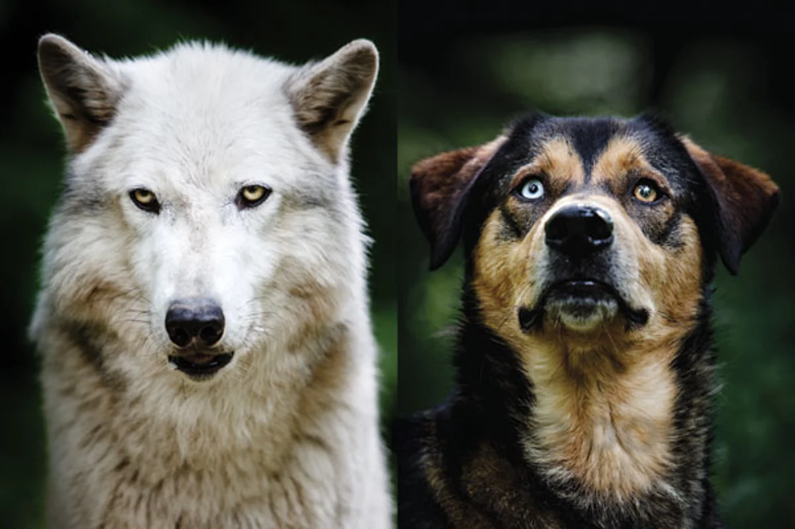

::: {.incremental}
- Evolucion? Si o no?
- Pista: Cuales perros estan mas probables para sobrevivir cerca de humanos?
-  **Si.** Seleccion artificial para rasgos deseables cambia las caracteristicas hereditarias en poblaciones domesticadas.
:::

---

:::: {.columns}
::: {.column width="50%"}
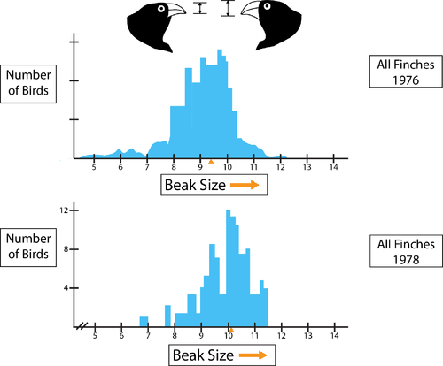
:::
::: {.column width="50%"}
::: {.incremental}
- Evolucion? Si o no?
- Pista: Cuales pajaros estan mas probables para sobrevivir cuando hay solo semillas grandes?
-  **Si.** Cambio en la distribucion y promedio del tamano del pico entre generaciones por cambios en el entorno (disponibilidad de semillas de diferentes tamanos).
:::
:::
::::

---

:::: {.columns}
::: {.column width="50%"}
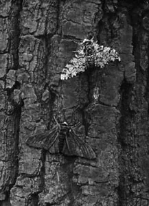

:::
::: {.column width="50%"}
::: {.incremental}
- Evolucion? Si o no?
- Pista: Cuales polillas estan mas probables de evitar predadores donde no hay liquenes?
-  **Si.** Cambio en la frecuencia de individuos con diferentes colores entre generaciones por cambios en el entorno (habitat, camuflaje y depredacion).
:::
:::
::::

Ver mas: https://www.youtube.com/watch?v=y4BHYYBif3Q

## Resumen

- Evolucion es cambio en las características **hereditarias** de **poblaciones** a lo largo de **generaciones**
- No es cambio en individuos a lo largo de su vida, ni entre estaciones.

## Resumen definicion de evolucion

> Piensen asi: Es un cambio en la distribucion poblacional de un rasgo, no en el rasgo de un individuo.

# Aclimatacion {background-color="#E8F5E9"}

## Cambio fenotipico rapido — sin cambio heredable

> **Aclimatacion**: cambio reversible en el fenotipo de un individuo en respuesta a un cambio ambiental. Ocurre dentro de la vida del organismo y **no se hereda**.

::: {.incremental}
- Escala de tiempo: horas, dias, semanas — no generaciones.
- Ejemplos:
  - Produccion de globulos rojos a mayor altitud (dias a semanas).
  - Pigmentacion de la piel por exposicion solar (horas a dias).
  - Respuesta al calor: produccion de proteinas de choque termico (minutos a horas).
  - Cambio de pelaje estacional en mamiferos (semanas).
:::

---

## Aclimatacion vs Evolucion

| | Aclimatacion | Evolucion |
|---|---|---|
| ¿Quien cambia? | Un individuo | Una poblacion |
| ¿Se hereda? | No | Si |
| ¿Cuanto tarda? | Horas a semanas | Generaciones |
| ¿Es reversible? | Generalmente si | No (es acumulativo) |

::: {.fragment}
> La liebre que vimos antes cambia de pelaje cada estacion: **aclimatacion**, no evolucion. Si en el futuro naciesen mas liebres con pelaje blanco permanente por seleccion en entornos nevados, **eso si seria evolucion**.
:::

# Entorno y Aptitud {background-color="#E8F5E9"}

## Definicion

> Aptitud - la **capacidad** de un organismo para **sobrevivir** y **reproducirse** en su **entorno**

---

> La aptitud no es una propiedad fija de un organismo, sino que depende del entorno en el que se encuentra.

::: {.columns}
::: {.column}

:::

::: {.column}
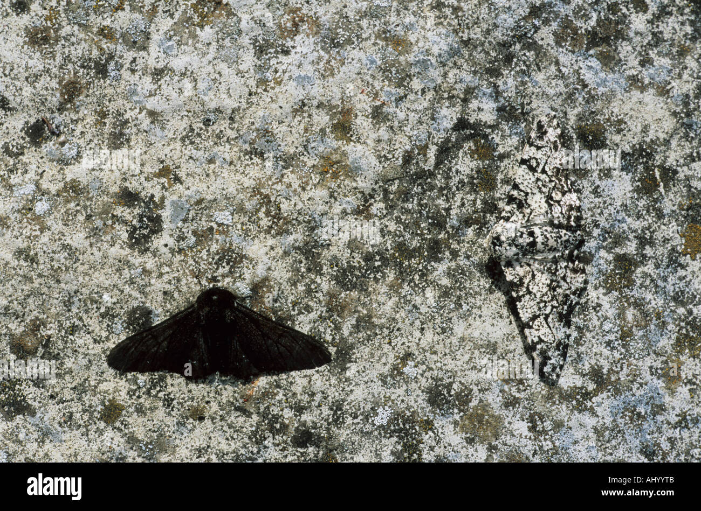
:::
:::

---

> Un rasgo que aumenta la aptitud en un entorno puede disminuirla en otro entorno.

::: {.columns}
::: {.column}
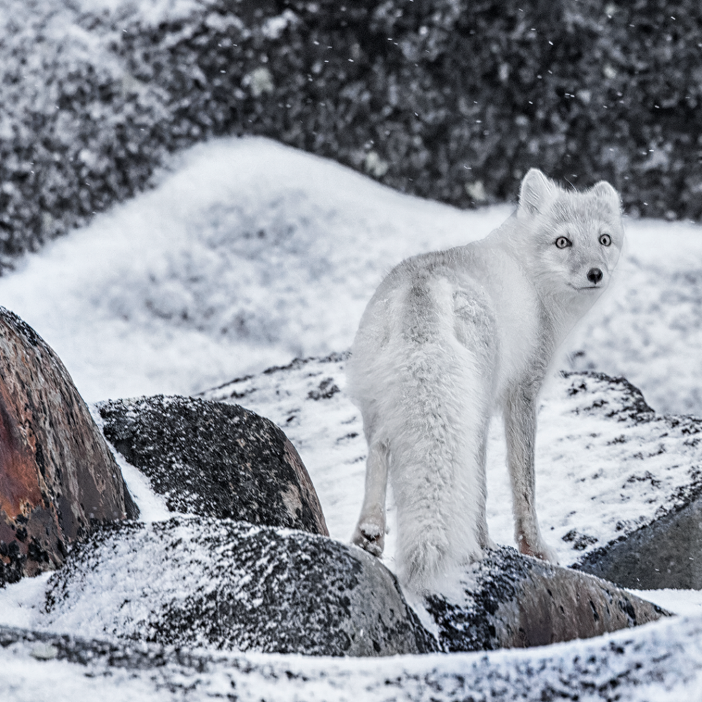
:::
::: {.column}
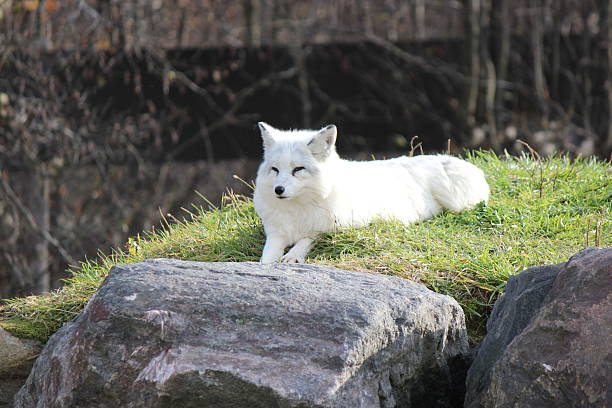
:::
:::

---

::: {.incremental}
- Verdadero o falso: Individuos con alta aptitud siempre sobreviven en cualquier entorno.
- **No**. La aptitud es relativa a otros organismos en la misma población y entorno.
:::

---

- Verdadero o falso: Individuos con alta aptitud siempre sobreviven en cualquier entorno.
- **No**. La aptitud es relativa a otros organismos en la misma población y entorno.

Definicion alternativa de aptitud: 

> Exito reproductivo relativo de un organismo o genotipo en una dada población y entorno.

## Un marco para pensar sobre fenotipos, aptitud, y entorno {.smaller}

::: {.columns}

::: {.column}
> **Norma de Reaccion**: Patrón de fenotipos que un genotipo puede producir bajo diferentes condiciones ambientales.
:::
::: {.column}
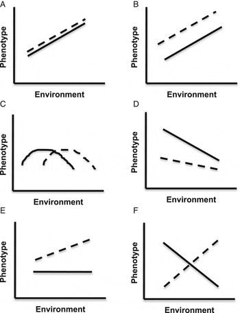
:::
:::

## Plasticidad y canalizacion {.smaller}

::: {.columns}
::: {.column}
> **Plasticidad fenotípica**: Capacidad de un genotipo para producir diferentes fenotipos en respuesta a diferentes condiciones ambientales.
:::
::: {.column}
> **Canalizacion**: La capacidad de un genotipo para producir el mismo fenotipo independientemente de las condiciones ambientales.
:::
:::

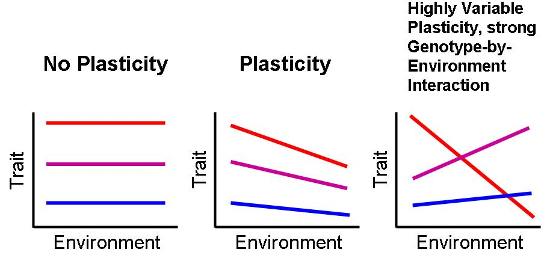

## Ejemplo: aptitud segun el entorno {.smaller}

> El mismo rasgo puede favorecer la supervivencia y reproduccion en un entorno, pero no en otro.

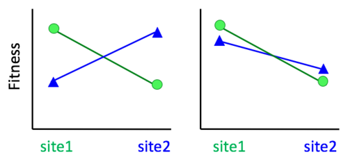

## Resumen aptitud y entorno

- La aptitud depende del entorno y es relativa a otros organismos en la misma población.
- Un rasgo que aumenta la aptitud en un entorno puede disminuirla en otro entorno.
- La plasticidad y la canalización son patrones de interacción con el ambiente que producen diferentes fenotipos.
- Este tipo de contraste entre entornos prepara el terreno para la seleccion natural que veremos en las próximas clases.

# Conceptos erroneos comunes {background-color="#E8F5E9"}

## Teleologia: definicion

> **Teleologia**: explicar un rasgo biologico por su proposito o meta final (por ejemplo, "evoluciono para...").

---

> Eviten pensar en la evolución como un proceso que "mejora" a los organismos. La evolución no tiene una dirección o meta, y lo que es "mejor" depende del entorno específico.

---

::: {.incremental}
- ❌ **Incorrecto**: "La evolucion siempre produce organismos mejores".
- ✅ **Mejor formulacion**: "La evolucion cambia la frecuencia de rasgos; su ventaja depende del entorno y puede cambiar con el tiempo".

:::

---

> Eviten pensar en terminos teleológicos, como "necesitar" o "querer" rasgos. Los organismos no evolucionan porque "necesitan" algo, sino porque ciertos rasgos aumentan la aptitud en un entorno dado.

---

::: {.incremental}
- ❌ **Incorrecto**: "La jirafa alargo el cuello porque necesitaba alcanzar hojas altas".
- ✅ **Mejor formulacion**: "Las jirafas con cuellos mas largos tenian mas exito reproductivo en un entorno con hojas altas, lo que llevo a un aumento en la frecuencia de cuellos largos en la poblacion a lo largo de generaciones".
:::

---

> Eviten pensar que los individuos evolucionan. La evolución ocurre a nivel de poblaciones a lo largo de generaciones, no a nivel de individuos.

---

::: {.incremental}
- ❌ **Incorrecto**: "Este individuo evoluciono resistencia durante su vida".
- ✅ **Mejor formulacion**: "La poblacion evoluciono porque, entre generaciones, aumento la frecuencia de variantes hereditarias asociadas a resistencia".
:::

---

> Eviten pensar en terminos de 'perfeccion' o 'progreso'. La evolución no tiene una dirección inherente hacia la perfección o el progreso, sino que es un proceso de cambio adaptativo a las condiciones ambientales.

---

::: {.incremental}
- ❌ **Incorrecto**: "Las especies modernas son mas avanzadas que las antiguas".
- ✅ **Mejor formulacion**: "Todas las especies actuales estan adaptadas a sus condiciones presentes; no hay una escala universal de progreso evolutivo".
:::

## Cierre

# Proxima semana: Evidencia de la Evolucion {background-color="#E8F5E9"}

> Si las poblaciones cambian a través del tiempo… ¿cómo sabemos que eso realmente ocurrió?