## Metas

1. Introducir las varias líneas de evidencia que apoyan la teoría de la evolución.

2. Construir una comprensión de cómo múltiples formas de evidencias complementarias fortalecen la teoría de la evolución.

3. Aclarar errores comunes asociados con la interpretación de la evidencia evolutiva.

4. Reforzar la idea de que la ciencia funciona mediante la convergencia de evidencias.

## Ser capaces de {.smaller}

::: {.incremental}
- Explicar cómo el registro fósil documenta cambios en la biodiversidad a lo largo del tiempo y constituye evidencia de descendencia con modificación.
- Interpretar similitudes y diferencias anatómicas entre organismos como evidencia de ancestro común y adaptación a distintas funciones.
- Explicar cómo la distribución geográfica de los organismos refleja procesos evolutivos, historia geológica y aislamiento poblacional.
- Interpretar similitudes en ADN y proteínas como evidencia de parentesco evolutivo y ancestro común.
- Explicar cómo la evolución puede observarse y medirse en poblaciones contemporáneas.
- Integrar múltiples líneas independientes de evidencia para sustentar la teoría evolutiva como explicación científica de la diversidad biológica.
:::

# Registro fósil {background-color="#E8F5E9"}

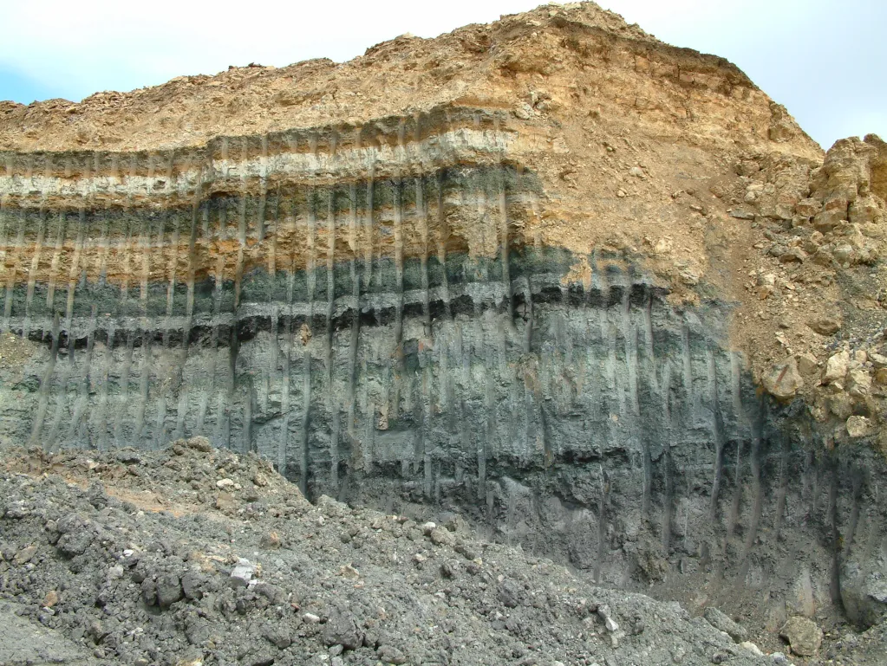

---

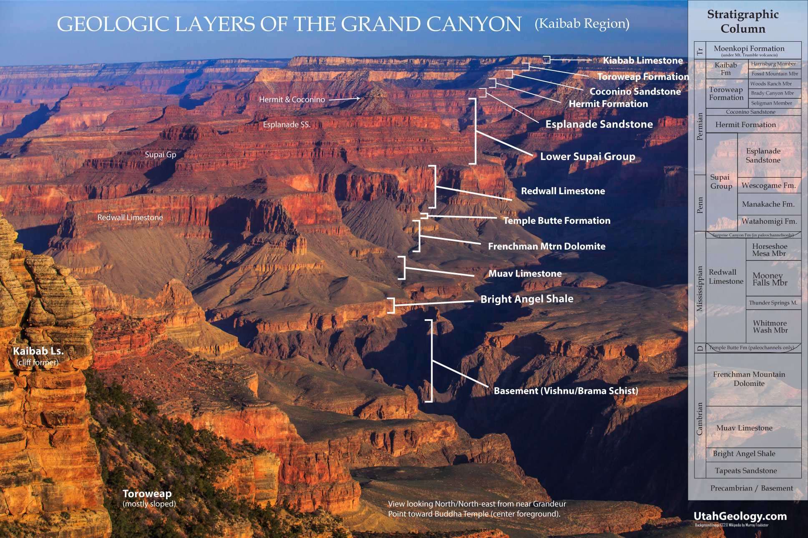

## El registro fósil muestra una secuencia temporal

::: {.columns}
::: {.column}

::: {.fragment fragment-index=1}
* las capas más profundas son generalmente más antiguas,
:::

::: {.fragment fragment-index=2}
* los organismos aparecen/desaparecen a lo largo del tiempo,
:::

::: {.fragment fragment-index=3}
* las comunidades antiguas se diferencian de las modernas.
:::

:::
::: {.column}

::: {.r-stack}
{.fragment .fade-in-then-out fragment-index=1 width=90%}

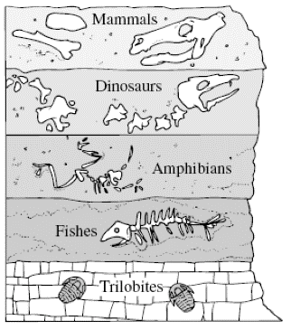{.fragment .fade-in-then-out fragment-index=2 width=90%}

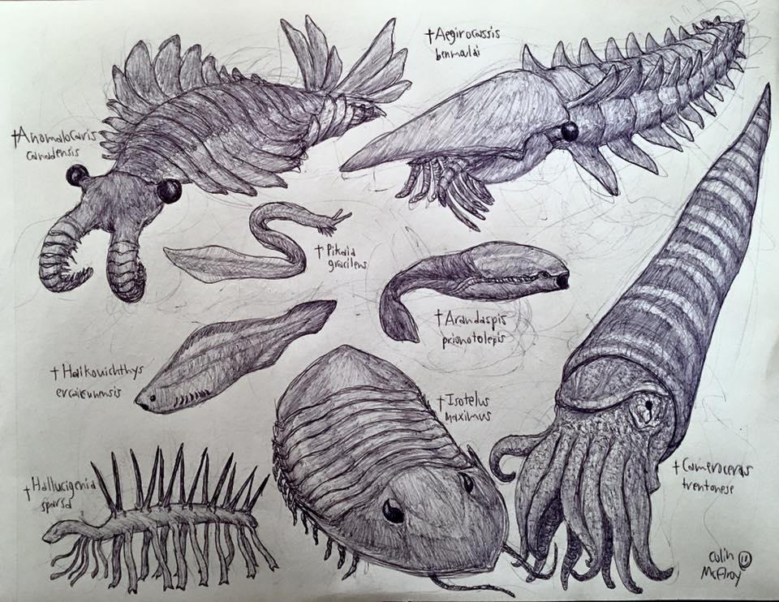{.fragment fragment-index=3 width=90%}
:::

:::
:::

---

## La mayoría de las especies que han existido están extintas

::: {.columns}

::: {.column}

* la extinción es normal,

* la biodiversidad cambia,

* las comunidades son dinámicas.

:::
::: {.column}

{width=70%}

:::
:::

::: {.fragment}
> Si las especies desaparecen y aparecen nuevas, ¿están parecidas las nuevas a las antiguas?
:::

---

## Características transicionales

> "Transicional" no significa "a medio formar"

::: {.incremental}
* combinaciones de rasgos ancestrales y derivados,
* conectan grupos mayores a través del tiempo,
* *Tiktaalik*, *Archaeopteryx*, y los ancestros de las ballenas son ejemplos clásicos.
:::

## Tiktaalik

*Tiktaalik* -- fósil de 375 millones de años -- es un pez con rasgos de tetrápodo.

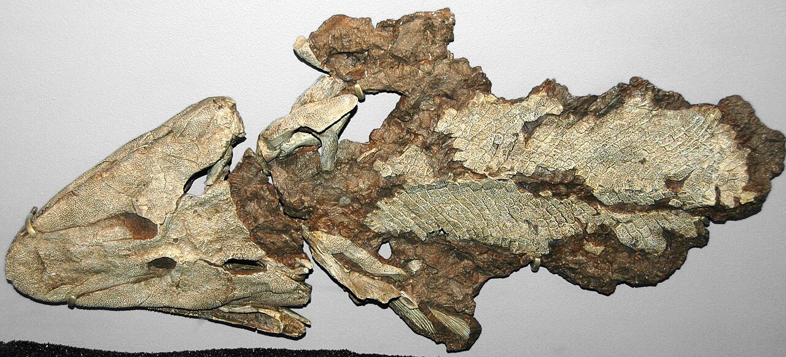{width="90%"}

---

Vivia en ambientes de agua dulce y somera.

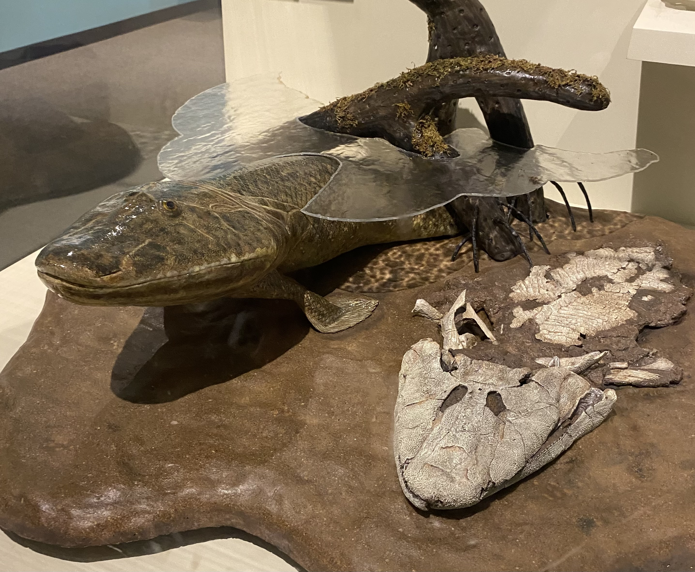{width="90%"}

---

Tenía aletas con huesos que se asemejan a los de los miembros de los tetrápodos.

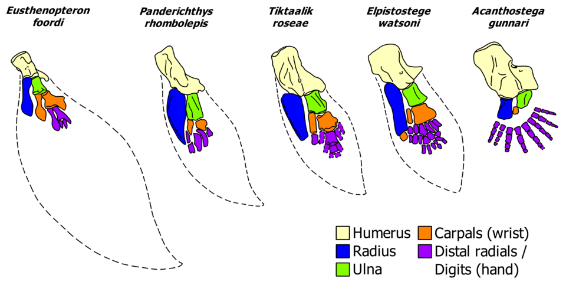{width="90%"}

---

Un cuello móvil y costillas que podrían haber ayudado a sostener su cuerpo en tierra.

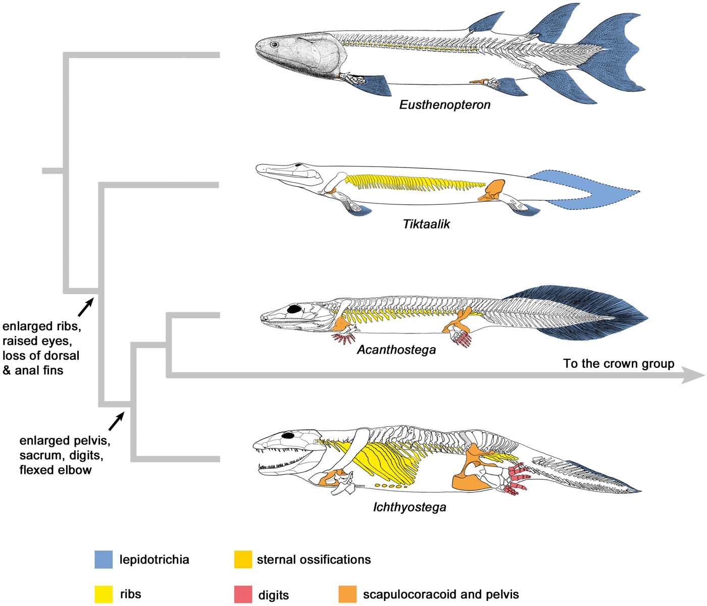{width="90%"}

---

## *Tiktaalik*: características de peces y tetrápodos

::: {.columns}

::: {.column}

Rasgos de pez:

* escamas, aletas, branquias.

Rasgos de tetrápodo:

* cuello móvil, aletas con estructura de miembro, costillas.

:::

::: {.column}
{width="90%"}
:::
:::

---

## El registro fósil es consistente con descendencia con modificación

::: {.incremental}
* los organismos aparecen en orden temporal,
* los grupos relacionados aparecen cerca entre sí en el tiempo,
* las características transicionales conectan los grandes grupos,
* la extinción y la diversificación ocurren repetidamente.
:::

---

## El registro fósil es incompleto

::: {.columns}
::: {.column}

* la fosilización es rara,
* la preservación está sesgada hacia organismos con partes duras y ambientes específicos,
* la erosión y la destrucción eliminan evidencia.

:::
::: {.column}
:::
:::

---

## Mitos sobre el registro fósil

::: {.incremental}

* Los fósiles son solo huesos y conchas
* Los "missing links" en el registro fósil desmienten la evolución
* Cada fósil encontrado es un ancestro directo de una especie moderna
* La evolución es lineal y en forma de escalera
* Los fósiles más antiguos son inherentemente "menos evolucionados" o primitivos
:::

## Resumen

El registro fósil nos permite establecer:

::: {.columns}
::: {.column}
* tiempo profundo,
* secuencias temporales,
* descendencia con modificación,
* extinciones,
* características transicionales.

:::
::: {.column}
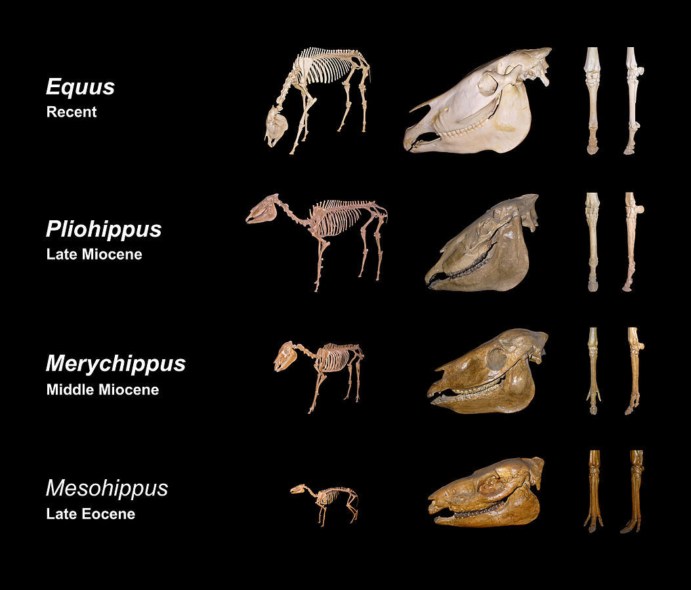{width=90%}
:::
:::

# Anatomía comparativa {background-color="#E8F5E9"}

> ¿Por qué organismos tan diferentes comparten el mismo plan estructural?

---

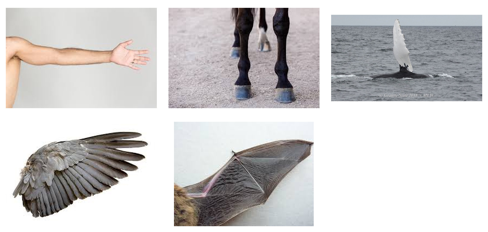

> ¿Cuál de estas estructuras es más parecida?

---

## Estructuras homólogas

Misma estructura básica, funciones distintas.

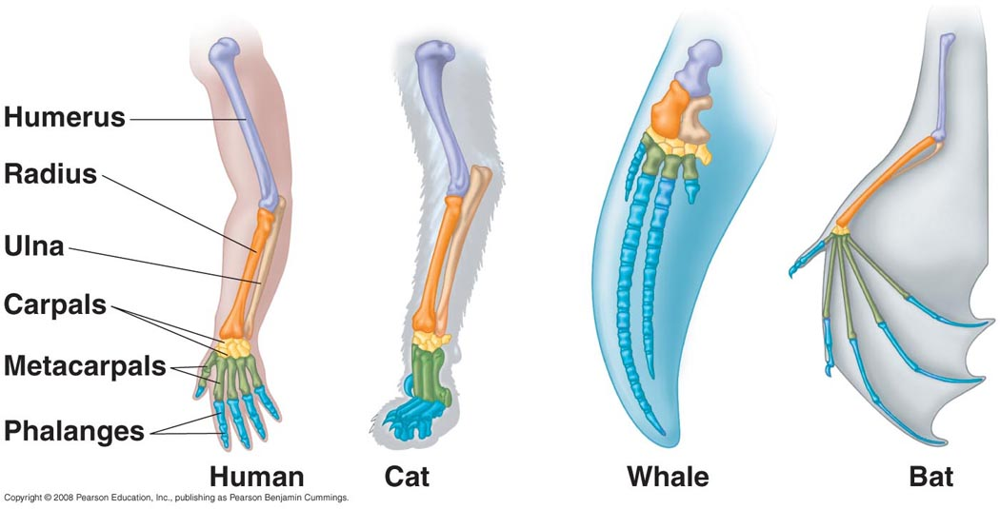

> Homología = similitud debida a ancestro común.

## Descendencia con modificación

La evolución modifica estructuras existentes.

::: {.columns}
::: {.column}
No: 

> "diseñar un ala"

pero sí:

> "modificar una característica existente."

:::
::: {.column}

{width=90%}
:::
:::

---

## Función vs Ancestro

::: {.columns widths="60% 40%"}

::: {.column}
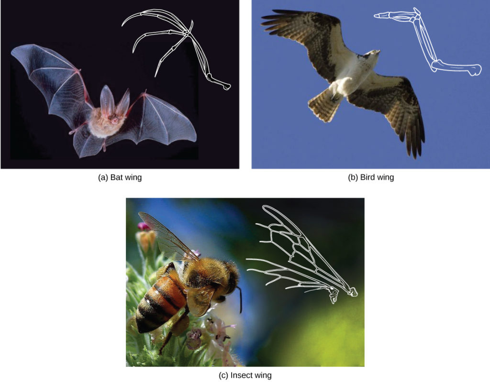

:::

::: {.column}

::: {.fragment}
> ¿Todas son homólogas? Si o no, ¿por qué?
:::

::: {.fragment}
> Función similar. Origen evolutivo diferente.
:::

:::
:::

---

## Estructuras análogas

> Analogia = similitud debida a función, no a ancestro común.

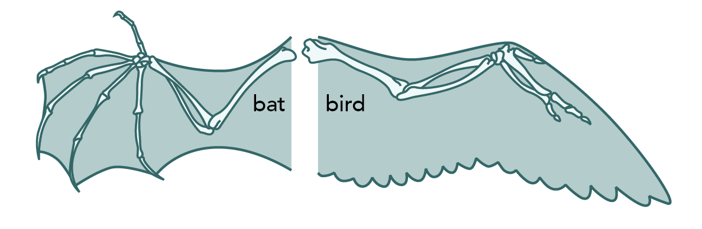{width=90%}

> Selección similar puede producir soluciones similares. (Evolución convergente)

---

## Homología vs Analogía

| Homología                            | Analogía                               |
| ------------------------------------ | -------------------------------------- |
| Similaridad por ancestro común       | Similaridad por función                |
| Indica parentesco                    | No necesariamente indica parentesco    |
| Ej: brazo humano y ala de murciélago | Ej: ala de murciélago y ala de insecto |

---

## Estructuras vestigiales

::: {.fragment}
Ejemplo: hueso pélvico en ballenas, apéndice humano, alas de avestruz, piernas de serpientes, etc.
:::

::: {.fragment}
> ¿Por qué un organismo tendría estructuras aparentemente inútiles?
:::

::: {.fragment}
> **Porque esas estructuras eran funcionales en ancestros pasados.**
:::

---

## Resumen: ¿Qué predice la evolución?

Si las especies comparten un ancestro común, debemos observar:

::: {.incremental}
- similitudes anidadas
- estructuras homólogas
- estructuras vestigiales
- evolución convergente bajo ambientes similares
:::

::: {.fragment}
> **Y eso es exactamente lo que observamos.**
:::

# Biogeografía {background-color="#E8F5E9"}

La biogeografía estudia por qué las especies viven donde viven.

## La historia geológica

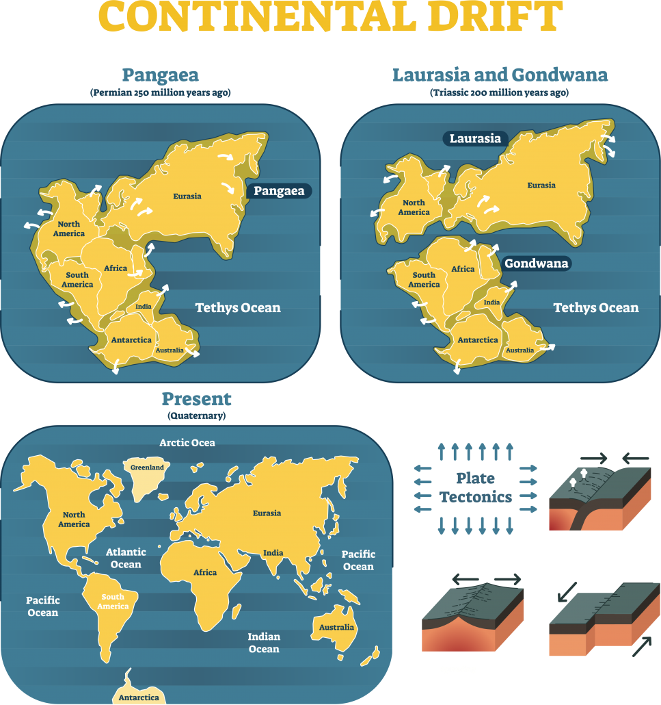

---

::: {.columns widths="70% 30%"}

::: {.column}
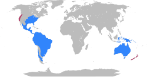{width=90%}
:::

::: {.column}
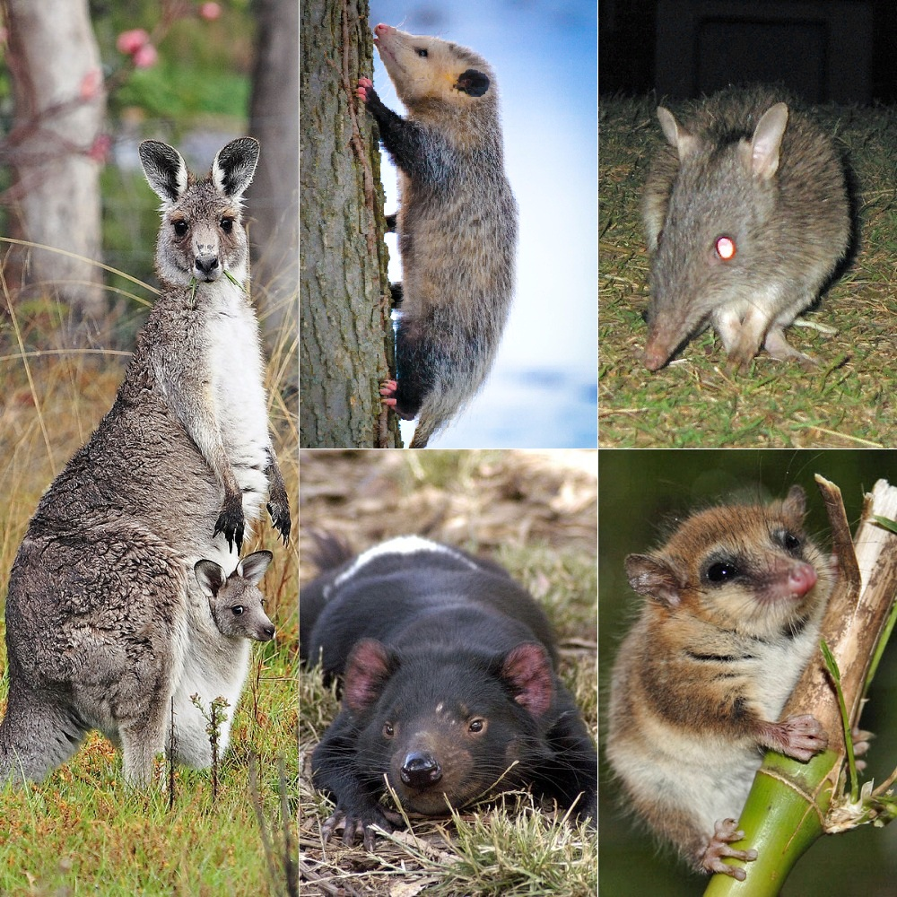{width=90%}
:::
:::

> Los marsupiales se concentran sobre todo en Australia: la distribución refleja historia geológica y aislamiento.

---

::: {.columns widths="70% 30%"}

::: {.column}
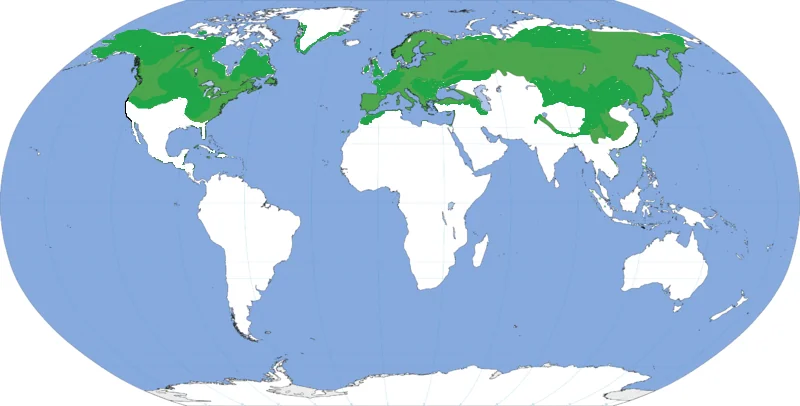{width=90%}
:::

::: {.column}
{width=60%}
:::
:::

> Las especies emparentadas suelen agruparse geográficamente.

---

::: {.columns widths="70% 30%"}

::: {.column}
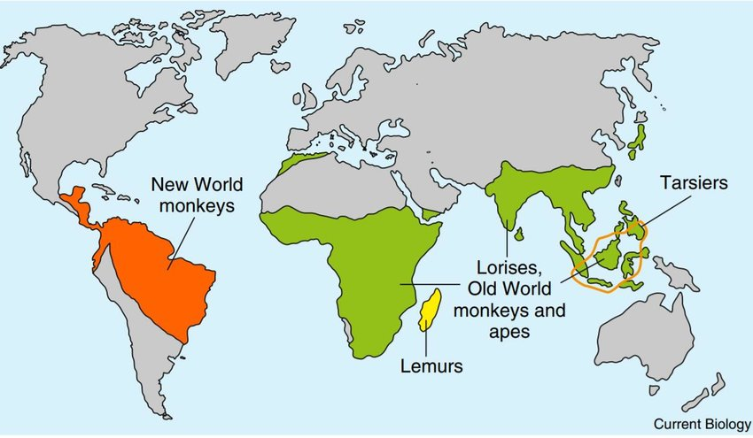{width=90%}
:::

::: {.column}
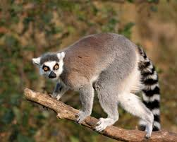
:::
:::

> Madagascar tiene un conjunto distintivo de primates: el aislamiento deja huellas evolutivas.

---

## Los organismos no están distribuidos al azar

::: {.columns}

::: {.column}

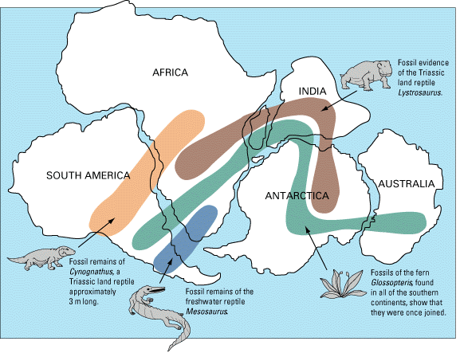{width=90%}

:::

::: {.column}

Regiones diferentes contienen linajes evolutivos distintos.

::: {.fragment}
> ¿Por qué?
:::

::: {.fragment}
> **Historia y aislamiento**
:::

::: {.fragment}
> Dos procesos clave: vicariancia y dispersión.
:::

:::

:::

---

## Definiciones clave

::: {.incremental}
* **Dispersión**: una población coloniza una nueva región al cruzar una barrera geográfica.
* **Aislamiento**: el flujo génico entre poblaciones se reduce o se corta, permitiendo divergencia evolutiva.
* **Vicariancia**: una barrera geográfica divide una población ancestral y separa sus descendientes.
:::

---

## Las islas son laboratorios evolutivos

::: {.columns}
::: {.column}

Características:

::: {.incremental}
* aisladas
* pequeñas poblaciones fundadoras
* flujo génico limitado
* nuevas oportunidades ecológicas
:::

:::

::: {.column}

::: {.fragment}
Ejemplos:

* Galápagos
* Hawaii
* Madagascar
:::

:::
:::

::: {.fragment}
> **El aislamiento promueve la divergencia.**
:::

---

## Galápagos

Los pinzones de Galápagos ilustran radiación adaptativa tras colonización y aislamiento.

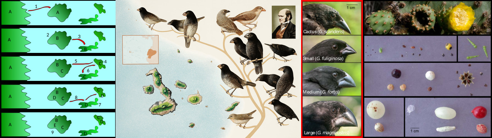

---

## Convergencia

::: {.columns}

::: {.column}

{width="60%"}

:::

::: {.column}

::: {.fragment}
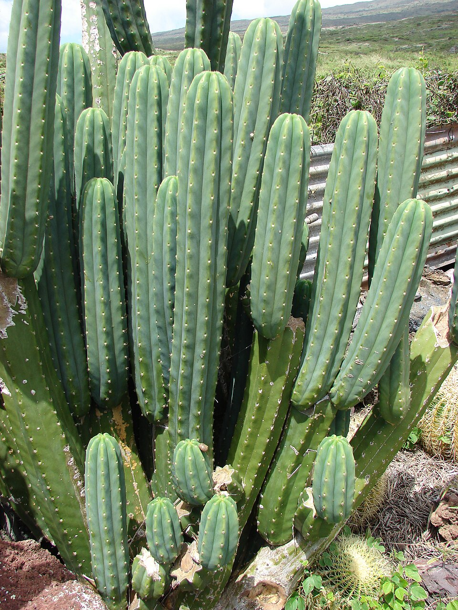{width="50%"}
:::

:::
:::
::: {.fragment}
> ¿Por qué las especies no emparentadas se parecen tanto?
:::

::: {.fragment}
> **Presiones ecológicas similares en regiones distintas pueden producir formas parecidas.**
:::

---

> La biogeografía suele reflejar historia y aislamiento; la convergencia nos recuerda que la similitud morfológica por sí sola no siempre refleja parentesco.

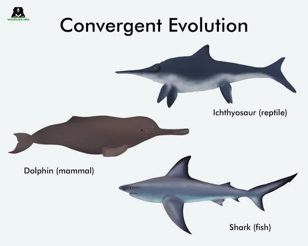

---

## Resumen: ¿Qué predice la evolución?

Si las especies comparten un ancestro común y las poblaciones se aíslan, deberíamos observar:

::: {.incremental}
- parientes geográficamente agrupados
- floras y faunas insulares únicas
- radiaciones adaptativas 
- efectos de la historia geológica
- evolución convergente en ambientes similares
:::

::: {.fragment}
> **Y eso es exactamente lo que observamos.**
:::

---

# Evidencia molecular {background-color="#E8F5E9"}

> ¿Qué esperaríamos encontrar en el ADN si los organismos comparten ancestros comunes?

---

::: {.columns widths="55% 45%"}
::: {.column}

| Organismos            | Similitud de ADN |
| --------------------- | ---------------- |
| Humano - chimpancé    | alta             |
| Humano - ratón        | menor            |
| Humano - pez          | menor            |
| Humano - levadura     | mucho menor      |

> ¿Es coincidencia?

:::
::: {.column}

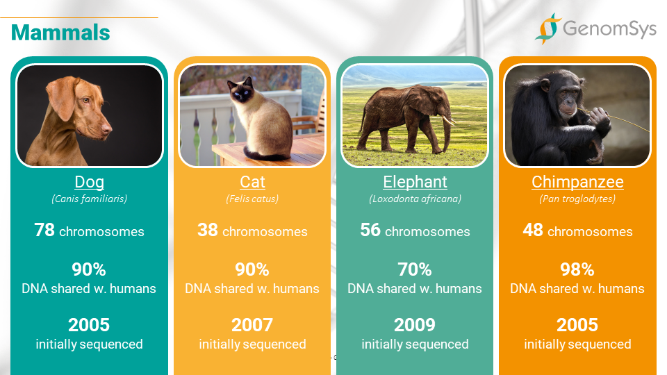{width=90%}

:::
:::

---

## El ADN guarda historia evolutiva

::: {.columns widths="50% 50%"}
::: {.column}

* el ADN se hereda entre generaciones,
* las mutaciones se acumulan,
* los linajes divergen.

> Predicción: parientes cercanos comparten más ADN.

:::
::: {.column}

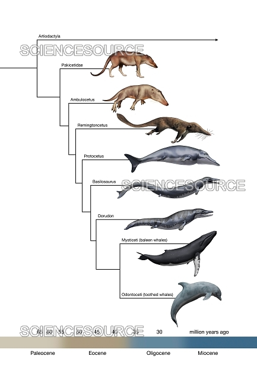{width=70%}

:::
:::

---

## Predicciones de ancestro común

::: {.incremental}
* especies cercanas comparten más ADN,
* especies lejanas comparten menos,
* el patrón genético debe coincidir con fósiles, anatomía y biogeografía.
:::

---

## Código genético universal

::: {.columns widths="55% 45%"}
::: {.column}

* mismo sistema molecular básico en toda la vida:
  * ADN
  * ARN
  * proteínas
  * código genético

> ¿Por qué organismos tan distintos usan el mismo sistema?

:::
::: {.column}

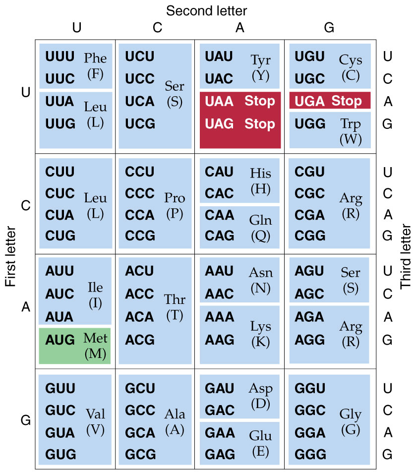{width=90%}

:::
:::

---

## Genes compartidos

::: {.columns widths="55% 45%"}
::: {.column}

* genes de metabolismo, división celular y desarrollo aparecen en linajes muy distintos.

> Los genes también pueden ser homólogos.

:::
::: {.column}

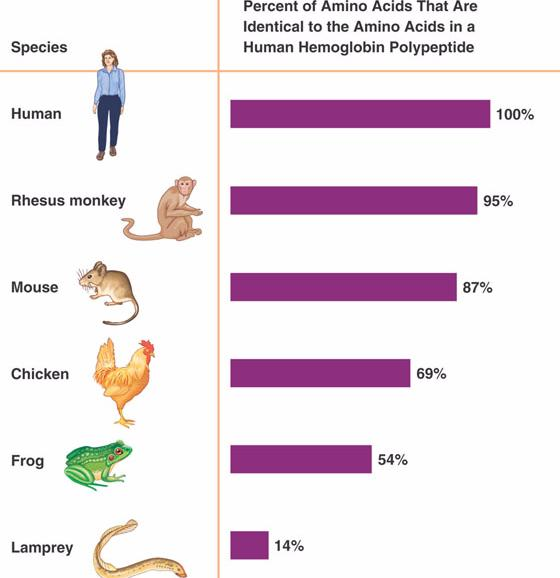{width=90%}

:::
:::

---

## Árboles moleculares

::: {.columns widths="50% 50%"}
::: {.column}

* el ADN permite reconstruir parentescos,
* especies con ADN más similar se agrupan.

:::
::: {.column}

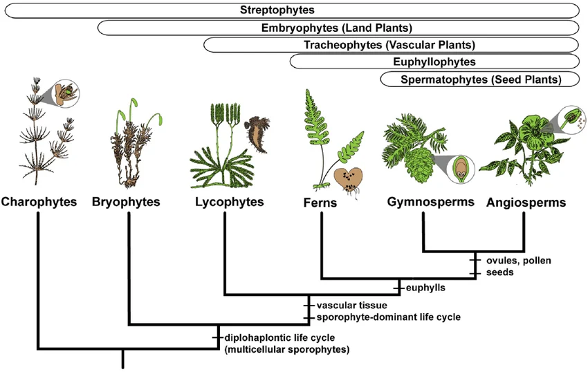{width=90%}

:::
:::

---

## Predicción potente

> Si construimos un árbol con fósiles, otro con anatomía y otro con ADN, ¿deberían coincidir?

::: {.fragment}
**Predicción evolutiva:** sí, en gran medida.
:::

---

## Resumen: ¿Qué nos dice el ADN?

::: {.incremental}
- todos los organismos usan maquinaria molecular compartida,
- especies más cercanas comparten más información genética,
- el ADN conserva huellas de historia evolutiva,
- la evidencia molecular respalda de forma independiente el ancestro común.
:::

::: {.fragment}
> El patrón importa más que un porcentaje exacto.
:::

---

# Evolución observada directamente {background-color="#E8F5E9"}

> ¿Podemos observar la evolución directamente?

---

> Si la evolución es real, ¿deberíamos poder observarla ocurriendo hoy?

::: {.fragment}
Si, pero en organismos con ciclos de vida cortos o en condiciones de selección fuerte.
:::

## ¿Qué tendríamos a observar?

> Evolución = cambio en poblaciones a través de generaciones.

::: {.columns}
::: {.column}

- cambio en las frecuencias de rasgos
- cambio en las frecuencias de alelos
- cambio medible en la población a lo largo de generaciones
:::

::: {.column}

❌ individuos cambiando

✅ poblaciones cambiando

:::

:::

## Resistencia a antibióticos

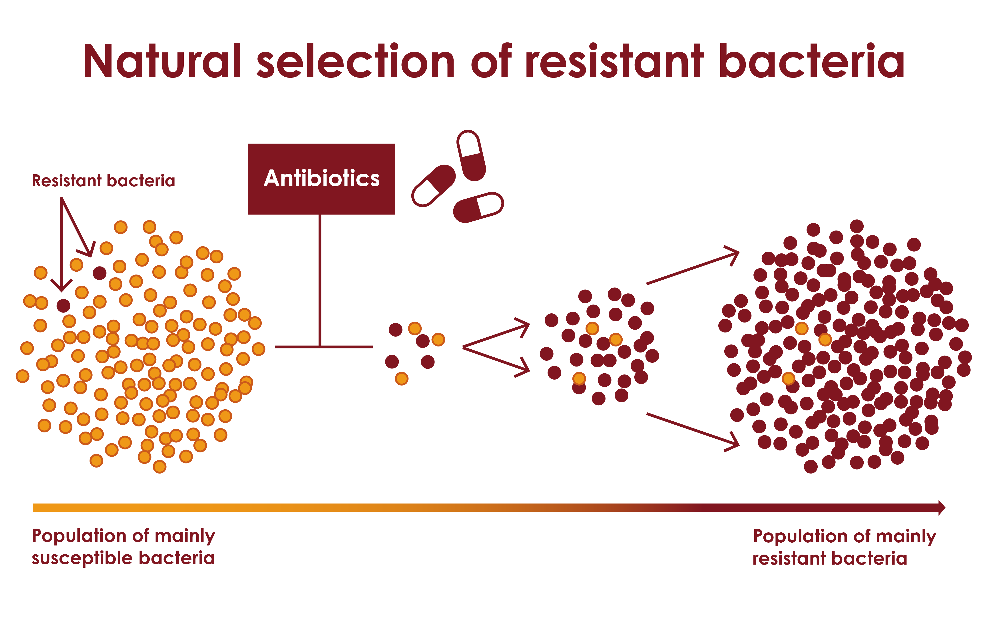{width="100%"}

::: {.incremental}
- el antibiotico no causa resistencia
- las variantes resistentes ya existen en la población
- el antibiótico selecciona a los resistentes, que sobreviven y se reproducen mas
- resulando en cambio en la población a lo largo de generaciones
:::

## Pinzones de nuevo

::: {.incremental}
- cambios en el ambiente (sequía) cambiaron la disponibilidad de alimentos
- los pinzones con picos más grandes tenían ventaja
- los picos más grandes se volvieron más comunes en la población
:::

## Experimentos evolutivos

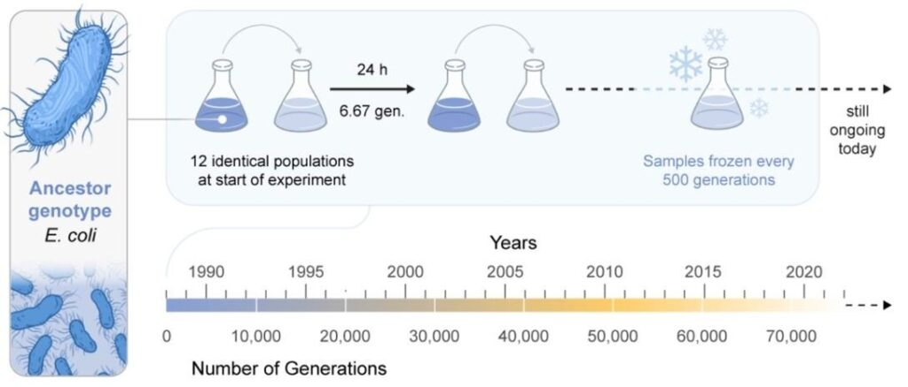{width=80%}

::: {.incremental}
- Adaptacion predicible y repetida
- Evolucion de nuevas funciones (ej: metabolizar citrato)
:::

---

| Evidencia           | Qué demuestra              |
| ------------------- | -------------------------- |
| Fósiles             | Cambio a través del tiempo |
| Anatomía            | Ancestro común             |
| Embriología         | Desarrollo compartido      |
| Biogeografía        | Historia y aislamiento     |
| ADN                 | Parentesco evolutivo       |
| Observación directa | Evolución ocurriendo hoy   |

---

> El registro fósil, la anatomía, la biogeografía, el ADN , observaciones directas (y embriología, etc.) cuentan la misma historia desde perspectivas independientes.

---

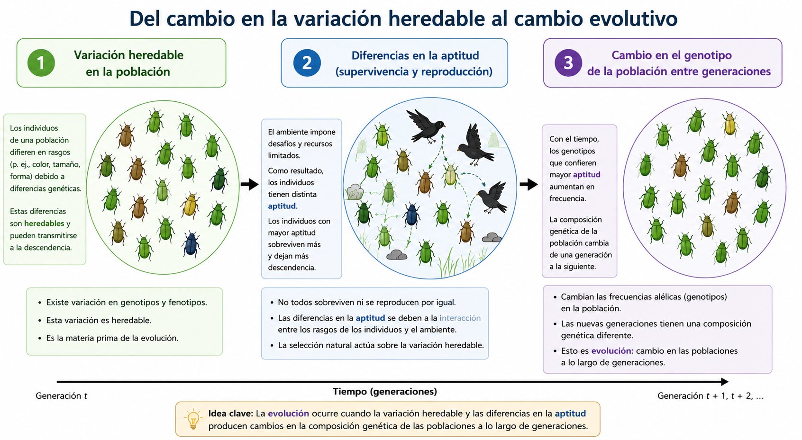{width=90%}

---

