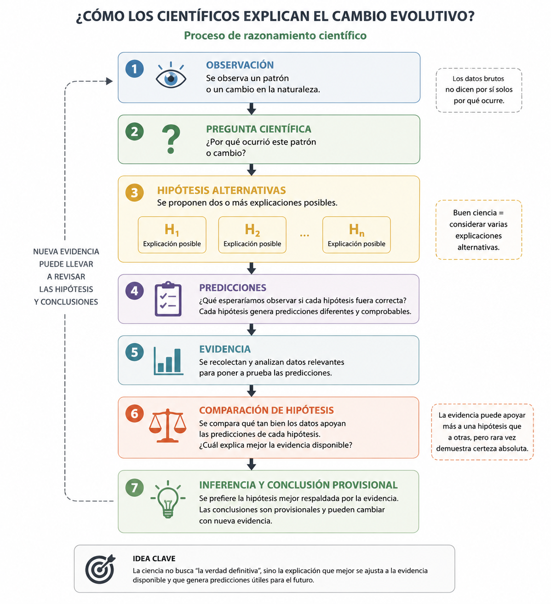

## Metas

1. Entender como los biólogos evolutivos estudian la evolución a través de evidencia, inferencia, comparación de hipótesis y reconocimiento de límites.
2. Desarrollar razonamiento evolutivo (científico): entender suposiciones, interpretar datos, comparar hipótesis

## Ser capaces de

::: {.incremental}

- entender suposiciones de estudios evolutivos
- interpretar evidencia evolutiva
- comparar hipótesis evolutivas
- aplicar conceptos evolutivos a problemas biológicos actuales

:::

# ¿Cómo sabemos cuál explicación evolutiva es correcta? {background-color="#E8F5E9"}

---

## Observación vs explicación

Observación:

* Los pinzones de Galápagos tienen picos diferentes que hace unos años.

::: {.fragment}
¿Por qué?
:::

::: {.fragment}
Posibles explicaciones:

* azar
* adaptación a la dieta

:::

::: {.fragment}
> La evidencia por sí sola no proporciona automáticamente la explicación.
:::

## Observación vs explicación

Observación:

* Los pinzones de Galápagos tienen picos diferentes que hace unos años.

::: {.fragment}
Necesitamos:

* hipótesis alternativas
* predicciones
* comparación de hipótesis
:::

## Explicación 1: Azar {.smaller}

Hipótesis:

* El cambio se debe a procesos aleatorios que modificaron la frecuencia de variantes en la población.

::: {.fragment}

Predicción:

::: {.incremental}
* No debería existir una relación consistente entre tamaño del pico y tamaño de las semillas. (Ecología, Recursos)
* No debería existir una relación consistente entre tamaño del pico y supervivencia. (Aptitud, Selección Natural)
* El cambio podría ocurrir incluso sin cambios en los recursos disponibles. (Ecología, Recursos)
:::
:::

## Explicación 2: Adaptación a la dieta {.smaller}

Hipótesis:

* El cambio se debe a que individuos con picos más grandes sobrevivieron y se reprodujeron más durante la sequía.

::: {.fragment}
Predicción:

::: {.incremental}
* Debería existir una relación entre tamaño del pico y tamaño de las semillas disponibles. (Ecología, Recursos)
* Debería existir una relación consistente entre el tamaño del pico y la dieta. (Ecología, Recursos)
* Parte de la variación en el tamaño del pico debería ser heredable. (Genética)
* El tamaño promedio del pico debería aumentar generación tras generación. (Aptitud, Selección Natural)
* Los individuos con picos más grandes deberían sobrevivir más frecuentemente. (Aptitud, Selección Natural)
:::
:::

## Comparación de hipótesis

¿Qué datos serían útiles para distinguir entre estas explicaciones?

::: {.incremental}
* Tamaño de pico
* Tamaño de semillas
* Dieta
* Supervivencia
* Número de hijos
* Herencia padres–hijos
* Cambios en la población a través del tiempo
:::

## Picos y semillas

```{r}
set.seed(123)
years <- 2000:2020
seed_size <- seq(2, 6, length.out = length(years)) +
  rnorm(length(years), 0, 0.5)
beak_size <- rnorm(length(years), 3, 0.7)
plot(
  years,
  seed_size,
  type = "b",
  col = "brown",
  pch = 16,
  ylim = c(0, 7),
  ylab = "Tamaño (mm)",
  xlab = "Año"
)
points(years, beak_size, type = "b", col = "blue", pch = 16)
legend(
  "topleft",
  legend = c("Tamaño de semilla", "Tamaño de pico"),
  col = c("brown", "blue"),
  pch = 16
)
```

::: {.fragment}
> Que hipótesis apoya esta evidencia? Y por qué?
:::
::: {.fragment}
> **Cambio por azar.** 
:::

## Picos y semillas
```{r}
set.seed(123)
years <- 2000:2020
seed_size <- seq(2, 6, length.out = length(years)) +
  rnorm(length(years), 0, 0.5)
beak_size <- seed_size + rnorm(length(years), 0, 0.7)
plot(
  years,
  seed_size,
  type = "b",
  col = "brown",
  pch = 16,
  ylim = c(0, 7),
  ylab = "Tamaño (mm)",
  xlab = "Año"
)
points(years, beak_size, type = "b", col = "blue", pch = 16)
legend(
  "topleft",
  legend = c("Tamaño de semilla", "Tamaño de pico"),
  col = c("brown", "blue"),
  pch = 16
)
```

::: {.fragment}
> Que hipótesis apoya esta evidencia? Y por qué?
:::

::: {.fragment}
> **Apoya la hipótesis de adaptación, pero una sola línea de evidencia no basta.**
:::

## Padres e hijos
```{r, fig.width=6}
set.seed(123)
parent_beak_size <- rnorm(20, 3, 0.5)
offspring_beak_size <- parent_beak_size + rnorm(20, 0, 0.5)
plot(
  parent_beak_size,
  offspring_beak_size,
  xlab = "Tamaño de pico de los padres",
  ylab = "Tamaño de pico de los hijos",
  pch = 16
)
abline(lm(offspring_beak_size ~ parent_beak_size), col = "red")
```

::: {.fragment}
> Que hipótesis apoya esta evidencia? Y por qué?
:::

::: {.fragment}
> **Apoya una condición necesaria para selección, pero no demuestra adaptación por sí sola.**
:::

## Picos y número de hijos

```{r, fig.width=6}
set.seed(123)
beak_size <- rnorm(100, 3, 0.5)
num_offspring <- rpois(100, lambda = exp(beak_size - 3))
plot(
  beak_size,
  num_offspring,
  xlab = "Tamaño de pico",
  ylab = "Número de hijos",
  pch = 16
)
abline(lm(num_offspring ~ beak_size), col = "red")
```

::: {.fragment}
> Que hipótesis apoya esta evidencia? Y por qué?
:::

::: {.fragment}
> **Adaptación a la dieta.**
:::


## Evidencia combinada: sin aptitud {.smaller}

```{r}
# Case where there is
# a positive relationship between seed size and beak size,
# but no relationship between beak size and fitness.
layout(matrix(1:2, nrow = 1))
years <- 2000:2020
seed_size1 <- seq(2, 6, length.out = length(years)) +
  rnorm(length(years), 0, 0.5)
beak_size1 <- seed_size1 + rnorm(length(years), 0, 0.7)
plot(
  years,
  seed_size1,
  type = "b",
  col = "brown",
  pch = 16,
  ylim = c(0, 7),
  ylab = "Tamaño (mm)",
  xlab = "Año"
)
points(years, beak_size1, type = "b", col = "blue", pch = 16)
legend(
  "topleft",
  legend = c("Tamaño de semilla", "Tamaño de pico"),
  col = c("brown", "blue"),
  pch = 16
)

beak_size <- seed_size + rnorm(length(years), 0, 0.5)
num_offspring <- rpois(length(years), lambda = 5) # No relationship with beak size
plot(
  beak_size,
  num_offspring,
  xlab = "Tamaño de pico",
  ylab = "Número de hijos",
  pch = 16
)
abline(lm(num_offspring ~ beak_size), col = "red")
```


::: {.fragment}
> Que hipótesis apoya esta evidencia? Y por qué?
:::

::: {.fragment}
> **No hay suficiente evidencia para adaptación por selección natural.**
:::

## Evidencia combinada: sin heredabilidad {.smaller}

```{r}
# Case where there is
# a positive relationship between seed size and beak size,
# but no heritability.
layout(matrix(1:2, nrow = 1))
years <- 2000:2020
seed_size1 <- seq(2, 6, length.out = length(years)) +
  rnorm(length(years), 0, 0.5)
beak_size1 <- seed_size1 + rnorm(length(years), 0, 0.7)
plot(
  years,
  seed_size1,
  type = "b",
  col = "brown",
  pch = 16,
  ylim = c(0, 7),
  ylab = "Tamaño (mm)",
  xlab = "Año"
)
points(years, beak_size1, type = "b", col = "blue", pch = 16)
legend(
  "topleft",
  legend = c("Tamaño de semilla", "Tamaño de pico"),
  col = c("brown", "blue"),
  pch = 16
)

parent_beak_size <- rnorm(20, 3, 0.5)
offspring_beak_size <- rnorm(20, 3, 0.5) # No heritability
plot(
  parent_beak_size,
  offspring_beak_size,
  xlab = "Tamaño de pico de los padres",
  ylab = "Tamaño de pico de los hijos",
  pch = 16
)
abline(lm(offspring_beak_size ~ parent_beak_size), col = "red")
```

::: {.fragment}
> Que hipótesis apoya esta evidencia? Y por qué?
:::

::: {.fragment}
> **No hay suficiente evidencia para adaptación por selección natural.**
:::

## Evidencia combinada: las tres condiciones {.smaller}

```{r}
# Case where all three conditions are met:
# positive seed-beak correlation, heritability, and fitness relationship.
layout(matrix(1:3, nrow = 1))
set.seed(42)
years <- 2000:2020
seed_size_full <- seq(2, 6, length.out = length(years)) +
  rnorm(length(years), 0, 0.5)
beak_size_full <- seed_size_full + rnorm(length(years), 0, 0.7)
plot(
  years,
  seed_size_full,
  type = "b",
  col = "brown",
  pch = 16,
  ylim = c(0, 7),
  ylab = "Tamaño (mm)",
  xlab = "Año"
)
points(years, beak_size_full, type = "b", col = "blue", pch = 16)
legend(
  "topleft",
  legend = c("Tamaño de semilla", "Tamaño de pico"),
  col = c("brown", "blue"),
  pch = 16
)

parent_beak <- rnorm(40, 3, 0.5)
offspring_beak <- parent_beak + rnorm(40, 0, 0.4) # Heritability
plot(
  parent_beak,
  offspring_beak,
  xlab = "Tamaño de pico — padres",
  ylab = "Tamaño de pico — hijos",
  pch = 16
)
abline(lm(offspring_beak ~ parent_beak), col = "red")

beak_size_fit <- rnorm(80, 3, 0.5)
num_offspring_fit <- rpois(80, lambda = exp(0.8 * (beak_size_fit - 3) + 1.5)) # Positive fitness effect
plot(
  beak_size_fit,
  num_offspring_fit,
  xlab = "Tamaño de pico",
  ylab = "Número de hijos",
  pch = 16
)
abline(lm(num_offspring_fit ~ beak_size_fit), col = "red")
```

::: {.fragment}
> Que hipótesis apoya esta evidencia? Y por qué?
:::

::: {.fragment}
> **Las tres piezas juntas — correlación con recurso, variación heredable y relación con aptitud — apoyan adaptación por selección natural.**
:::

## Resumen {.smaller}

1. La evidencia por sí sola no proporciona automáticamente la explicación.
2. La evidencia no demuestra que una hipótesis sea absolutamente verdadera; permite evaluar cuál explicación es más consistente con los datos disponibles.
3. Necesitamos evaluar varios tipos de evidencia junto (recursos, dieta, herencia, supervivencia, cambios poblacionales) para distinguir entre explicaciones evolutivas.
4. Adaptación por selección requiere varias piezas juntas: relación con ambiente/recurso, variación heredable y relación con aptitud.

## Más allá de los pinzones {.smaller}

Este ejemplo usa pinzones, pero la lógica aplica a cualquier rasgo en cualquier población:

::: {.incremental}
- **Resistencia a antibióticos en bacterias** → variación en el rasgo (tolerancia), heredable (mutación), relación con sobrevivencia (antibiótico como agente selectivo)
- **Camuflaje en polillas** → color del ala, heredable, depredadores como agente selectivo
- **Tolerancia a metales en plantas** → plantas en suelos contaminados, variación heredable en tolerancia, metales como filtro selectivo
- **Cualquier rasgo morfológico, fisiológico o de comportamiento** en cualquier especie
:::

::: {.fragment}
> La pregunta siempre es la misma: ¿hay variación heredable en el rasgo, y esa variación afecta la reproducción o sobrevivencia?
:::

---



# Ciencia histórica e inferencia con incertidumbre {background-color="#E3F2FD"}

## ¿Se puede estudiar el pasado?


::: {.incremental}
- **Astronomía**: ¿cómo se formaron las galaxias?
- **Geología**: ¿cómo se formaron las montañas?
- **Biología evolutiva**: ¿cuándo divergieron estas especies?
:::

::: {.fragment}
> No podemos repetir el pasado en el laboratorio.  
> Pero podemos **inferirlo** a partir de evidencia presente.
:::

## La ciencia histórica también usa hipótesis {.smaller}

El método es el mismo:

::: {.incremental}
1. Formular una **pregunta sobre el pasado**
2. Proponer **hipótesis alternativas**
3. Derivar **predicciones** de cada hipótesis
4. Reunir **evidencia**
5. **Comparar** qué hipótesis es más consistente
6. Formular una **conclusión provisional**
:::

## Caso de estudio: ¿clado o lago, quién es más antiguo? {.smaller}

**Pregunta científica:**

> ¿El clado X (grupo de especies) se originó antes o después de la formación del Lago Y?

::: {.fragment}
Esta pregunta importa porque:

- Si el clado es más antiguo → sus ancestros vivían antes del lago; el clado **no** diversificó en el lago.
- Si el clado es más joven → las poblaciones lacustres podrían haber estado aisladas; la diversificación podría haber ocurrido dentro del lago;
:::

## Hipótesis alternativas {.smaller}


**H₁: El clado X es más antiguo que el Lago Y**

El origen del clado, estimado con incertidumbre, *precede* a la formación del lago, también estimado con incertidumbre.

**H₂: El clado X es más joven que el Lago Y**

El origen del clado, estimado con incertidumbre, *es posterior* a la formación del lago, también estimado con incertidumbre.

## Predicciones de cada hipótesis {.smaller}

| | **Si H₁ es correcta** | **Si H₂ es correcta** |
|---|---|---|
| **Fósiles** | Los fósiles más antiguos del clado son *anteriores* a la formación del lago | Los fósiles más antiguos del clado son *posteriores* a la formación del lago |
| **Filogenia** | El origen estimado del clado *precede* al lago | El origen estimado del clado *es posterior* al lago |

> Cada prediccion incluye incertidumbre

## Evidencia: tres fuentes independientes {.smaller}

::: {.columns}

::: {.column}

::: {.incremental}
1. **Fósil clave del clado X** datado por C¹⁴:  
   **12 650 ± 150 años AP** (rango: 12 500–12 800)

2. **Sedimentos del Lago Y** datados por C¹⁴:  
   **12 250 ± 150 años AP** (rango: 12 100–12 400)

3. **Filogenia molecular** de varios loci:  
   Edad estimada del clado: **12 500 años AP** (rango: 11 800–13 200)
:::


:::

::: {.column}

::: {.fragment}

```{r}
# Intervalos de datación
labels  <- c("Fósil", "Lago", "Filogenia")
medians <- c(12650, 12250, 12500)
mins    <- c(12500, 12100, 11800)
maxs    <- c(12800, 12400, 13200)
cols    <- c("#2d7ac7", "#d86715", "#2a9f4d")
y       <- 1:3

par(mar = c(5, 6, 3, 2))
plot(
  NA,
  xlim = c(13500, 11500),
  ylim = c(0.5, 3.8),
  xlab = "Años antes del presente",
  ylab = "",
  yaxt = "n",
  bty = "l"
)
axis(2, at = y, labels = labels, las = 1)
segments(mins, y, maxs, y, col = cols, lwd = 4)
points(medians, y, pch = 21, bg = "white", col = cols, cex = 1.8, lwd = 2)
# Range labels above each segment
range_labels <- paste0(format(mins, big.mark = " "), "–", format(maxs, big.mark = " "), " AP")
text(
  x = (mins + maxs) / 2, y = y + 0.22,
  labels = range_labels,
  col = cols, cex = 0.65
)
# Median labels below each point
text(
  x = medians, y = y - 0.22,
  labels = paste0("med: ", format(medians, big.mark = " ")),
  col = cols, cex = 0.6
)
```
:::

:::

:::

## Suposiciones de cada método {.smaller}

Cada método descansa en suposiciones que pueden no cumplirse perfectamente:

::: {.incremental}
- **Datación C¹⁴** asume:
  - la tasa de desintegración del carbono-14 es constante
  - el sistema estuvo cerrado después de la muerte (sin intercambio de carbono)
- **Filogenia molecular** asume:
  - las tasas de sustitución de ADN son relativamente constantes a lo largo del tiempo (*reloj molecular*)
  - el modelo de evolución molecular elegido es correcto
- **Registro fósil** asume:
  - los fósiles encontrados son representativos de los organismos que existieron
  - la ausencia de fósiles más antiguos no implica que no existieran
:::

::: {.fragment}
> Si las suposiciones no se cumplen, las estimaciones pueden estar sesgadas.  
> Por eso integramos **múltiples métodos independientes**.
:::

## Límites e incertidumbre {.smaller}

::: {.columns}

::: {.column width="55%"}
Cada fuente de evidencia tiene límites:

::: {.incremental}
- **El registro fósil es incompleto** → el fósil más antiguo conocido no es necesariamente el primero que existió.
- **Las dataciones tienen error** → ±150 años en este caso; no son valores exactos.
- **Las reconstrucciones filogenéticas son estimaciones** → reflejan incertidumbre estadística.
:::
:::

::: {.column width="45%"}
::: {.fragment}
> Por eso los científicos reportan **intervalos**, no valores puntuales.
>
> Trabajamos con incertidumbre cuantificada, no la ignoramos.
:::
:::

:::

## Comparación de hipótesis {.smaller}

::: {.columns}

::: {.column width="50%"}
**Consistencia con H₁ (clado más antiguo)**

::: {.incremental}
- El fósil (12 500–12 800) es **anterior** al rango del lago (12 100–12 400)
- El origen filogenético (11 800–13 200) **incluye edades anteriores** al lago
:::
:::

::: {.column width="50%"}
**Consistencia con H₂ (clado más joven)**

::: {.incremental}
- El fósil **no** es posterior al lago
- El origen filogenético **no está claramente** después del lago
:::
:::

:::

::: {.fragment}
> **Los datos son más consistentes con H₁.**  
> La evidencia *favorece* una hipótesis, pero rara vez la *prueba* de forma absoluta.
:::

## Inferencia y conclusión provisional {.smaller}

::: {.fragment}
**Conclusión provisional:**

> La evidencia actual apoya que el clado X es más antiguo que el Lago Y, aunque existe incertidumbre en todas las fuentes de datos.
:::

::: {.fragment}
**¿Es definitivo?**

No. Nuevos datos pueden cambiar la conclusión:

- Más fósiles → límites del registro más precisos
- Más loci genéticos → intervalos filogenéticos más estrechos
- Mejores dataciones → menor error en edades

**La ciencia es un proceso iterativo.**
:::

## Resumen: inferencia histórica con incertidumbre {.smaller}

::: {.incremental}
1. Los biólogos evolutivos estudian el pasado mediante **inferencia**, no experimentos directos.
2. Usamos el mismo marco lógico: pregunta → hipótesis → predicciones → evidencia → comparación.
3. Toda evidencia histórica tiene **límites cuantificables**: registro incompleto, error en dataciones, incertidumbre estadística.
4. Reportamos **intervalos**, no certezas.
5. Aun con incertidumbre, podemos hacer **inferencias bien fundamentadas** integrando múltiples líneas de evidencia.
:::

## Más allá del clado y el lago {.smaller}

Este ejemplo usa un grupo de especies y un lago, pero la misma lógica aplica a muchos contextos:

::: {.incremental}
- **Biogeografía de islas** → ¿el grupo colonizó la isla antes o después del aislamiento geográfico?
- **Virus en un nuevo huésped** → ¿el linaje viral es anterior o posterior al primer contacto con esa especie?
- **Diversificación en montañas** → ¿el clado se originó antes o después del levantamiento de la cordillera?
- **Origen de una enfermedad** → ¿cuándo divergió el patógeno de su ancestro común con una cepa conocida?
:::

::: {.fragment}
> En todos los casos: usamos fósiles, filogenias y dataciones para inferir el pasado, reconociendo las suposiciones y los límites de cada método.
:::

---

