## Metas

1. Entender por que la teoria de evolucion por seleccion natural necesitaba una explicacion genetica de la herencia.
2. Entender Hardy-Weinberg como modelo nulo para poblaciones.
3. Interpretar cuando los datos se ajustan o no se ajustan al la expectativa de Hardy-Weinberg.

## Ser capaces de

::: {.incremental}
- Definir frecuencia alelica y frecuencia genotipica.
- Aplicar $p + q = 1$ y $p^2 + 2pq + q^2 = 1$.
- Calcular genotipos esperados bajo Hardy-Weinberg.
- Identificar casos cuando hay desviaciones de Hardy-Weinberg.
:::

# Del problema historico al modelo nulo {background-color="#E8F5E9"}

## El problema en el siglo XIX

::: {.columns}

::: {.column}

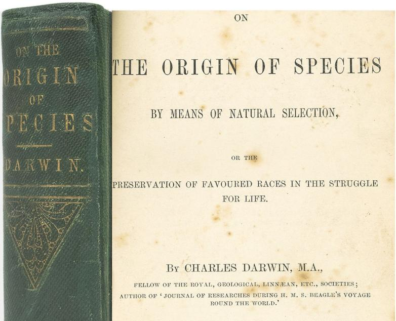

:::

::: {.column}

::: {.incremental}
- Darwin y Wallace (1858-1859) propusieron seleccion natural.
- La seleccion requiere variacion heredable.
- Sin una buena teoria de herencia, la explicacion quedaba incompleta.
:::

:::

:::

## Herencia por mezcla: una dificultad

::: {.columns}

::: {.column}

- Los descendientes son una mezcla de ambos padres.
- Los alelos se mezclarían para formar un alelo completamente nuevo.
- Los rasgos mezclados se transmiten a las siguientes generaciones.
- La variación se diluye con el tiempo.

:::

::: {.column}

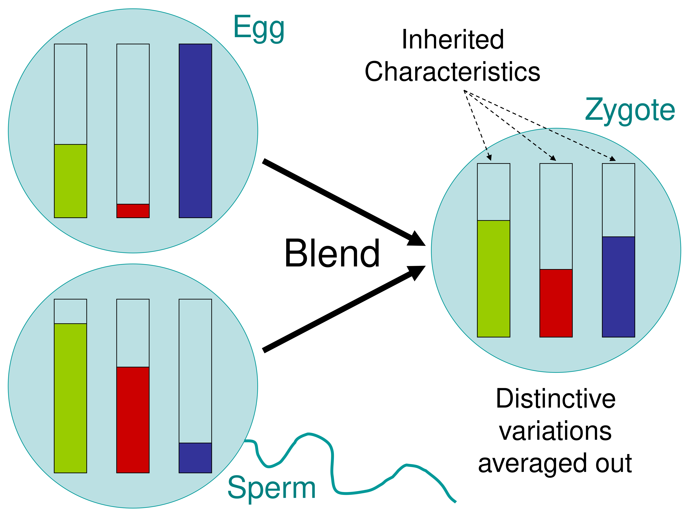{width=80%}

:::

:::

## Herencia por mezcla

- No se mantiene la variacion entre generaciones
- No queda variacion heredable para que actue la seleccion natural
- No se puede explicar la adaptacion a largo plazo

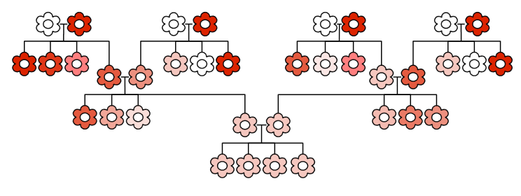

## Mendel cambia el panorama: herencia particulada

::: {.columns}

::: {.column}

::: {.fragment}

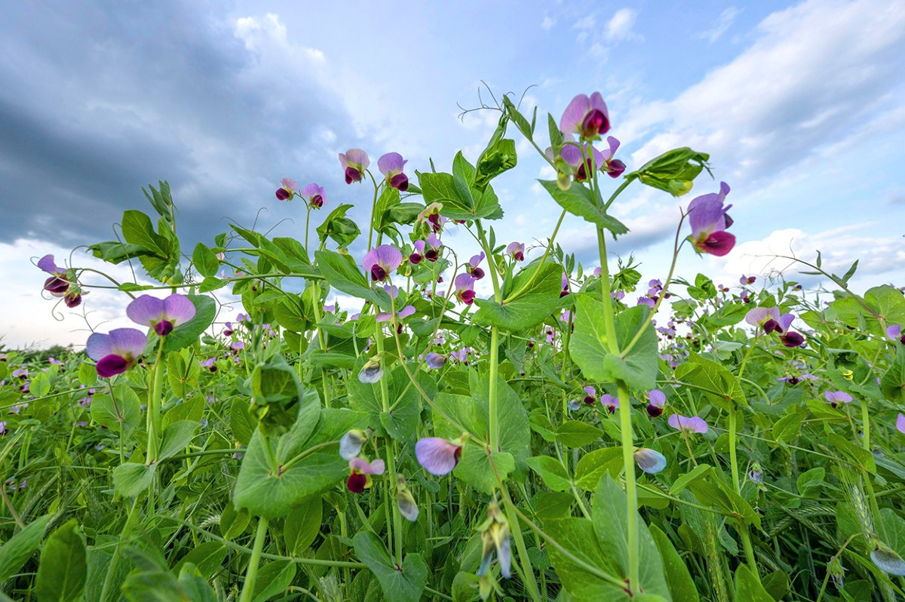

:::

:::

::: {.column}

::: {.incremental}

- Los descendientes son una combinación de ambos padres.
- Los rasgos de ambos padres se transmiten a la siguiente generación como entidades separadas.
- La variación se mantiene a lo largo del tiempo.
- Los alelos se segregan y recombinan en cada generación.

:::

:::

:::

## Segregacion equitativa

::: {.columns}

::: {.column}

- Cada individuo diploide tiene dos alelos por locus.
- En meiosis, los dos alelos se separan.
- Cada gameto recibe solo uno, con probabilidad 1/2.

:::

::: {.column}

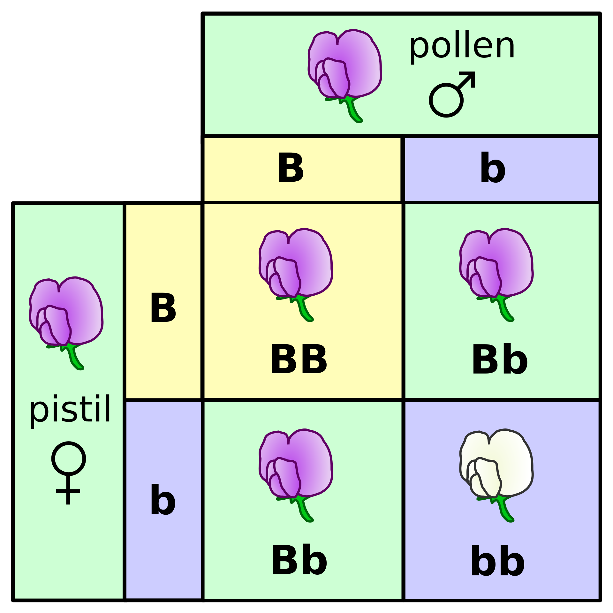

:::

:::

## Surtido independiente {.smaller}

::: {.columns}

::: {.column}

- Alelos de loci distintos se distribuyen de forma independiente en los gametos.
- Esto ocurre cuando los loci no estan ligados (o estan muy separados).
- Se generan combinaciones nuevas de alelos en cada generacion.

:::

::: {.column}

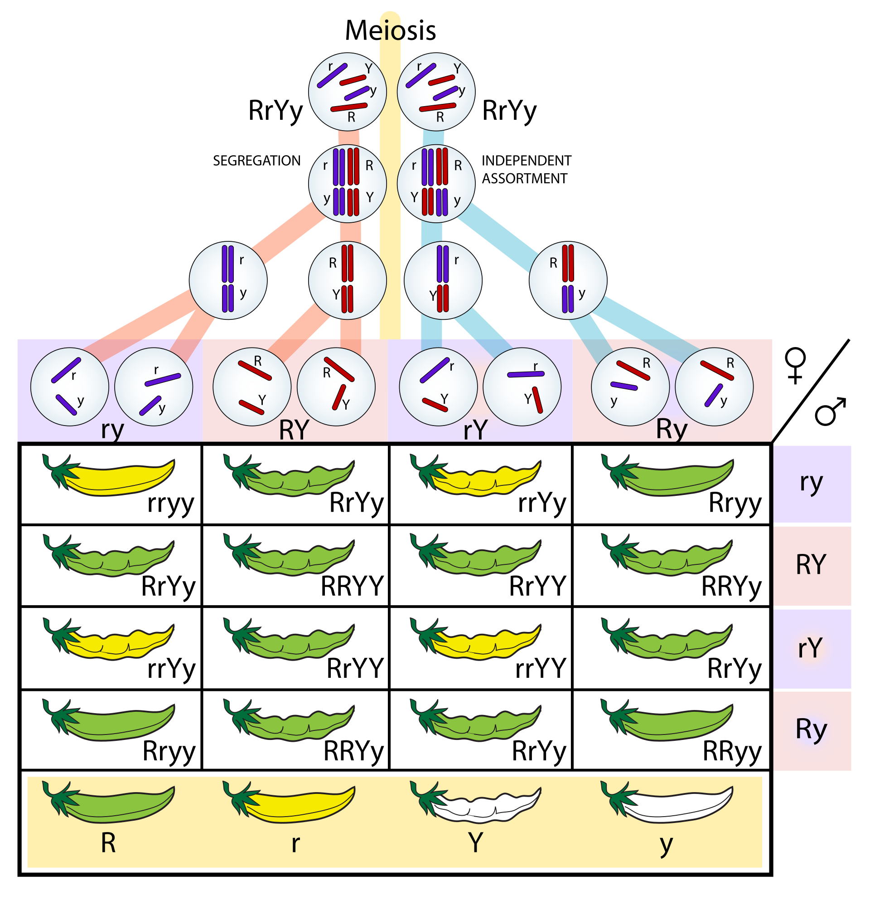

:::

:::

::: {.fragment}
> Aumenta la variacion genotipica sobre la que puede actuar la seleccion.
:::

## Resumen: Herencia particulada y evolucion

::: {.incremental}
- Segregacion + surtido permiten predecir proporciones esperadas.
- La seleccion cambia frecuencias alelicas.
- La variacion se conserva y se reorganiza cada generacion.
:::

# El principio de Hardy-Weinberg {background-color="#E8F5E9"}

## Modelo nulo {.smaller}

> Que esperamos observar si no actua ninguna fuerza evolutiva?

::: {.fragment}
::: {.incremental}
- Frecuencias alélicas permanecen constantes de una generación a otra.
- Las frecuencias genotípicas se estabilizan en las proporciones de Hardy-Weinberg.
- La diversidad genética existente se mantiene.
- Aunque las frecuencias en un locus no cambian, la recombinación puede generar nuevas combinaciones multilocus de alelos.
:::
:::

::: {.fragment}

> HW describe estabilidad en las frecuencias alélicas de un locus, no ausencia de variación entre individuos.

:::

## Supuestos de Hardy-Weinberg

::: {.incremental}
- Apareamiento aleatorio.
- Poblacion muy grande.
- Sin seleccion natural.
- Sin mutacion.
- Sin migracion (flujo genico).
:::

::: {.fragment}
Si los datos no ajustan, al menos un supuesto puede estar fallando.
:::

# Ejemplo visual {background-color="#E8F5E9"}

## Antes de cualquier evento: allelos

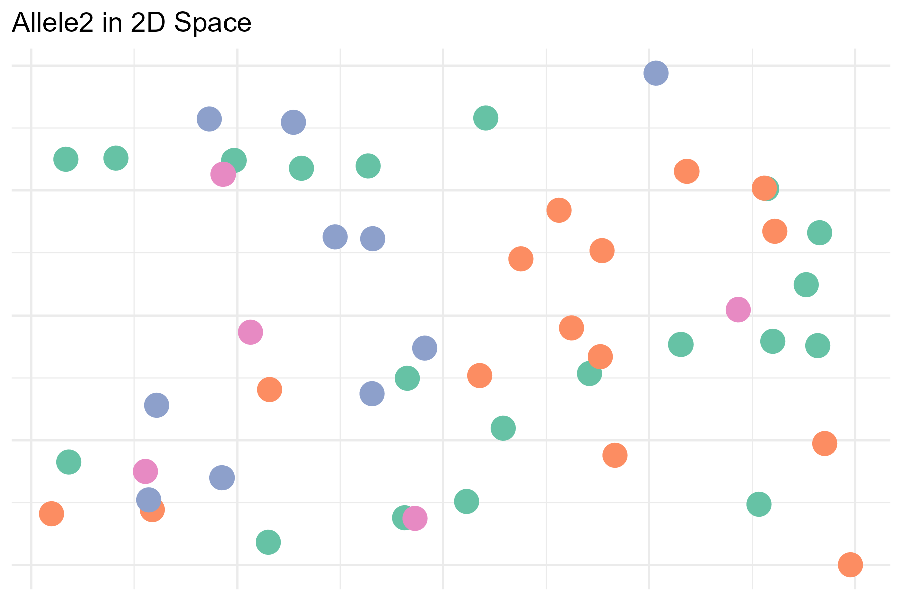{width=60%}

## Antes de cualquier evento: allelos y frecuencias

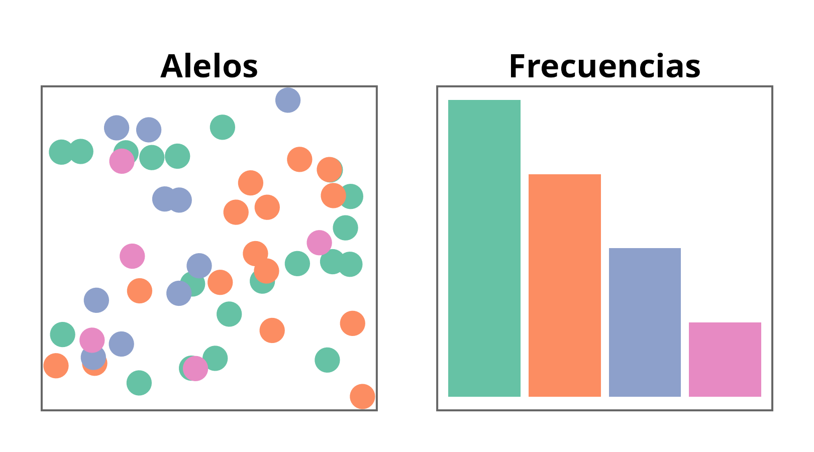{width=50%}

## Hardy-Weinberg: apareamiento aleatorio

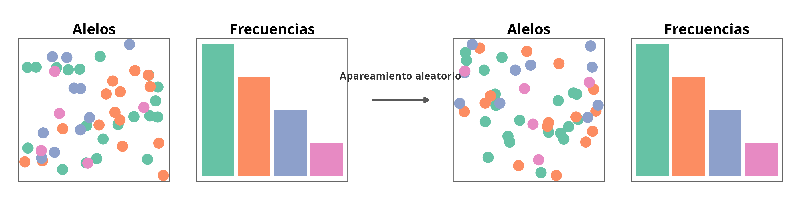{width=100%}

## Seleccion natural: antes

{width=50%}

## Seleccion natural: despues

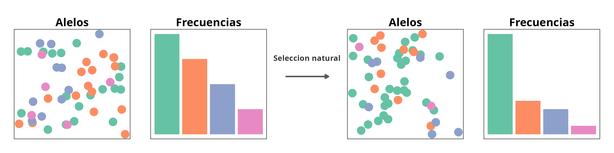{width=100%}

## Deriva genetica: antes

{width=50%}

## Deriva genetica: despues

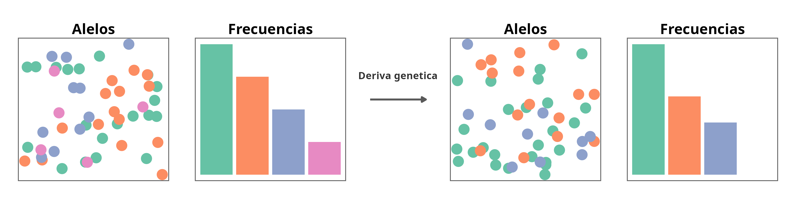{width=100%}

## Mutacion: antes

{width=50%}

## Mutacion: despues

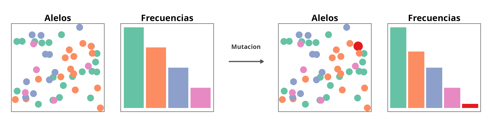{width=100%}

## Migracion: antes

{width=50%}

## Migracion: despues

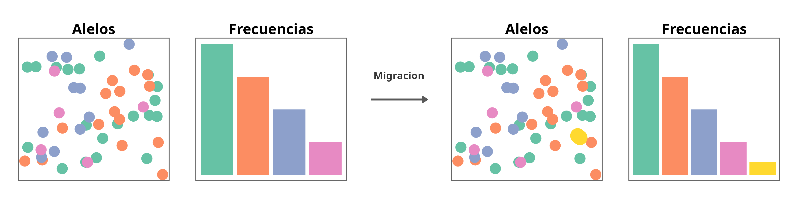{width=100%}

# Ejemplo numerico {background-color="#E8F5E9"}

## Datos y ecuaciones
Poblacion de plantas con dos alelos:

::: {.columns}

::: {.column width="40%"}

- $A$ (morado)
- $a$ (blanco)

Frecuencias:

- $p = 0.6$
- $q = 0.4$
:::

::: {.column width="60%"}
::: {.fragment}
$$
p + q = 1
$$

$$
p^2 + 2pq + q^2 = 1
$$
:::

::: {.fragment}

::: {.incremental}
- $AA = p^2 = 0.6^2 = 0.36$
- $Aa = 2pq = 2(0.6)(0.4) = 0.48$
- $aa = q^2 = 0.4^2 = 0.16$
:::

:::

:::

:::

## Comparar esperado vs observado 

::: {.columns}

::: {.column width="50%"}
**Caso 1: ajuste aproximado**

Esperado (100): 36, 48, 16

Observado: 36, 46, 18

::: {.fragment}
Compatible con Hardy-Weinberg.
:::
:::

::: {.column width="50%"}
::: {.fragment}
**Caso 2: desviacion clara**

Esperado (100): 36, 48, 16

Observado: 48, 30, 22

Deficit fuerte de heterocigotos.
:::
:::

:::

## Prueba chi-cuadrado

Comparamos observado ($O$) vs esperado ($E$):

$$
\chi^2 = \sum \frac{(O - E)^2}{E}
$$

::: {.fragment}
Para cada categoria (aqui, cada genotipo), calculamos la diferencia entre observado y esperado, la escalamos por el esperado, y luego sumamos todas.
:::

::: {.fragment}
El cuadrado hace que todas las desviaciones cuenten como positivas y penaliza mas las diferencias grandes.
:::

::: {.fragment}
Mientras mayor sea $\chi^2$, mayor es la desviacion respecto a Hardy-Weinberg.
:::

## Chi-cuadrado: caso 1

**Caso 1: ajuste aproximado**

$$
\chi^2 = \frac{(36-36)^2}{36} + \frac{(46-48)^2}{48} + \frac{(18-16)^2}{16}
$$

$$
\chi^2 = 0 + 0.083 + 0.25 = 0.333
$$

::: {.fragment}
Valor pequeno: compatible con ajuste aproximado.
:::

## Chi-cuadrado: caso 2

**Caso 2: desviacion clara**

$$
\chi^2 = \frac{(48-36)^2}{36} + \frac{(30-48)^2}{48} + \frac{(22-16)^2}{16}
$$

$$
\chi^2 = 4 + 6.75 + 2.25 = 13
$$

::: {.fragment}
Valor grande: desviacion marcada de Hardy-Weinberg.
:::

# Extra {background-color="#E8F5E9"}

## 3 alelos en una poblacion diploide (sistema ABO)

En el sistema ABO hay 3 alelos en un locus: $I^A$, $I^B$ e $i$.

Frecuencias alelicas:
$$
?
$$

Frecuencias genotipicas esperadas bajo HW:
$$
?
$$

## 3 alelos en una poblacion diploide (sistema ABO)

En el sistema ABO hay 3 alelos en un locus: $I^A$, $I^B$ e $i$.

Frecuencias alelicas:
$$
p + q + r = 1
$$

Frecuencias genotipicas esperadas bajo HW:
$$
p^2 + q^2 + r^2 + 2pq + 2pr + 2qr = 1
$$

## Sistema ABO: genotipos y fenotipos esperados {.smaller}

Esto produce 6 clases genotipicas y 4 fenotipos esperados:

::: {.columns}

::: {.column}

- 3 homocigotos: $I^AI^A$, $I^BI^B$, $ii$
- 3 heterocigotos: $I^AI^B$, $I^Ai$, $I^Bi$

:::

::: {.column}

Fenotipos ABO:

- Tipo A: $I^AI^A$ o $I^Ai$
- Tipo B: $I^BI^B$ o $I^Bi$
- Tipo AB: $I^AI^B$
- Tipo O: $ii$

:::

:::

::: {.fragment}
> Recordatorio: $I^A$ e $I^B$ son codominantes, y ambos dominan sobre $i$.
:::

## Y si la especie es poliploide?

::: {.incremental}
- Muchas especies de plantas no son diploides.
- Ejemplo: papa cultivada (*Solanum tuberosum*), frecuentemente tetraploide.
- En tetraploides, para dos alelos se expande $(p+q)^4$.
:::

## Hardy-Weinberg en tetraploides (papa)

$$
(p + q)^4 = p^4 + 4p^3q + 6p^2q^2 + 4pq^3 + q^4
$$

::: {.fragment}
Cada termino representa clases genotipicas con 4 copias alelicas (por ejemplo, AAAa, AAaa, Aaaa).
:::

::: {.fragment}
> En sistemas no modelo, estimar frecuencias alelicas/genotipicas puede volverse rapidamente complejo.
:::

# Cierre {background-color="#E8F5E9"}

Hardy-Weinberg no dice que las poblaciones reales "no evolucionan".

::: {.fragment}
Nos da una referencia para detectar cuando y como pueden estar evolucionando.
:::

## Resumen

1. Seleccion natural necesita variacion heredable persistente.
2. Mendel explico como se conserva la variacion.
3. El principio de Hardy-Weinberg ofrece una linea base cuantitativa.
4. Las desviaciones de Hardy-Weinberg guian preguntas evolutivas.
