## Metas

1. La mutación como la fuente última de nueva variación genética.
2. Como allelos discretos pueden generar variación continua a través de la herencia poligénica.
3. Entender que la mutación es un proceso aleatorio, no dirigido por las necesidades del organismo.

## Ser capaces de {.smaller}

::: {.incremental}
- Explicar por qué la mutación es la única fuente de nuevas variantes alélicas.
- Describir los tipos básicos de mutaciones y cómo afectan el ADN.
- Reconocer que las mutaciones son procesos aleatorios, no dirigidos por necesidades del organismo.
- Integrar el concepto de mutación con el equilibrio de Hardy-Weinberg para entender cómo se introducen nuevas variantes en las poblaciones.
- Integrar el concepto de mutación con el modelo de herencia poligénica para explicar la variación continua.
:::

# Evolucion y herencia {background-color="#E8F5E9"}

## Hasta ahora hemos visto que

* Los individuos difieren en muchos rasgos.
* Parte de esa variación es heredable.
* Sin fuerzas evolutivas:
    - las frecuencias alélicas no cambian, 
    - las frecuencias genotípicas se ajustan a Hardy-Weinberg, 
    - la población está en equilibrio.


::: {.fragment}

Pero queda una pregunta:

> ¿De dónde provienen las nuevas variantes genéticas?

:::

## Darwin tenía una explicación incompleta

La selección natural requiere:

1. Variación entre individuos.
2. Herencia de parte de esa variación.
3. Diferencias en supervivencia o reproducción.

::: {.fragment}

> Sin embargo, Darwin no conocía el mecanismo de la herencia.

:::


## El aporte de Mendel {.smaller}

::: {.columns}

::: {.column}

Los experimentos de Mendel mostraron que:

* Los rasgos se heredan mediante unidades discretas.
* Las variantes hereditarias no se mezclan.
* Los alelos pueden mantenerse ocultos durante generaciones.

:::

::: {.column}

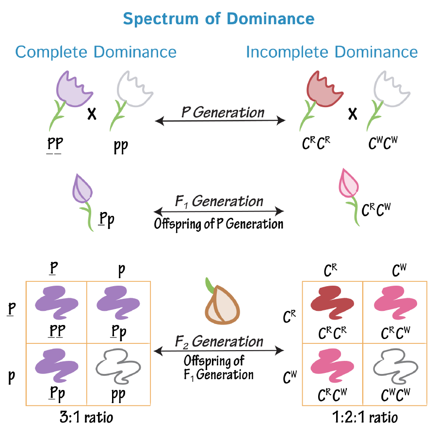

:::

:::


::: {.fragment}


Esto resolvió uno de los principales problemas de la teoría de Darwin: ¿cómo se mantiene la variación a lo largo del tiempo?

:::

## Una limitación importante

Mendel trabajó principalmente con rasgos:

* Cualitativos
* Fácilmente clasificables

::: {.fragment}

Por ejemplo:

* Semillas lisas o rugosas
* Flores púrpuras o blancas

:::


---

## ¿Y los rasgos continuos? 

Muchos rasgos biológicos muestran variación continua:

* Estatura
* Peso
* Producción de semillas
* Tamaño corporal


::: {.fragment}

> A finales del siglo XIX no estaba claro cómo la herencia mendeliana podía producir este tipo de variación.

:::

# Herencia poligénica {background-color="#E8F5E9"}

Puente conceptual clave entre genética, la variación cuantitativa, y la evolución. **El inicio de genética cuantitativa.**

## La aparente contradicción {.smaller}

::: columns
::: {.column width="50%"}
### Mendelianos

Observaban rasgos como:

* Flores púrpuras vs blancas
* Semillas lisas vs rugosas
* Presencia vs ausencia de un rasgo


::: {.fragment}

> La herencia es particulada y discreta.

:::

:::

::: {.column width="50%"}
### Biometristas

Medían rasgos como:

* Estatura
* Peso
* Producción de leche
* Tamaño de pico


::: {.fragment}

> La variación observada es continua.

:::

:::
:::


::: {.fragment}

> Si la herencia es discreta, ¿por qué muchos rasgos se ven continuos?

:::


## Ronald Fisher y la herencia poligénica

::: columns
::: {.column width="45%"}

| Genotipo | Contribución a estatura |
| -------- | ----------------------- |
| AA       | Alta                    |
| Aa       | Intermedia              |
| aa       | Baja                    |

Aparecen tres categorías claras.
:::

::: {.column width="55%"}
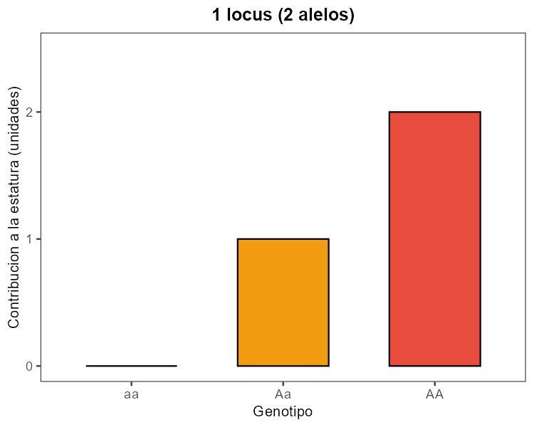{fig-alt="Un locus con tres genotipos y tres contribuciones de estatura." width=100%}
:::
:::

---

## Ahora imagina 2 loci

::: columns
::: {.column width="45%"}
| Locus 1 | Locus 2 |
| ------- | ------- |
| A/a     | B/b     |

Si cada alelo mayúscula aporta +1 unidad, tendramos genotipos con 0, 1, 2, 3 o 4 unidades.
:::

::: {.column width="55%"}
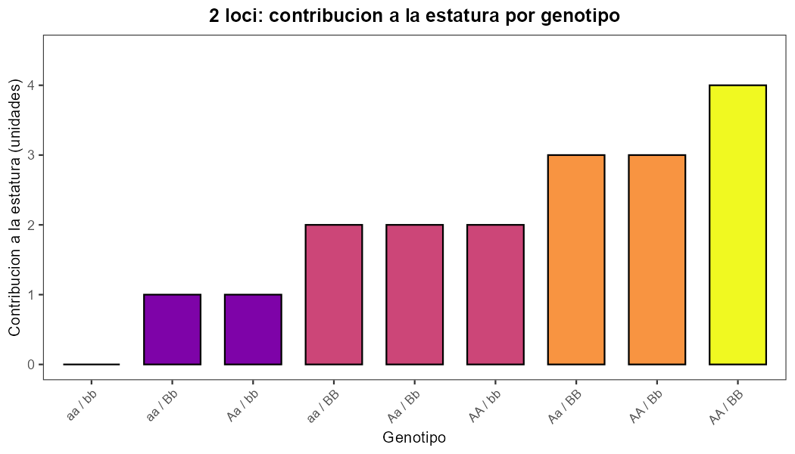{fig-alt="Contribucion a la estatura por genotipo para 2 loci." width=100%}
:::
:::

---

## 2 loci: agregando efecto genotipo x ambiente (GxE)

::: columns
::: {.column width="45%"}
Ahora agregamos un efecto de interacción genotipo por ambiente (GxE):

* Barras claras de fondo: valor con GxE
* Barras oscuras frontales: valor genético base
:::

::: {.column width="55%"}
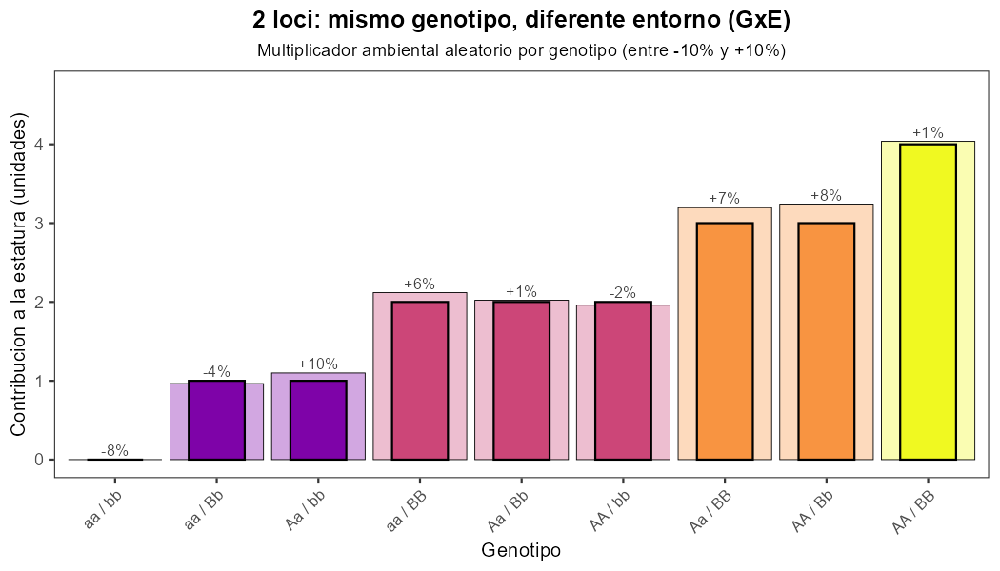{fig-alt="Contribucion a la estatura por genotipo en 2 loci con efecto genotipo por ambiente entre -10% y +10%." width=100%}
:::
:::

---

## Los mismos 2 loci, resumidos en población

::: columns
::: {.column width="40%"}
Al agrupar genotipos por su contribución total, vemos una distribución por frecuencias.

Este paso conecta genotype-by-genotype con patrón poblacional.
:::

::: {.column width="60%"}
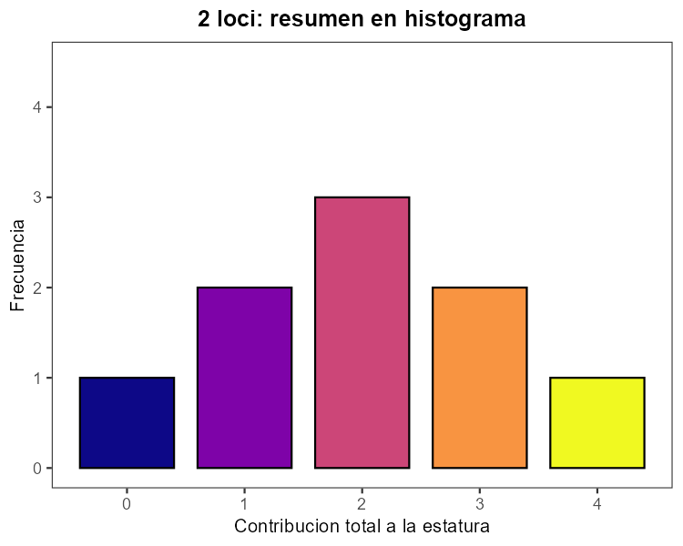{fig-alt="Histograma de frecuencias para 2 loci." width=100%}
:::
:::

---

## 10 loci

::: columns
::: {.column width="45%"}
```text
A/a
B/b
C/c
D/d
...
J/j
```

Cada alelo mayúscula aporta una pequeña parte.

Rango posible:

```text
0 a 20 contribuciones
```

El fenotipo empieza a verse continuo.
:::

::: {.column width="55%"}
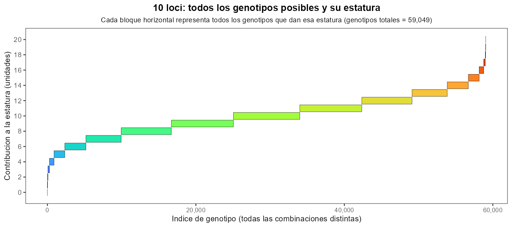{fig-alt="Mapa de todos los genotipos posibles y su contribucion a la estatura para 10 loci." width=100%}
:::
:::

## Nivel poblacional: simulación con 5 loci

::: columns
::: {.column width="40%"}
Con muchos individuos, la distribución de fenotipos empieza a tomar forma de campana.
:::

::: {.column width="60%"}
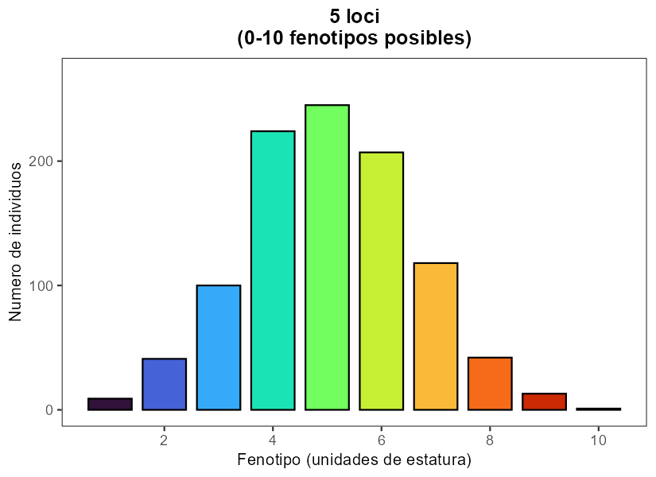{fig-alt="Histograma de fenotipos en una poblacion simulada para 5 loci." width=100%}
:::
:::

## Nivel poblacional: simulación con 10 loci

::: columns
::: {.column width="40%"}
Aumentar loci incrementa el número de combinaciones genéticas y densifica el continuo fenotípico.
:::

::: {.column width="60%"}
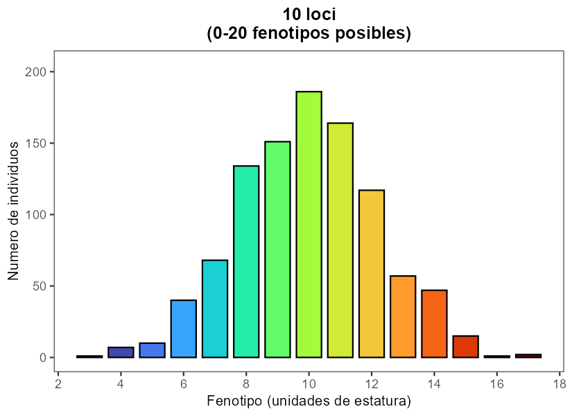{fig-alt="Histograma de fenotipos en una poblacion simulada para 10 loci." width=100%}
:::
:::

## Nivel poblacional: simulación con 20 loci

::: columns
::: {.column width="40%"}
Con más loci, el patrón poblacional se acerca aún más a una distribución continua.
:::

::: {.column width="60%"}
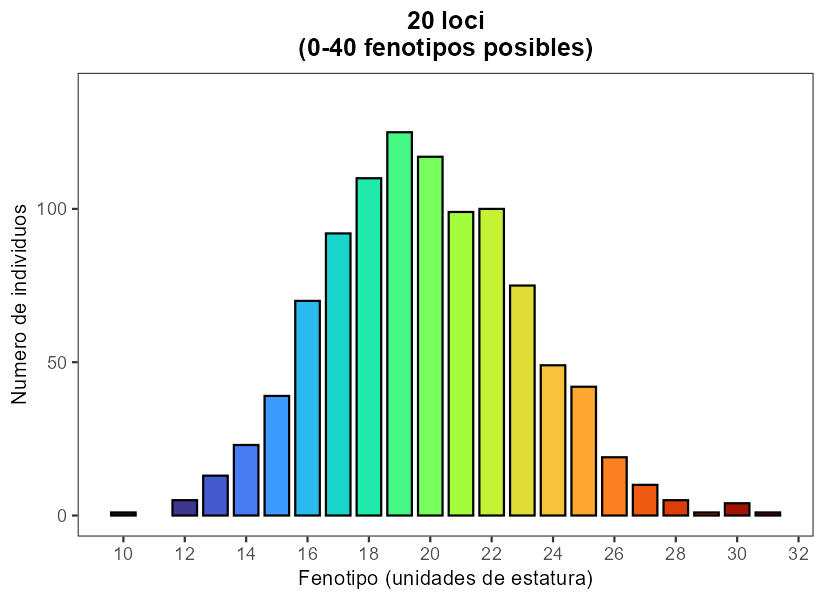{fig-alt="Histograma de fenotipos en una poblacion simulada para 20 loci." width=100%}
:::
:::

## Progresión general

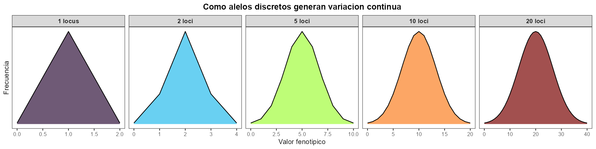{fig-alt="Comparacion de distribuciones fenotipicas al aumentar el numero de loci que contribuyen al rasgo." width=100%}

Resumen:

* Pocos loci: categorías más separadas.
* Muchos loci: variación más suave.
* La herencia sigue siendo mendeliana en cada locus.


# ?De dónde proviene la variación genética? {background-color="#E8F5E9"}

## ¿Cómo aparecen nuevas variantes?

- Mendel explicó cómo se transmiten variantes existentes.

- Fischer explico cómo la herencia poligénica puede generar variación continua.

Pero seguía faltando una explicación para:

> ¿Cómo surgen nuevos alelos?

---

## Thomas Hunt Morgan y Drosophila

A principios del siglo XX, Morgan observó la aparición espontánea de nuevas variantes hereditarias en moscas de la fruta.


::: {.columns widths="60% 40%"}

::: {.column}

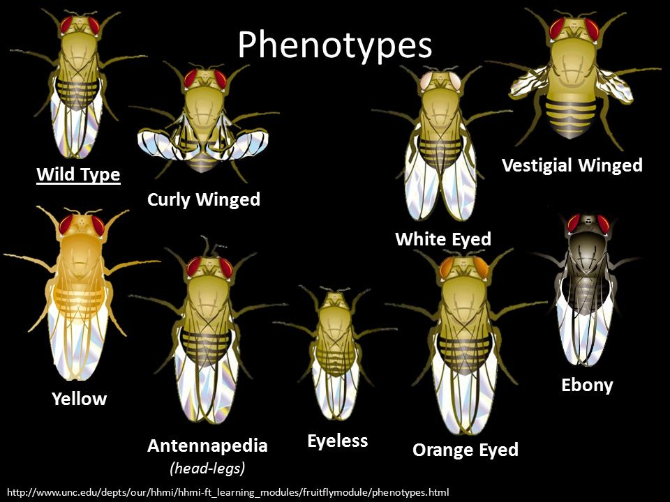{fig-alt="Mutaciones en mosca de la fruta." width=100%}

:::

::: {.column}


::: {.fragment}


Estas variantes:

* Eran heredables.
* Aparecían de manera aparentemente espontánea.
* Podían seguir las reglas mendelianas.

:::

:::

:::


## Definición

Una mutación es:

> Un cambio heredable en la secuencia del ADN.

Las mutaciones generan nuevos alelos que pueden transmitirse a generaciones futuras.

## Mutación vs selección natural

::: {.fragment}

La mutación:

* Produce nuevas variantes genéticas.

:::


::: {.fragment}

La selección natural:

* Cambia la frecuencia de esas variantes.

:::


## ¿La selección produce mutaciones?


::: {.fragment}

> No.

:::


::: {.fragment}

La secuencia correcta es:

> Mutación → Variación → Selección

:::


::: {.fragment}

> La seleccion natural actua sobre el fenotipo, no sobre la mutación o el genotipo.

:::


## ¿Cómo ocurren las mutaciones?

Cada vez que una célula copia su ADN pueden ocurrir errores.

La mayoría son corregidos.

Algunos permanecen y se convierten en mutaciones.

## Mutágenos: Factores que aumentan la tasa de mutación

Ejemplos:

* Radiación UV
* Rayos X
* Algunos compuestos químicos


::: {.fragment}

Importante:

> Los mutágenos aumentan la frecuencia de mutaciones, pero no las dirigen hacia lo que el organismo necesita.

:::

## ¿Todas las mutaciones son dañinas?

::: {.fragment}

> No.

:::


::: {.fragment}

Las mutaciones pueden ser:

* Dañinas
* Neutras
* Beneficiosas

:::

## El destino de una mutación nueva

Cuando surge una nueva mutación:

* Aparece en un único individuo.
* Comienza a muy baja frecuencia.
* Puede perderse por azar.


::: {.fragment}

> La mayoría de las mutaciones nuevas generalmente son muy raras

:::

# Tipos de mutaciones y su importancia evolutiva {background-color="#E8F5E9"}

## Dos grandes escalas

Las mutaciones pueden organizarse en dos grupos:

1. Mutaciones de pequeña escala (puntuales)
2. Mutaciones cromosómicas (gran escala)

## Mutaciones de pequeña escala (puntuales)

Afectan pocos nucleótidos.

Incluyen:

* Sustituciones (una base por otra)
* Inserciones (se agregan bases)
* Deleciones (se eliminan bases)

Pueden alterar un codón, varios codones o el marco de lectura.

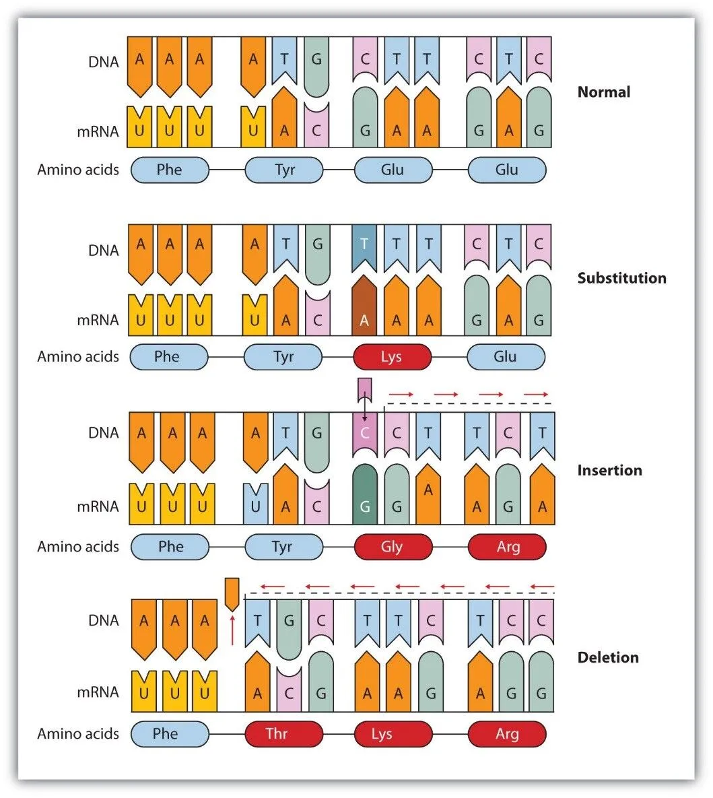{fig-alt="Esquema de mutaciones puntuales: sustituciones, inserciones y deleciones." width=100%}

## Sustituciones: tres resultados {.smaller}

::: {.columns}

::: {.column}

::: {.incremental }
* Silenciosa (silent): cambia el codón pero no cambia el aminoácido.
* Con cambio de sentido (missense): cambia el aminoácido.
* Sin sentido (nonsense): convierte un codón en stop prematuro.


:::

:::

::: {.column}

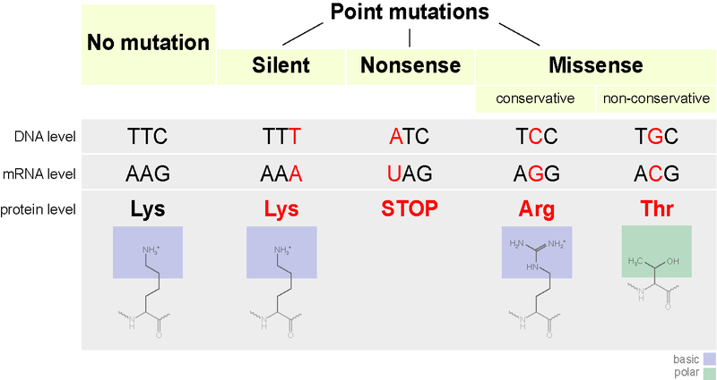{fig-alt="Esquema de tipos de sustituciones: silenciosa, con cambio de sentido y sin sentido." width=100%}

:::

:::

## Inserciones y deleciones {.smaller}

Si la inserción/deleción no es múltiplo de 3:

* produce desplazamiento de marco (frameshift),
* cambia todos los codones siguientes,
* suele tener efectos grandes.

Si es múltiplo de 3:

* se agregan o eliminan aminoácidos sin cambiar el marco completo.
* puede tener efectos variables dependiendo de la función de la región afectada.

## Ejemplos

::: {.columns}

::: {.column}


```text

# original
ATG CCT GAA TGA
|   |   |   |
Ala Pro Glu Stop

# after insertion of one base
ATG CCT GGA ATG A
|   |   |   |   |
Ala Pro Gly Met Stop


# after deletion of one base
ATG CCT GAT GA
|   |   |   |
Ala Pro Asp Stop

```
:::

::: {.column}

```text

# original
ATG CCT GAA TGA
|   |   |   |
Ala Pro Glu Stop

# after insertion of three bases
ATG CCT GAA TTT TGA 
|   |   |   |   |
Ala Pro Glu Phe Stop

# after deletion of three bases
ATG CCT TGA
|   |   |
Ala Pro Stop
```

:::

:::


## Mutaciones cromosómicas (gran escala)

Afectan segmentos grandes o cromosomas completos.

* Deleciones grandes
* Duplicaciones
* Inversiones
* Translocaciones
* Aneuploidías (pérdida o ganancia de cromosomas)

---

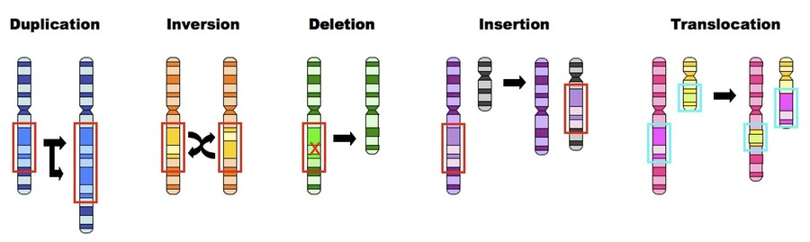{fig-alt="Esquema de mutaciones cromosómicas." width=100%}

## Germinales vs somáticas

* Germinal (línea germinal): ocurre en células que forman gametos; puede heredarse a la descendencia; importa directamente para evolución entre generaciones.
* Somática: ocurre en células del cuerpo; afecta al individuo pero normalmente no se hereda; es relevante para cáncer, mosaicos y envejecimiento.

## Implicaciones evolutivas {.smaller}

No todos los tipos de mutación aportan el mismo "material" para evolución.

* Sustituciones silenciosas: suelen comportarse como casi neutras.
* Missense y nonsense: cambian función proteica; pueden ser dañinas, neutras o (raramente) beneficiosas.
* Inserciones/deleciones con frameshift: frecuentemente tienen efectos grandes y deletéreos.
* Cambios regulatorios: pueden modificar cuándo, dónde y cuánto se expresa un gen.
* Duplicaciones: crean copias extra que pueden divergir funcionalmente.

## Duplicación génica y destinos evolutivos {.smaller}

Una duplicación crea dos copias del mismo gen. A partir de ahí, hay varios destinos:

1. Pseudogenización: una copia acumula mutaciones y pierde función.
2. Subfuncionalización: cada copia retiene parte de la función ancestral.
3. Neofuncionalización: una copia adquiere una función nueva.


::: {.fragment}

> Las duplicaciones abren espacio para innovación evolutiva sin perder de inmediato la función original.

:::

---

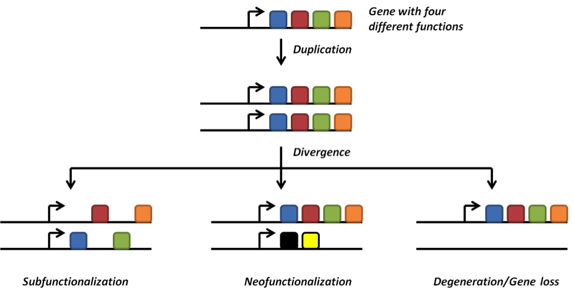{fig-alt="Esquema de destinos evolutivos de una duplicación génica: pseudogenización, subfuncionalización y neofuncionalización." width=100%}


::: {.fragment}

Ejemplo: 
- globinas (hemoglobina y mioglobina) surgieron por duplicación y neofuncionalización.
- fetal vs adulto: hemoglobina fetal tiene mayor afinidad por oxígeno que la adulta, lo que es crucial para el intercambio de gases en el útero.
- proteínas antifreeze en peces antárticos surgieron por duplicación y neofuncionalización de un gen de rol digestivo.

:::

## Resumen

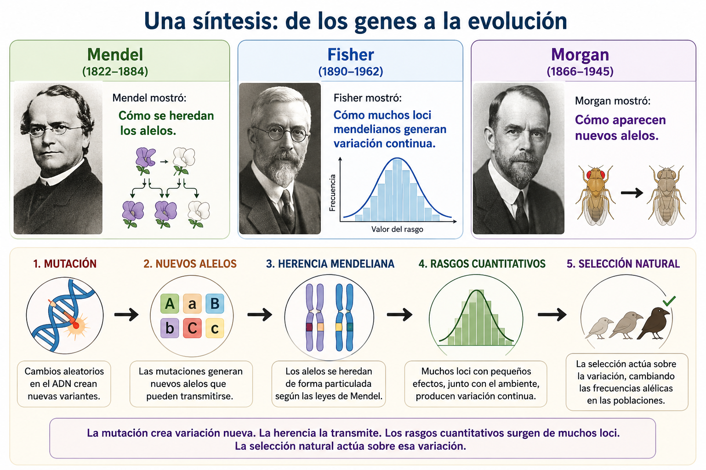

---

# Recursos adicionales:

- https://www.bbc.co.uk/bitesize/guides/zk9vhbk/test
- https://www.khanacademy.org/science/hs-bio/x230b3ff252126bb6:gene-expression-and-regulation/x230b3ff252126bb6:mutations/v/mutation-as-a-source-of-variation