## Metas

Introducir:

1. La selección natural y adaptación
2. Cómo la selección natural actúa sobre la variación genética
3. Hardy-Weinberg y selección
4. Diferentes tipos de selección

## Ser capaces de

::: {.incremental}

* Definir selección natural como cambio en frecuencias alélicas debido a diferencias en aptitud.
* Definir algunos de los diferentes tipos de selección (balanceadora, disruptiva, direccional).
* Reconocer cómo la selección mantiene alelos (diversidad genetica) a través de la ventaja del heterocigoto.
* Definir adaptacion como un rasgo heredable que origino por seleccion natural y aumenta la aptitud relativa.
* Entender la diferencia entre evolucion y adaptacion.
:::

## ¿Qué es la selección natural? {background-color="#E8F5E9"}

> **Selección natural**: proceso evolutivo donde los individuos con ciertos rasgos heredables tienen mayor supervivencia o reproducción que otros, causando cambios en las frecuencias alélicas dentro de poblaciones a lo largo del tiempo.

::: {.incremental}

* Requiere **variación heredable** en la población.
* Requiere **diferencias en aptitud** (supervivencia o reproducción) entre genotipos.
* Resultado: **cambio en frecuencias alélicas** de una generación a la siguiente.

:::

## Anemia falciforme

## El locus de anemia falciforme {.smaller}

* A = hemoglobina normal
* S = alelo falciforme

| Genotipo | Fenotipo          |
| -------- | ----------------- |
| AA       | normal            |
| AS       | portador          |
| SS       | anemia falciforme |

::: {.fragment}

La paradoja:

* SS tiene baja supervivencia.
* Sin embargo, S no desaparece.

> Si SS es tan dañino, ¿qué debería pasar con S según nuestra intuición?

:::

---

## Frecuencia del alelo de anemia falciforme

---

> ¿Por qué un alelo que causa una enfermedad grave sigue siendo relativamente común en algunas poblaciones humanas?

::: {.fragment}

> **Selección natural**. 

:::

::: {.fragment}

¡Veamos cómo!

:::

## Malaria

::: {.columns}

::: {.column}

:::

::: {.column}

:::

:::

## Distribuciones geográficas

::: {.fragment}

> **Las poblaciones humanas con alta frecuencia del alelo de anemia falciforme viven en regiones con alta incidencia de malaria.** 

:::

::: {.fragment}

¿Podría ser que el alelo de anemia falciforme sea de alguna forma útil para la resistencia a la malaria?

:::

## Anemia falciforme y malaria {.smaller}

> Los heterocigotos para anemia falciforme (AS) presentan menor riesgo de malaria grave que los homocigotos normales (AA).

::: {.incremental}

- Los heterocigotos producen principalmente eritrocitos normales, pero una fracción contiene hemoglobina S.
- Cuando un eritrocito es infectado por _Plasmodium falciparum_, el estrés fisiológico dentro de la célula favorece la deformación falciforme.
- Los eritrocitos infectados y deformados son reconocidos y removidos más rápidamente por el bazo.
- Como consecuencia, la carga parasitaria suele mantenerse más baja que en individuos AA.
- Esto reduce el riesgo de malaria grave y aumenta la supervivencia en regiones donde la malaria es común.
:::

---

## Combinando las dos presiones selectivas {.smaller}

| Genotipo | Malaria              | Anemia falciforme |
| -------- | -------------------- | ----------------- |
| AA       | Alta susceptibilidad | No                |
| AS       | Protección parcial   | No o muy leve     |
| SS       | Protección parcial   | Grave             |

## Agregando aptitud {.smaller}

| Genotipo | Malaria              | Anemia falciforme | Aptitud    |
| -------- | -------------------- | ----------------- | ---------- |
| AA       | Alta susceptibilidad | No                | Intermedia |
| AS       | Protección parcial   | No o muy leve     | Alta       |
| SS       | Protección parcial   | Grave             | Baja       |

---

# Ojo! {background-color="#E8F5E9"}

> La selección natural ocurre dentro de una generación, cuando algunos individuos sobreviven o se reproducen más que otros.

> La evolución se observa entre generaciones, cuando esas diferencias producen cambios en las frecuencias alélicas de la población.

## Población en Hardy-Weinberg {.smaller}

::: {.incremental}
* $p = 0.6; q = 0.4$
* $f(AA) = p^2 = 0.36; N_{AA} = 400 * 0.36 = 144$ 
* $f(AS) = 2pq = 0.48; N_{AS} = 400 * 0.48 = 192$ 
* $f(SS) = q^2 = 0.16; N_{SS} = 400 * 0.16 = 64$ 
:::

## Selección natural {.smaller}

::: {.incremental}
- Seleccion natural
- De un lado la anemia falciforme selecciona fuerte contra `SS`
- De otro lado la malaria selecciona mas fuerte contra `AA`
- Algunos individuos no sobreviven
:::

## Selección natural {.smaller}

::: {.incremental}
- Algunos individuos no sobreviven
- La probabilidad de sobrevivir no es igual para todos los genotipos
- La supervivencia diferencial cambia las frecuencias alélicas
- La población en este momento **no está en equilibrio Hardy-Weinberg**
:::

## Selección natural {.smaller}

::: {.incremental}
* $N_{A} = 397; p = f(A) = \frac{N_{A}}{319 * 2} = 0.622$
* $N_{S} = 241; q = f(S) = \frac{N_{S}}{319 * 2} = 0.378$
* $f(AA) = p^2 = 0.622^2 = 0.387; N_{AA} = 319 * 0.387 \approx 123$
* $f(AS) = 2pq = 2 \times 0.622 \times 0.378 = 0.470; N_{AS} = 319 * 0.470 \approx 150$
* $f(SS) = q^2 = 0.378^2 = 0.143; N_{SS} = 319 * 0.143 \approx 46$
:::

## Apareamiento aleatorio {.smaller}

{width=100%}

::: {.incremental}
- Los sobrevivientes se aparean al azar
- Los cigotos vuelven a estar en proporciones de Hardy-Weinberg
- Pero ahora parten de frecuencias alélicas ligeramente distintas
- Es decir, están en euquilibrio Hardy-Weinberg pero para las nuevas frecuencias alélicas
:::

## Apareamiento aleatorio {.smaller}

{width=100%}

::: {.incremental}
* $N_{A} = 498; p = f(A) = \frac{N_{A}}{319 * 2} = 0.622$
* $N_{S} = 140; q = f(S) = \frac{N_{S}}{319 * 2} = 0.378$
* $f(AA) = p^2 = 0.622^2 = 0.387; N_{AA} = 400 * 0.387 \approx 155$
* $f(AS) = 2pq = 2 \times 0.622 \times 0.378 = 0.470; N_{AS} = 400 * 0.470 \approx 188$
* $f(SS) = q^2 = 0.378^2 = 0.143; N_{SS} = 400 * 0.143 \approx 57$
:::

## Y si la frecuencia de alelo falciforme `S` empieza muy baja?

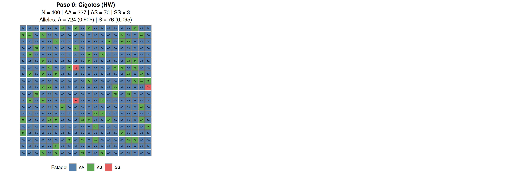

* Tarea: calcular si la población está en Hardy-Weinberg.

## Selección natural

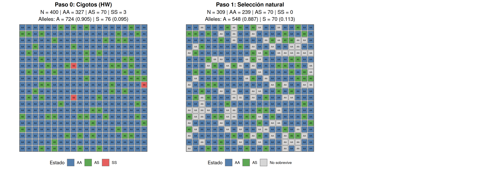

* Tarea: calcular si la población está en Hardy-Weinberg.

## Apareamiento aleatorio

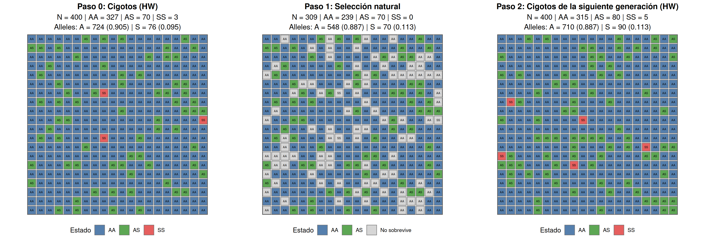

* Tarea: calcular si la población está en Hardy-Weinberg.

## ¿Qué suele pasar en las próximas generaciones?

* **Si** el entorno no cambia, por lo que las presiones selectivas siguen siendo las mismas,
* y **si** la diferencia en aptitud entre genotipos se mantiene,

> Las frecuencias alélicas llegarán a un equilibrio donde las dos presiones selectivas están en balance.

## Aproximación hacia el equilibrio alélico {.smaller}

::: {.columns}

::: {.column}

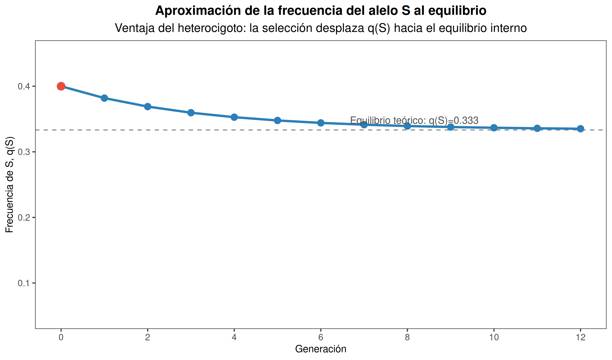{width=92%}

:::

::: {.column}

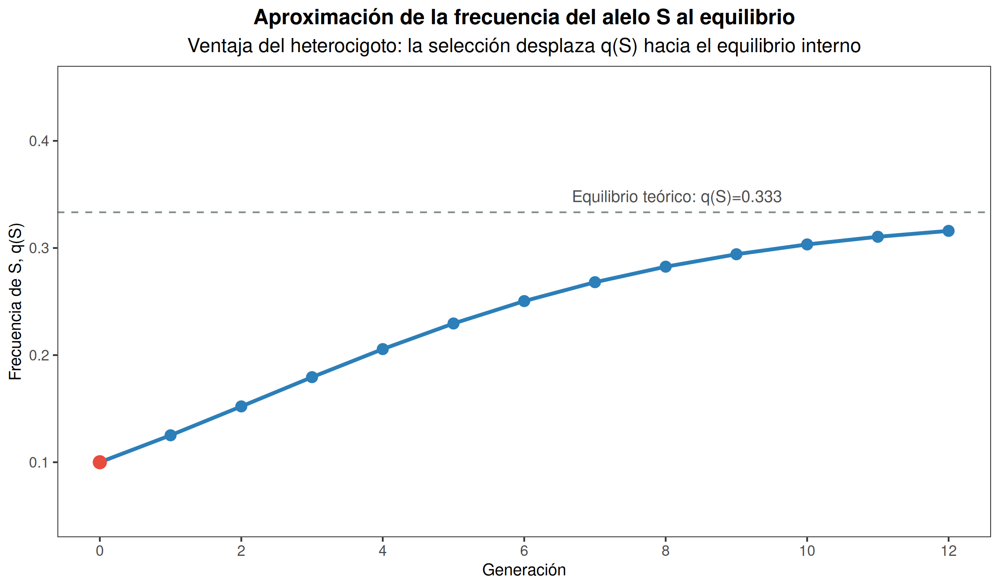{width=92%}

:::

:::

::: {.incremental}
* Con $w(AA)=0.7$, $w(AS)=1.0$ y $w(SS)=0.4$, el equilibrio interno esperado es $q(S)=0.333$.
* Partiendo de $q(S)=0.4$ o $q(S) = 0.1$, la frecuencia del alelo S se acerca a ese valor generación tras generación.
* Aunque el alelo S es dañino en terminos absolutos, se mantiene en una frecuencia relativamente alta
:::

## Aptitud relativa por genotipo

## Aptitud relativa y coeficiente de selección {.smaller}

::: {.fragment}

> Aptitud relativa ($\omega$): la aptitud de un genotipo específico comparada con la del genotipo más apto en la población.

:::

::: {.fragment}

> Coeficiente de selección: la desventaja de un genotipo. Es la tasa con la cual un genotipo es seleccionado en contra. Se calcula como $s = 1 - \omega$.

:::

::: {.fragment}

| Genotipo | Aptitud    | $\omega$ | $s = 1 - \omega$  |
| -------- | ---------- | -------- | ----------------- |
| AA       | Intermedia | 0.7      | 0.3               |
| AS       | Alta       | 1        | 0                 |
| SS       | Baja       | 0.4      | 0.6               |

:::

## Selección balanceada

> Definición: **selección balanceada** es selección natural que mantiene la diversidad genética, conservando múltiples alelos en una población en lugar de favorecer la fijación de uno de ellos.

* Mecanismo clásico: ventaja del heterocigoto.
* La aptitud del heterocigoto es mayor que la de ambos homocigotos.
* Mantiene polimorfismos genéticos estables en la población.

# Selección direccional {background-color="#E8F5E9"}

## Un alelo o genotipo es más apto que los demás

::: {.columns}

::: {.column}

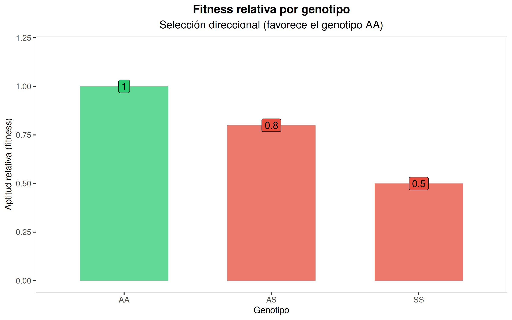
:::

::: {.column}

::: {.fragment}

* Pinzones de Daphne Major (Galápagos) durante la sequía de 1977
* Polillas de Manchester durante la industrialización
* Resistencia a antibióticos en bacterias

:::

:::

:::

## Selección direccional

> Definición: **selección direccional** favorece consistentemente a un fenotipo, alelo o genotipo sobre los demás, aumentando su frecuencia a través del tiempo.

* Mecanismo: un genotipo tiene mayor aptitud que los otros.
* Favorece una dirección particular de cambio evolutivo.
* Puede conducir a la fijación de un alelo.
* Tiende a reducir la variación genética local.

## Pinzones de Daphne Major (1977) {.smaller}

::: {.columns}

::: {.column}

:::

::: {.column}

::: {.incremental}

- La sequía alteró la disponibilidad de semillas.
- Las semillas pequeñas se volvieron escasas, mientras que las semillas grandes permanecieron disponibles.
- Los individuos con picos pequeños presentaron una mortalidad más alta.
- Como resultado, aumentó la frecuencia de individuos con picos más grandes en la población.

:::

:::

:::

## Polillas de Manchester {.smaller}

::: {.columns}

::: {.column}

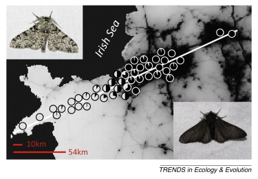

:::

::: {.column}

::: {.incremental}
- La industrialización provocó altos niveles de contaminación atmosférica.
- El hollín oscureció los troncos de los árboles y modificó el hábitat de las polillas.
- Las polillas de color claro se volvieron más visibles para los depredadores.
- Como resultado, aumentó la frecuencia de polillas de color oscuro en la población.

:::

:::

:::

## Pinzones! Otra vez? {.smaller}

::: {.columns}

::: {.column}

:::

::: {.column}

::: {.incremental}
- El ambiente cambia.
- Las presiones de selección cambian.
- La aptitud relativa de los distintos fenotipos cambia.
- Como consecuencia, cambia la distribución de rasgos dentro de la población.
:::

:::

:::

::: {.fragment}

> El ambiente determina qué rasgos son ventajosos; cuando el ambiente cambia, la selección también puede cambiar.

:::

# Selección diversificadora {background-color="#E8F5E9"}

## Los fenotipos extremos son más aptos que los intermedios {.smaller}

::: {.columns}

::: {.column}

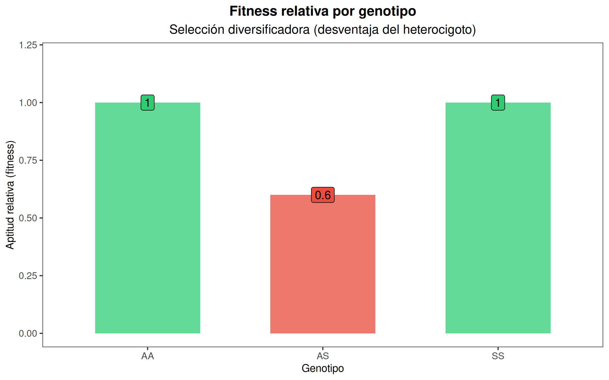

:::

::: {.column}

::: {.fragment}

* Pinzón semillero africano
* Threespine stickleback en lagos
* Especialización sobre diferentes recursos alimenticios
* Especialización sobre distintos hospederos en insectos

:::

:::

:::

## Selección diversificadora (disruptiva)

> Definición: **selección diversificadora** favorece fenotipos extremos sobre los fenotipos intermedios.

* Mecanismo: los individuos intermedios presentan menor aptitud.
* Favorece la divergencia dentro de una población.
* Puede contribuir a la especialización ecológica.
* En algunos casos puede favorecer procesos de especiación.

## Pinzón semillero africano {.smaller}

::: {.columns}

::: {.column}

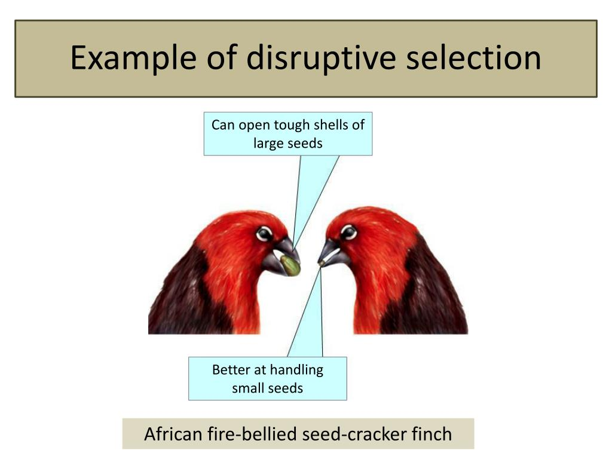

:::

::: {.column}

::: {.incremental}
- Individuos con picos grandes son mejores a romper semillas grandes
- Individuos con picos pequeños son mejores a manejar semillas pequeñas
- Individuos con picos intermedios tienen desventaja y menor aptitud.
- A lo largo del tiempo, la frecuencia de individuos con picos intermedios disminuye.

:::

:::

:::

## Threespine stickleback {.smaller}

::: {.columns}

::: {.column}

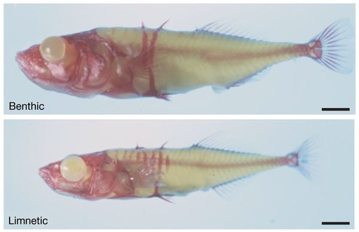

:::

::: {.column}

::: {.incremental}

- Los individuos grandes se observan con mayor frecuencia cerca de la orilla del lago, donde consumen insectos grandes.
- Los individuos pequeños se observan con mayor frecuencia en la zona de agua abierta, asociados al consumo de zooplancton.
- Los fenotipos intermedios muestran menor aptitud, por lo que su frecuencia disminuye.

:::

:::

:::

# Adaptación {background-color="#E8F5E9"}

## Definicion

> Una adaptación es un rasgo heredable que aumenta la aptitud de los individuos en un ambiente determinado como resultado de la selección natural.

::: {.incremental}

* Las adaptaciones evolucionan en poblaciones, no en individuos.
* Una adaptación aumenta la aptitud relativa en un ambiente particular.
* Un rasgo puede ser adaptativo en un ambiente y no en otro.
* Las adaptaciones no son necesariamente perfectas.

:::

## ¿Por qué los picos grandes son una adaptación?

> ¿Es un pico grande siempre mejor?

::: {.fragment}

* Año húmedo -> muchas semillas pequeñas.
* Año seco -> muchas semillas grandes.
* No existe un "mejor" pico en términos absolutos.
:::

::: {.fragment}

> **El valor adaptativo de un rasgo depende del ambiente.**

:::

## ¿Por qué las alas oscuras son una adaptación?

::: {.fragment}

- Antes de la industrialización: alas claras -> mayor aptitud.
- Después de la industrialización: alas oscuras -> mayor aptitud.

:::

::: {.fragment}

> **El valor adaptativo de un rasgo depende del ambiente.**

:::

## No todo rasgo es una adaptación

::: {.incremental}

* Algunos rasgos evolucionan por deriva genética.
* Algunos rasgos son subproductos de otras adaptaciones.
* Algunos rasgos fueron adaptativos en el pasado, pero ya no lo son.
* **Para demostrar adaptación debemos mostrar una ventaja en aptitud.**

:::

---

> ¿Cuál es la diferencia entre evolución y adaptación?

::: {.fragment}

> Evolución es cualquier cambio en las frecuencias alélicas de una población.
>
> Adaptación es el proceso por el cual la selección natural produce rasgos que aumentan la aptitud en un ambiente determinado.

:::

# La escala temporal y geográfica {background-color="#E8F5E9"}

---

::: {.columns}

::: {.column}

> Selección direccional

:::

::: {.column}

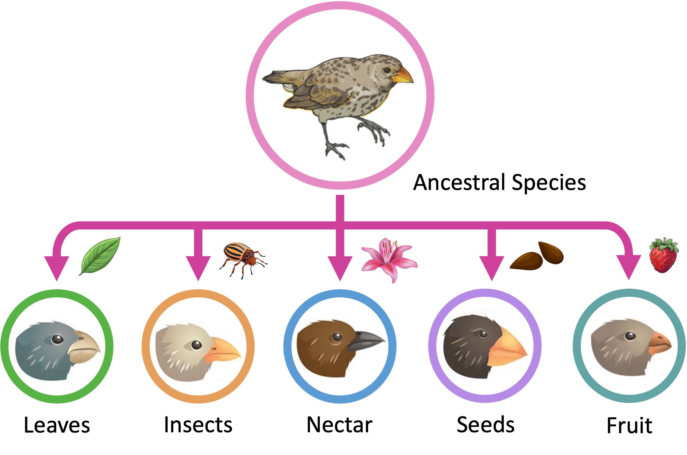

> Divergencia adaptativa

:::

:::

## ¡La escala importa! {.smaller}

* Los pinzones pueden ilustrar distintos patrones evolutivos dependiendo de la escala temporal y espacial considerada.

::: {.columns}

::: {.column}

### Isla Daphne Major (1977)

* Una población
* Una isla
* Unas pocas generaciones

> El proceso observado es consistente con selección direccional hacia picos más grandes durante la sequía.

:::

::: {.column}

### Archipiélago de Galápagos

* Muchas poblaciones
* Muchas islas
* Millones de años

> El resultado es consistente con divergencia adaptativa hacia diferentes nichos ecológicos y recursos.

:::

:::

## Resumen {background-color="#E8F5E9" .smaller}

* La selección natural requiere variación heredable y diferencias en aptitud, y produce cambios en frecuencias alélicas.
* En anemia falciforme, la ventaja del heterocigoto (AS) en ambientes con malaria puede mantener el alelo S (selección balanceada).
* La selección direccional favorece consistentemente un fenotipo; la selección diversificadora favorece fenotipos extremos.
* Una adaptación es un rasgo heredable cuyo valor depende del ambiente; no todo rasgo es necesariamente una adaptación.
* La escala importa: un patrón de corto plazo en una población puede conectarse con divergencia adaptativa a gran escala temporal y geográfica.

