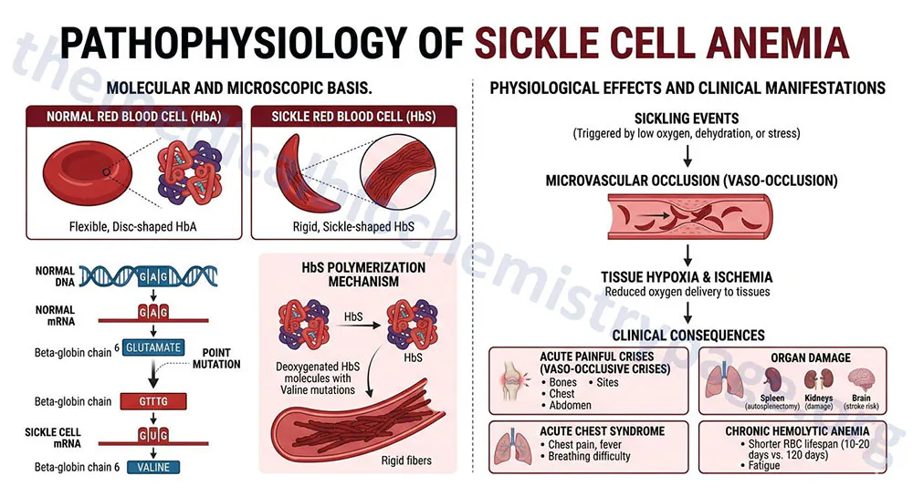
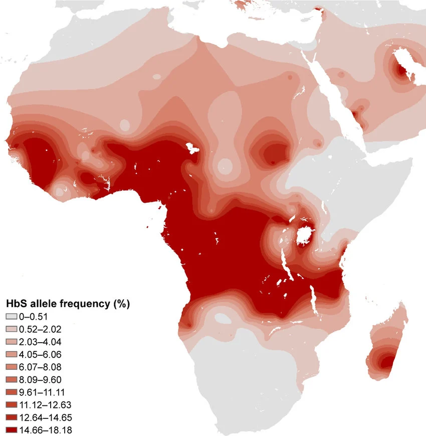
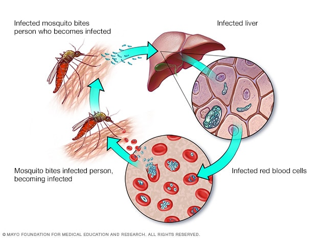
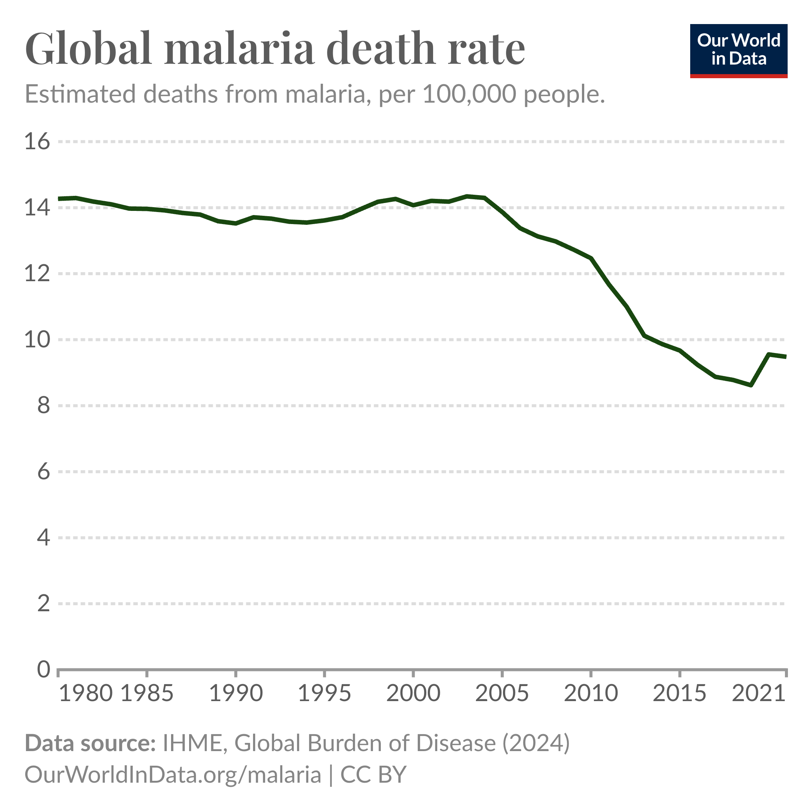
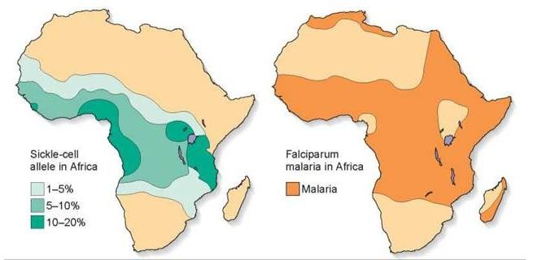
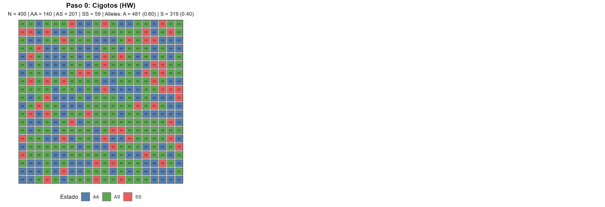
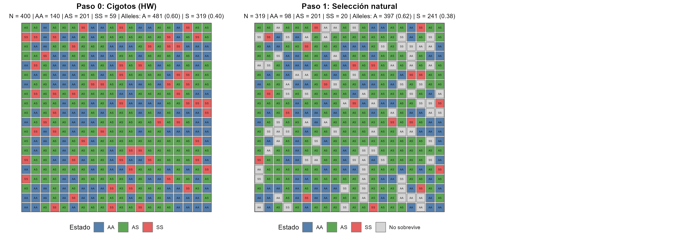
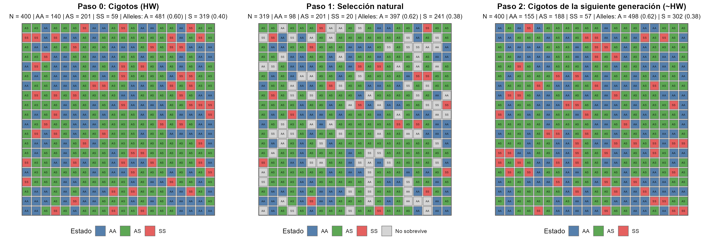
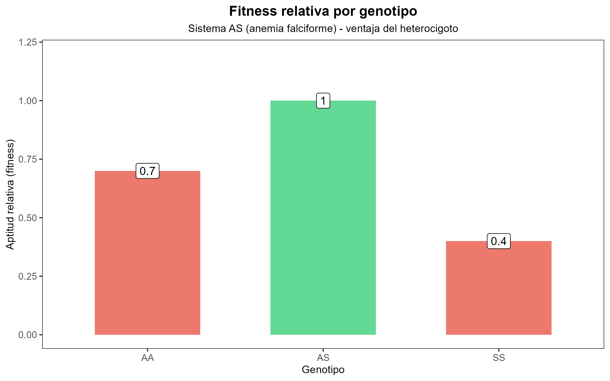

## Metas

1. Entender cómo la selección natural actúa sobre la variación genética
2. Reconocer ejemplos de selección en poblaciones humanas
3. Analizar cómo la selección mantiene alelos deletéreos

## Ser capaces de {.smaller}

::: {.incremental}

* Definir selección natural como cambio en frecuencias alélicas debido a diferencias en aptitud.
* Entender los diferentes tipos de selección (balanceadora, disruptiva, direccional).
* Entender la interacción entre selección y mutación para alelos nuevos en poblaciones.
:::

## Anemia falciforme

## El locus de anemia falciforme {.smaller}

* A = hemoglobina normal
* S = alelo falciforme

| Genotipo | Fenotipo          |
| -------- | ----------------- |
| AA       | normal            |
| AS       | portador          |
| SS       | anemia falciforme |

::: {.fragment}

La paradoja:

* SS tiene baja supervivencia.
* Sin embargo, S no desaparece.

> Si SS es tan dañino, ¿qué debería pasar con S según nuestra intuición?

:::

---

## Frecuencia del alelo de anemia falciforme

---

> ¿Por qué un alelo que causa una enfermedad grave sigue siendo relativamente común en algunas poblaciones humanas?

::: {.fragment}

> **Selección natural**. 

:::

::: {.fragment}

¡Veamos por qué!

:::

## Malaria

::: {.columns}

::: {.column}

:::

::: {.column}

:::

:::

## Distribuciones geográficas

::: {.fragment}

> **Las poblaciones humanas con alta frecuencia del alelo de anemia falciforme viven en regiones con alta incidencia de malaria.** 

:::

::: {.fragment}

¿Podría ser que el alelo de anemia falciforme sea de alguna forma útil para la resistencia a la malaria?

:::

## Anemia falciforme y malaria {.smaller}

> Los heterocigotos para anemia falciforme (AS) presentan menor riesgo de malaria grave que los homocigotos normales (AA).

::: {.incremental}

- Los heterocigotos producen principalmente eritrocitos normales, pero una fracción contiene hemoglobina S.
- Cuando un eritrocito es infectado por _Plasmodium falciparum_, el estrés fisiológico dentro de la célula favorece la deformación falciforme.
- Los eritrocitos infectados y deformados son reconocidos y removidos más rápidamente por el bazo.
- Como consecuencia, la carga parasitaria suele mantenerse más baja que en individuos AA.
- Esto reduce el riesgo de malaria severa y aumenta la supervivencia en regiones donde la malaria es común.
:::

---

## Combinando las dos presiones selectivas

| Genotipo | Malaria              | Anemia falciforme |
| -------- | -------------------- | ----------------- |
| AA       | Alta susceptibilidad | No                |
| AS       | Protección parcial   | No o muy leve     |
| SS       | Protección parcial   | Grave             |

## Agregando aptitud

| Genotipo | Malaria              | Anemia falciforme | Aptitud    |
| -------- | -------------------- | ----------------- | ---------- |
| AA       | Alta susceptibilidad | No                | Intermedia |
| AS       | Protección parcial   | No o muy leve     | Alta       |
| SS       | Protección parcial   | Grave             | Baja       |

---

> La selección natural ocurre dentro de una generación, cuando algunos individuos sobreviven o se reproducen más que otros.

> La evolución se observa entre generaciones, cuando esas diferencias producen cambios en las frecuencias alélicas de la población.

## Población en Hardy-Weinberg

## Selección natural {.smaller}

::: {.incremental}
- Algunos individuos no sobreviven
- La probabilidad de sobrevivir no es igual para todos los genotipos
- La supervivencia diferencial cambia las frecuencias alélicas
- La población en este momento **no está en HW**
:::

## Apareamiento aleatorio { .smaller}

::: {.incremental}
- Los sobrevivientes se aparean al azar
- Los cigotos vuelven a estar en proporciones de Hardy-Weinberg
- Pero ahora parten de frecuencias alélicas ligeramente distintas
- Es decir, están en HW para las nuevas frecuencias alélicas
:::

## Aptitud relativa por genotipo

## Aptitud relativa y coeficiente de selección

::: {.fragment}

> Aptitud relativa ($\omega$): la aptitud de un genotipo específico comparada con la aptitud del genotipo más apto en la población.

:::

::: {.fragment}

> Coeficiente de selección: la desventaja de un genotipo. Es la tasa con la cual un genotipo es seleccionado en contra. Se calcula como $s = 1 - \omega$.

:::

::: {.fragment}

| Genotipo | Aptitud    | $\omega$ | $s = 1 - \omega$  |
| -------- | ---------- | -------- | ----------------- |
| AA       | Intermedia | 0.7      | 0.3               |
| AS       | Alta       | 1        | 0                 |
| SS       | Baja       | 0.4      | 0.6               |

:::

## ¿Cuál es la frecuencia alélica esperada dada la aptitud relativa?