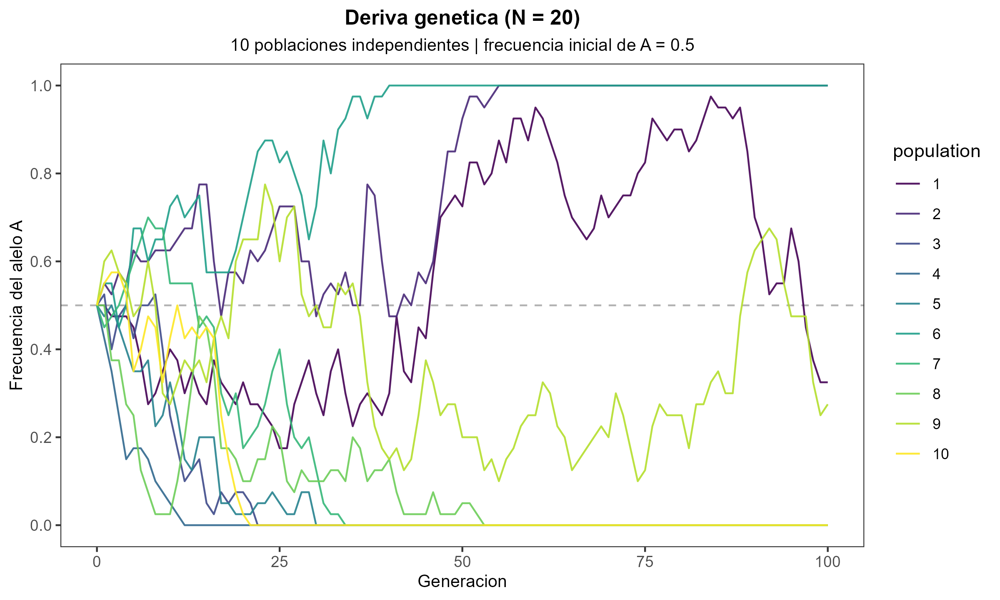
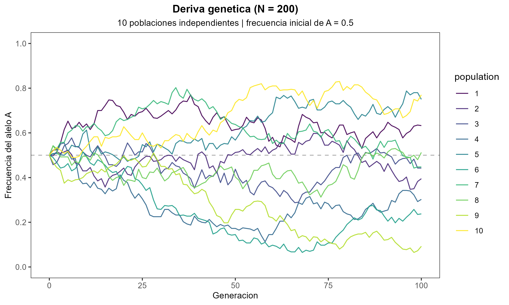
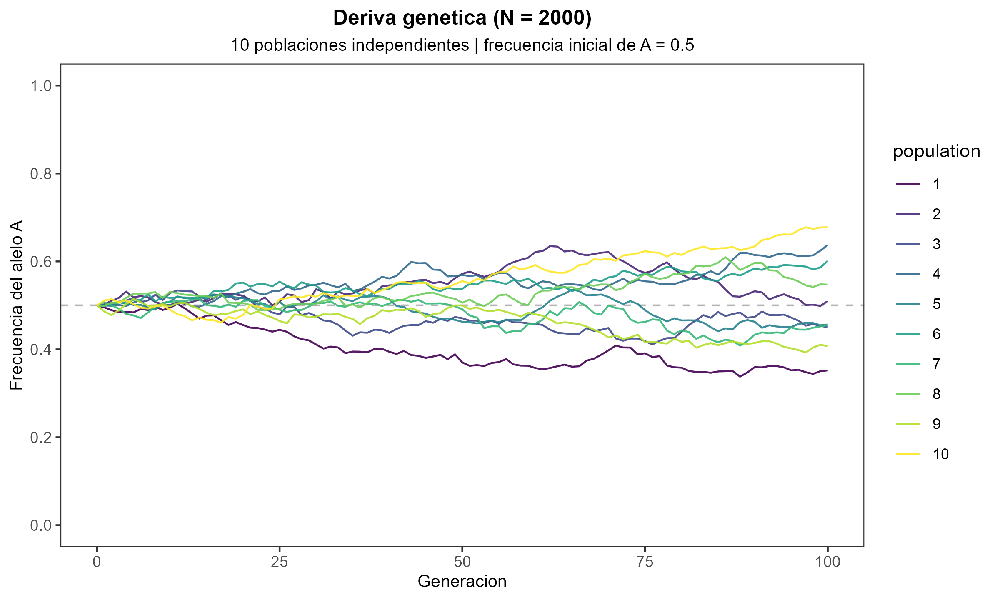
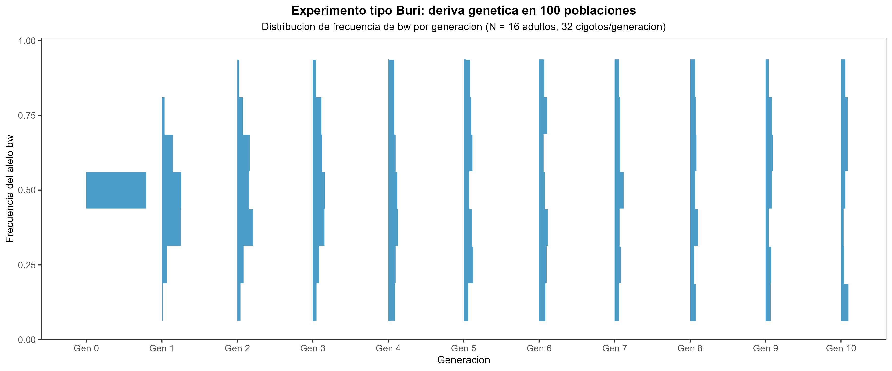

## Metas

Introducir:

1. Qué es la deriva genética y por qué ocurre por muestreo entre generaciones.
2. Cómo distinguir deriva genética de selección natural.
3. Por qué la deriva es más intensa en poblaciones pequeñas.

## Ser capaces de {.smaller}

::: {.incremental}

- Definir deriva genética como cambio aleatorio en frecuencias alélicas.
- Explicar por qué ocurre deriva incluso cuando no hay diferencias de aptitud.
- Comparar selección natural vs deriva genética en términos de causa y resultados.
- Interpretar los patrones de deriva en poblaciones con distinto tamaño ($N = 20, 200, 2000$).
- Reconocer cómo cuello de botella y efecto fundador amplifican la deriva.

:::

---

## Selección vs. deriva

| Selección natural | Deriva genética |
| --- | --- |
| Cambio no aleatorio | Cambio aleatorio |
| Algunas variantes tienen mayor aptitud | Los alelos tienen la misma aptitud |
| Produce adaptación | No produce adaptación necesariamente |
| Más importante en poblaciones grandes | Más intensa en poblaciones pequeñas |

---

## ¿Por qué ocurre la deriva?

Imaginemos una población con:

- 50% A
- 50% a

Pregunta:

> ¿La siguiente generación tendrá exactamente 50% y 50% otra vez?

No necesariamente.

Incluso si no hay selección, cada generación es una **muestra** de la anterior, y algunas variantes dejan más descendientes simplemente por azar.

---

## Analogía: lanzar una moneda

- 10 lanzamientos: resultados muy variables
- 10 000 lanzamientos: resultados muy cercanos a 50%

Los alelos son muestreados de forma similar entre generaciones.

---

## Deriva genética

**Cambios en la frecuencia de alelos debido al azar**, no a la selección.

La idea central es que la evolución puede ocurrir incluso cuando ninguna variante tiene ventaja.

---

## Efecto del tamaño poblacional en la deriva
**N = 20**
{fig-align="center" width="100%"}

---

## Efecto del tamaño poblacional en la deriva
**N = 200**
{fig-align="center" width="100%"}

---

## Efecto del tamaño poblacional en la deriva
**N = 2000**
{fig-align="center" width="100%"}

---

## ¿Qué observamos?

::: {.incremental}

- Todas las poblaciones empiezan iguales.
- Las trayectorias divergen por azar.
- Algunas poblaciones fijan el alelo A.
- Algunas poblaciones pierden el alelo A.
- La divergencia es mayor cuando N es pequeño.

:::

---

## Experimento tipo Buri: 500 poblaciones

{fig-align="center"}

::: {.incremental}
**Observar:**
- Gen 0: todos centrados en 0.5
- Generaciones posteriores: aumenta la dispersión
- Algunas poblaciones fijan un alelo, otras lo pierden
:::

---

## Consecuencias de la deriva

::: {.incremental}

- Pérdida de diversidad genética.
- Fijación o pérdida de alelos.
- Diferenciación entre poblaciones.
- Evolución incluso en ausencia de selección natural.

:::

---

## Cuello de botella y efecto fundador

Ambos casos amplifican la deriva porque implican una **muestra pequeña** de la diversidad original.

| Cuello de botella | Efecto fundador |
| --- | --- |
| Población grande → pequeña → grande | Nueva población formada por pocos individuos |
| Reducción brusca por enfermedad, desastre o caza | Colonización de una isla o nuevo hábitat |
| Pérdida de diversidad genética | Frecuencias alélicas distintas desde el inicio |

---

## Resumen

::: {.incremental}

- La deriva genética es evolución por azar.
- Ocurre en todas las poblaciones.
- Es más intensa en poblaciones pequeñas.
- Reduce la diversidad genética.
- Puede causar fijación o pérdida de alelos.
- Cuellos de botella y efectos fundadores amplifican la deriva.

:::