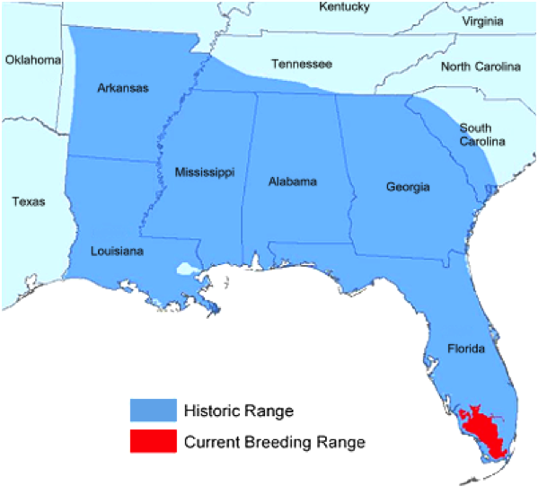
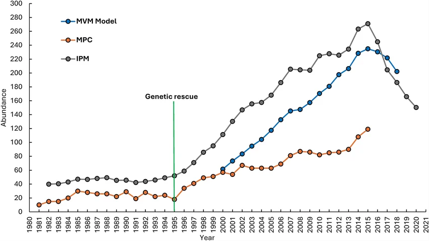
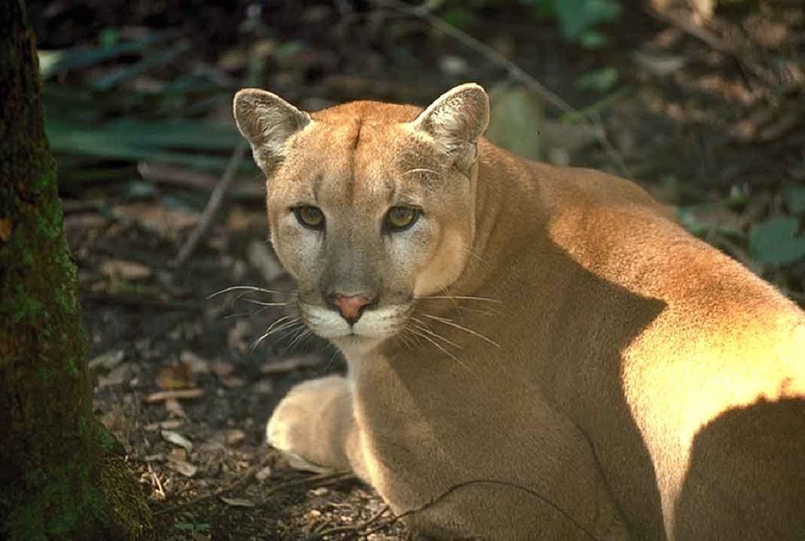
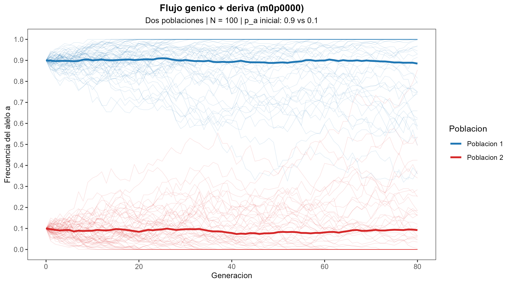
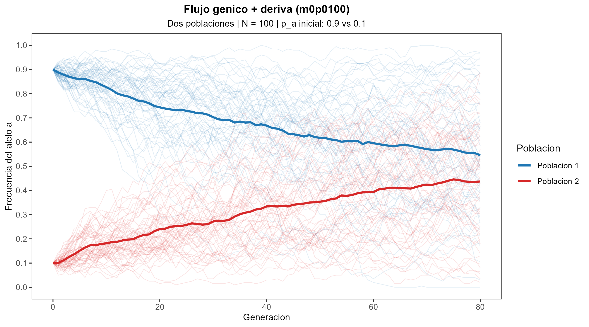
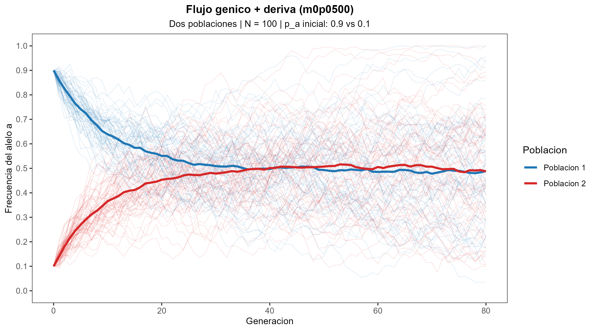
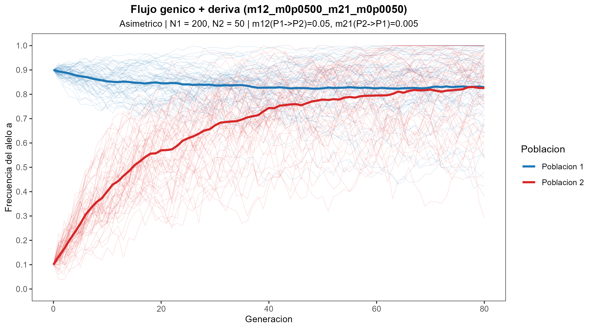

## Metas

Introducir:

1. Que es la migracion (flujo genico) y como actua como fuerza evolutiva.
2. Como la migracion cambia frecuencias alelicas entre poblaciones.
3. La diferencia entre migracion y otras fuerzas evolutivas.

## Ser capaces de {.smaller}

- Definir migracion como movimiento de alelos entre poblaciones.
- Explicar como la migracion reduce diferencias geneticas entre poblaciones.
- Diferenciar migracion de deriva genetica, seleccion y mutacion.
- Predecir efectos de migracion en poblaciones aisladas.
- Reconocer que la migracion tiende a homogenizar poblaciones.

## Pantera de Florida (1/3)

::: {.columns}

::: {.column}

:::

::: {.column}

**Caracteristicas:**  
- Poblacion altamente aislada en el sur de Florida  
- Pequeno tamaño poblacional (~30 individuos a los 1970s)  
- Alto nivel de consanguinidad y defectos geneticos  

:::

:::

## Pantera de Florida (2/3)

::: {.columns}

::: {.column}

**Migracion como solucion:**  
- Introduccion deliberada de panteras de Texas (poblacion geneticamente distinta)  
- Resultado: aumento de variacion genetica y reduccion de enfermedades geneticas  
- Mayor viabilidad poblacional  

:::

::: {.column}

:::

:::

## Pantera de Florida (3/3)

::: {.columns}

::: {.column}

**Importancia evolutiva:**  
- Demuestra como la deriva reduce diversidad en poblaciones pequenas  
- Ilustra el papel positivo de la migracion en recuperacion de especies en peligro  
- Ejemplo de manejo evolutivo basado en principios poblacionales  

:::

::: {.column}

:::

:::

---

## Visualizacion de migracion

Dos poblaciones con diferentes frecuencias:

**Poblacion A**: 90% A, 10% a  
**Poblacion B**: 10% A, 90% a  

Pregunta:

> ¿Que ocurre si cada generacion algunos individuos se mueven entre poblaciones y se reproducen en ellas?

---

## Sin migracion

## Poca migracion (1 individuo por generacion)

## Mucha migracion (5 individuos por generacion)

## Migracion asimetrica
<!-- 
* $m_{1->2} = 0.05$, si $N_{pop2} = 100$ -> 5 individuos cada generacion de Pop 1 a Pop 2
* $m_{2->1} = 0.005$, si $N_{pop1} = 100$ -> 1 individuo cada 2 generaciones de Pop 2 a Pop 1 -->

## Calculo del efecto de migracion {.smaller}

::: {.columns}

::: {.column}

::: {.fragment}

- Frecuencia de alelo en poblacion A despues de migracion:
$$p_{popA}' = (1 - m) p_{popA} + m p_{popB}$$

:::

:::

::: {.column}

::: {.fragment}

- Frecuencia de alelo en poblacion B despues de migracion:
$$p_{popB}' = (1 - m) p_{popB} + m p_{popA}$$  

:::

:::

:::

::: {.fragment}

Donde:  
- $p_{popA}$ y $p_{popB}$ son las frecuencias antes de migracion  
- $m$ es la tasa de migracion (proporcion de individuos que migran cada generacion)  
- $p_{popA}'$ y $p_{popB}'$ son las frecuencias despues de migracion  

:::

## Ejemplo numerico

Supongamos que $p_{popA} = 0.9$, $p_{popB} = 0.1$ y $m = 0.05$ (5% de migracion):

::: {.fragment}

- Para poblacion A:
$$p_{popA}' = (1 - 0.05) \cdot 0.9 + 0.05 \cdot 0.1 = 0.855$$

**La frecuencia de A disminuyo ~5% en una generacion**

:::

::: {.fragment}

- Para poblacion B:
$$p_{popB}' = (1 - 0.05) \cdot 0.1 + 0.05 \cdot 0.9 = 0.145$$

**La frecuencia de A aumento ~5% en una generacion**

:::

---

## Resumen

> Definicion: Migracion o flujo genico es el movimiento de alelos entre poblaciones.

::: {.incremental}

- Sin migracion -> poblaciones divergentes, diferencias mantenidas o aumentadas
- Con migracion -> poblaciones convergen, diferencias disminuyen
- El flujo genico homogeniza las poblaciones

:::

---

## Migracion vs Deriva

::: {.incremental}

**Deriva genetica**:  
- Aumenta diferencias entre poblaciones aisladas  
- Efecto mas fuerte en poblaciones pequenas  

**Migracion**:  
- Reduce diferencias entre poblaciones  
- Introduce variacion de otras poblaciones  

:::

## Migracion vs Seleccion

::: {.incremental}

**Seleccion**:  
- Favorece alelos adaptativos  
- Puede aumentar diferencias entre poblaciones con ambientes distintos  

**Migracion**:  
- Mueve alelos entre poblaciones  
- Puede introducir alelos no adaptativos o eliminar alelos adaptativos  
- Tiende a homogenizar poblaciones  

:::

## Migracion vs Mutacion

::: {.incremental}

**Mutacion**:  
- Crea nuevos alelos  
- Efecto muy lento en poblaciones grandes  

**Migracion**:  
- Mueve alelos existentes entre poblaciones  
- Puede tener un efecto rapido en poblaciones pequenas  

:::

---

## Las cuatro fuerzas evolutivas

| Fuerza    | Que hace |
| --------- | -------- |
| Mutacion  | Crea nuevos alelos |
| Seleccion | Favorece algunos alelos |
| Deriva    | Cambios por azar |
| Migracion | Mueve alelos entre poblaciones |

::: {.fragment}

Normalmente, todas estas fuerzas actuan juntas en poblaciones naturales, y el resultado evolutivo depende de la interaccion entre ellas.

:::

---