## Metas {background-color="#E8F5E9"}

* Intoducir lineages, su divergencia y como se relaciona con especiacion.
* Introducir el concepto de especie y especiacion.
* Discutir el papel de la geografia, ecologia, fenologia, comportamiento.

## Ser capaces de {background-color="#E8F5E9" .smaller}

* Definir linaje y especie.
* Explicar como divergen los linajes y como se relaciona con especiacion.
* Explicar el papel de la geografia, ecologia, fenologia, en especiacion.
* Describir algunos conceptos de especie y sus fortalezas y limitaciones.
* Entender los diferentes tipos de especiacion geografica (alopatrica, simpatrica, peripatrica).
* Explicar el concepto de refuerzo y especies anillo.

# Linajes {background-color="#E8F5E9"}

## Las fuerzas evolutivas {.smaller}

| Fuerza    | Que hace | Efecto para diversidad |
| --------- | -------- | -------- |
| Mutacion  | Crea nuevos alelos | Aumenta diversidad |
| Seleccion | Favorece algunos alelos | Puede aumentar o disminuir diversidad |
| Deriva    | Cambios por azar | Disminuye diversidad en poblaciones pequenas |
| Migracion | Mueve alelos entre poblaciones | Tiende a homogenizar poblaciones |

::: {.fragment}

> Normalmente, todas estas fuerzas actuan juntas en poblaciones naturales, y el resultado evolutivo depende de la interaccion entre ellas.

:::

---

> **Linaje** es un grupo de 
> 
>   - individuos 
>   - poblaciones
>   - especies
>     
>   que comparten un **ancestro comun** y evolucionan **independientemente** de otros grupos. 

## Fractal de linajes

::: {.columns}

::: {.column}

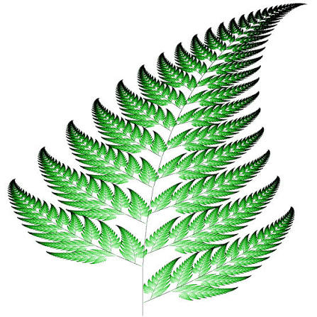

:::

::: {.column}

* Fractal: 
  * Un linaje puede contener muchos linajes más pequeños.
  * Un linaje puede ser parte de un linaje más grande.
* [**onezoom.org**](https://www.onezoom.org/life.html)

:::

:::

## De individuos a poblaciones a linajes

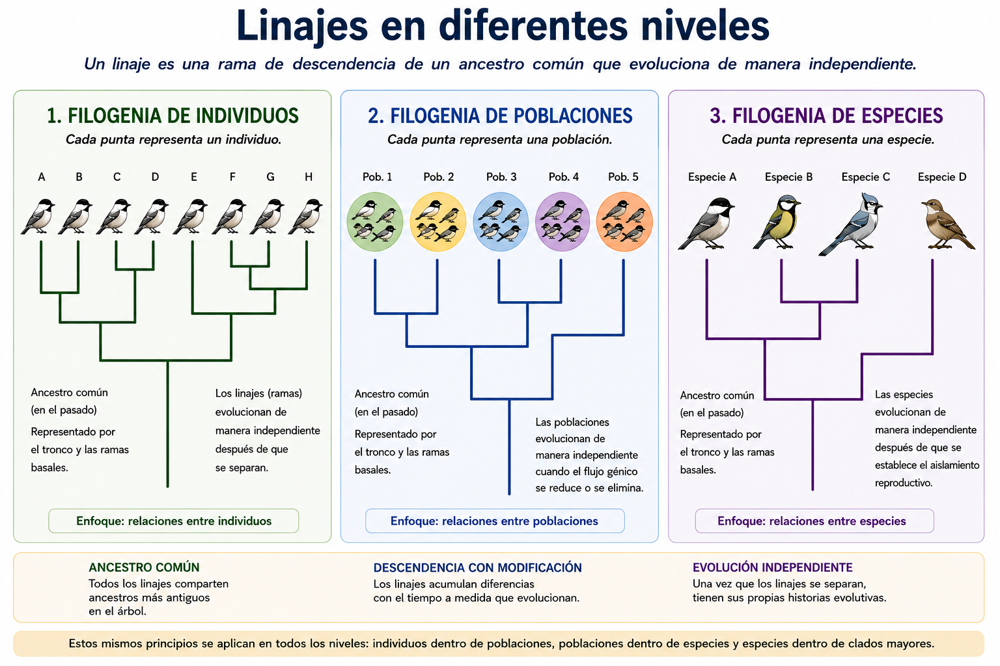{width=100% fig-align="center"}

# Especies {background-color="#E8F5E9"}

> **Todos tenemos una idea intuitiva de lo que es una especie, pero definirlo formalmente es complicado.**

## Son especies distintas?

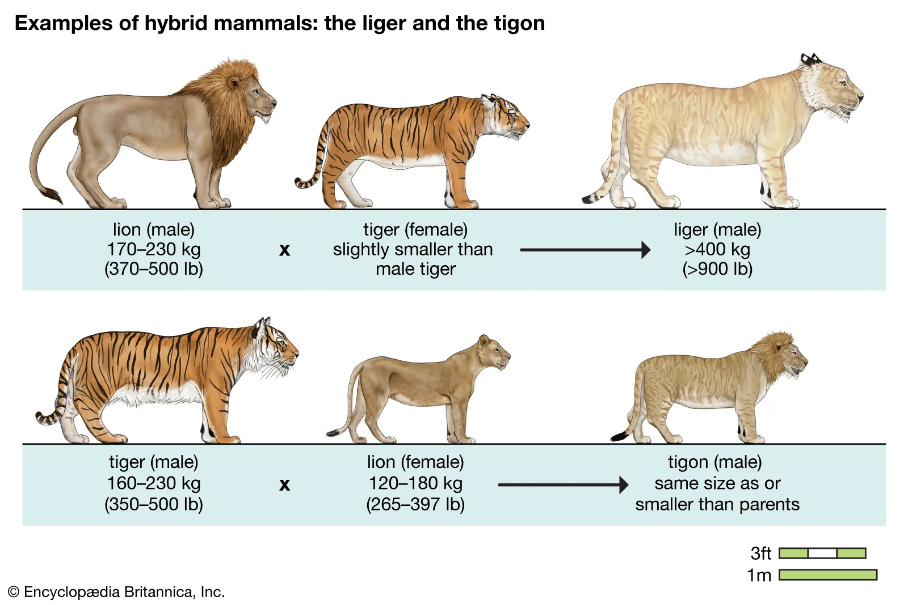

## Son especies distintas?

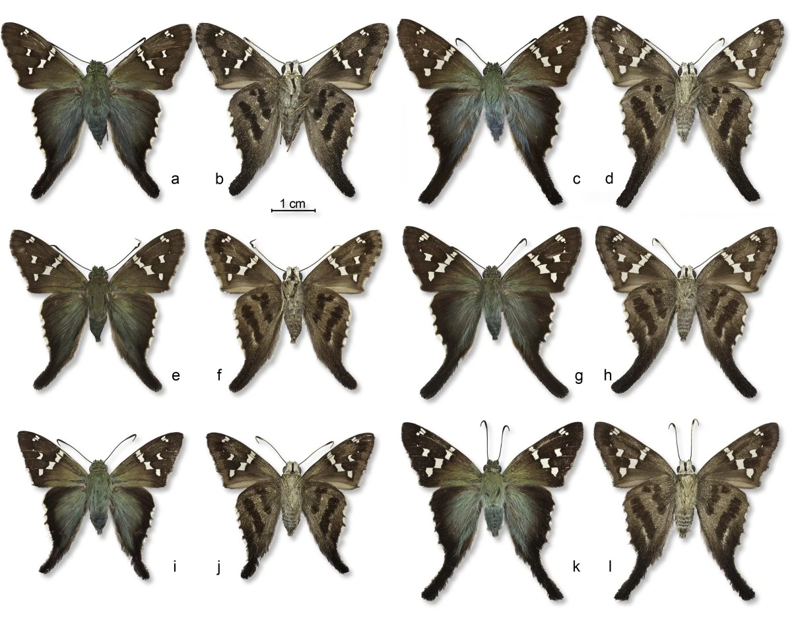

## Son especies distintas?

::: {.columns}

::: {.column}

:::

::: {.column}

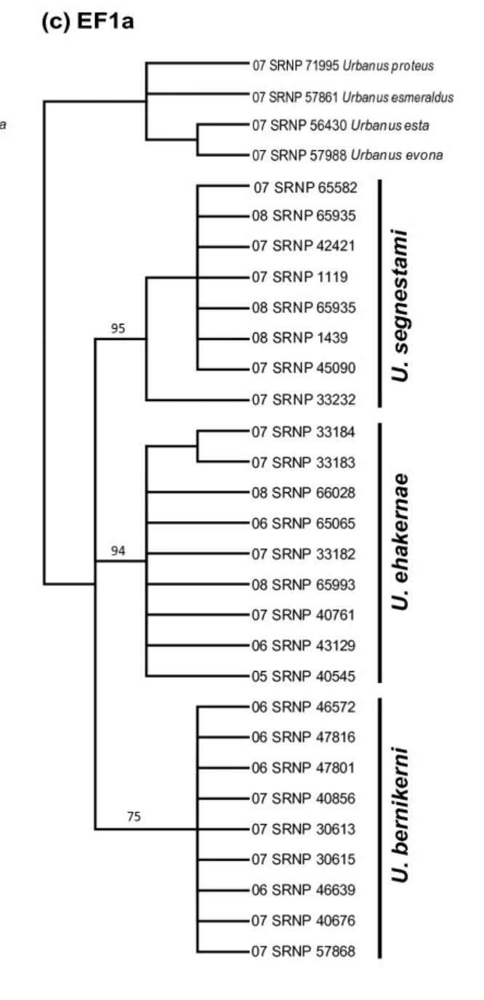{width=50%}

:::

:::

## Concepto de especie {.smaller}

Si dos poblaciones o linajes son differentes especies, depende  
  - del organismo que estamos estudiando,  
  - de la pregunta que queramos contestar, o  
  - la propriedad que consideramos que define una especie.  

::: {.columns}

::: {.column}

::: {.fragment}

Para un ornitologo, una especie puede ser un grupo de aves que se cruzan entre si y producen descendencia viable y fértil.

:::

:::

::: {.column}

::: {.fragment}

Para un microbiólogo, una especie puede ser un grupo de bacterias que comparten un conjunto de genes y rasgos fenotípicos.

:::

:::

:::

## Concepto de especie biologica

> Especies = grupos de poblaciones naturales, que están reproductivamente aisladas de otros grupos, y que se cruzan entre si (o pueden cruzar potencialmente) y producen descendencia viable y fértil.

::: {.fragment}

* Componentes:  
  - Aislamiento reproductivo  
  - Flujo genético  
  - Cruzamiento   
  - Viabilidad y fertilidad de la descendencia  

:::

## Concepto de especie biologica

::: {.columns}

::: {.column}

* Lo mejor
  - Se enfoca en el aislamiento reproductivo, que es el proceso central de la especiacion.

:::

::: {.column}

* Lo mas problemático
  - No funciona bien para fósiles, organismos asexuales o casos con hibridización.

:::

:::

## Concepto de especie morfológica

> Especies = grupo de organismos clasificados como una especie distinta basándose únicamente en sus características estructurales, anatómicas y físicas compartidas.

::: {.fragment}

* Componentes:  
  - Rasgos físicos  
  - Coincidencia visual  
  - Ignora la reproducción   

:::

## Concepto de especie morfológica

::: {.columns}

::: {.column}

* Lo mejor
  - Es rapido y util cuando solo tenemos observacion externa, como en el campo o con fosiles.

:::

::: {.column}

* Lo mas problemático
  - Puede confundir variacion normal con especies distintas y no detecta especies crípticas.

:::

:::

## Concepto de especie filogenética
  
> Especies = el grupo más pequeño de organismos que comparten un ancestro común y que pueden distinguirse de otros grupos similares por rasgos genéticos o físicos únicos heredados.

::: {.fragment}

* Componentes:  
  - Ancestro común  
  - Datos genéticos  
  - Monofilia  

:::

## Concepto de especie filogenética

::: {.columns}

::: {.column}

* Lo mejor
  - Usa relaciones evolutivas y ayuda a reconocer linajes distintos con datos geneticos o rasgos heredados.

:::

::: {.column}

* Lo mas problemático
  - Puede depender de datos incompletos y terminar dividiendo demasiado.

:::

:::

## Concepto de especie evolutiva

> Especies = Linaje de metapoblaciones que evolucionan independientemente.

::: {.fragment}

* Componentes:  
  - Continuidad de linaje  
  - Estructura de metapoblaciones  
  - Umbrales de evidencia  

:::

## Concepto de especie evolutiva

::: {.columns}

::: {.column}

* Lo mejor
  - Integra la historia completa del linaje y su independencia evolutiva.

:::

::: {.column}

* Lo mas problemático
  - Puede ser difícil de aplicar porque la independencia evolutiva no siempre se ve de inmediato.

:::

:::

::: {.fragment}

:::

## Definiciones diferentes contestan diferentes preguntas biologicas

::: {.columns}

::: {.column}

* Biologico => Aislamiento reproductivo
* Morfologico => Rasgos diagnósticos compartidos
* Filogenetico => Ancestro común y rasgos únicos
* Evolutivo => Independencia evolutiva

:::

::: {.column}

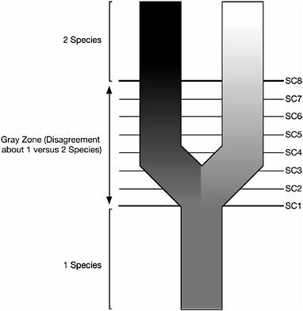

:::

:::

# Como divergen las linajes? {background-color="#E8F5E9"}

## Deriva genetica con migracion

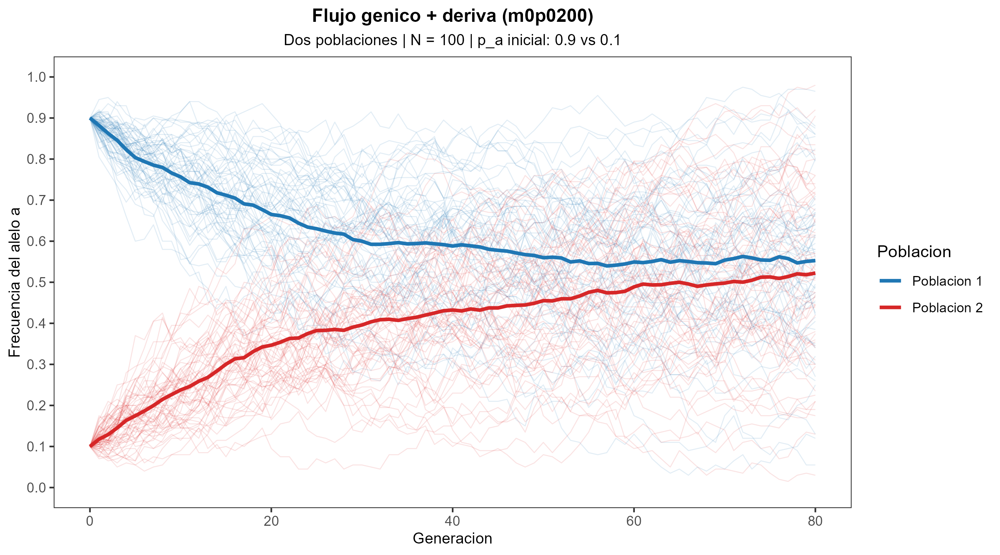

## Deriva genitica con barrera de migracion

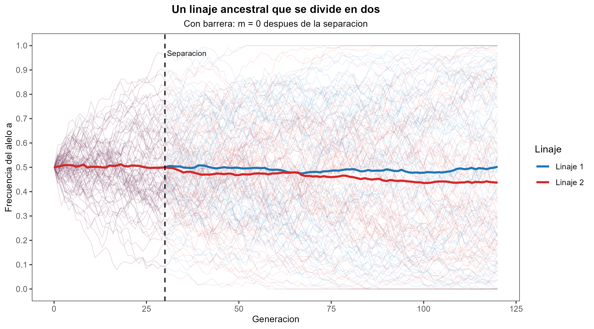

## Deriva genitica con barrera de migracion

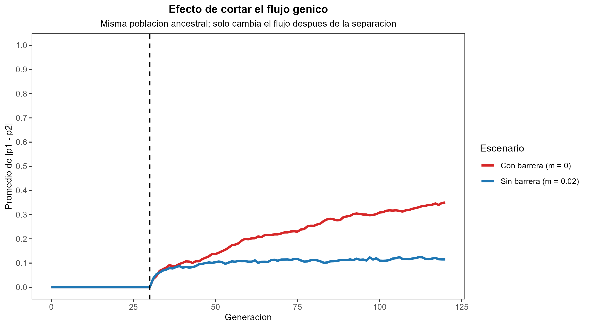

## ¿Qué puede reducir el flujo génico?

La evolución independiente y el aislamiento reproductivo aparecen cuando disminuye el intercambio de genes entre poblaciones.

Puede comenzar por diferencias:  
- geográficas  
- ecológicas  
- temporales  
- conductuales  

## Divergencia 

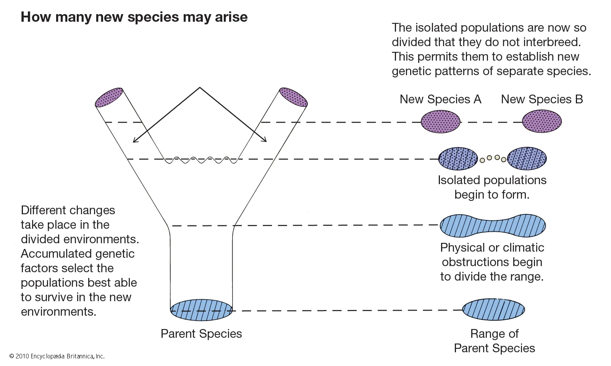

## Geografía y especiación {.smaller}

::: {.columns}

::: {.column}

::: {.incremental}
* Barrera
* Migración limitada
* Deriva, selección y mutación independientes
* Divergencia genética
* Aislamiento reproductivo
:::

:::

::: {.column}

::: {.fragment}
Ejemplos:  
- islas  
- cordilleras  
- glaciaciones  
- ríos  

:::

:::

:::

## Istmo de Panamá

::: {.columns}

::: {.column}

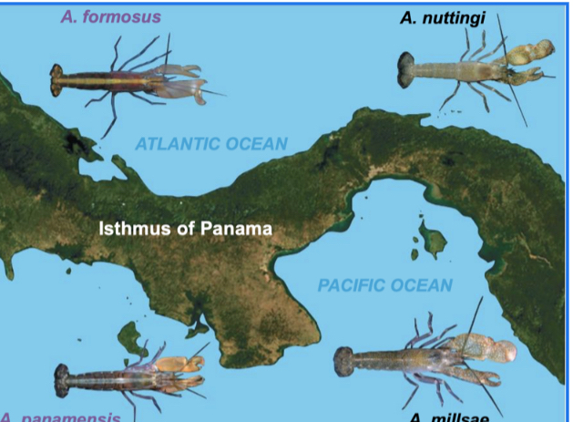

:::

::: {.column}

  - Istmo de Panamá
  - 3 millones de años
  - 15 pares de especies hermanas
  - Divergencia genética y morfológica

:::

:::

## Grand Canyon

::: {.columns}

::: {.column}

- Grand Canyon, Arizona
- 5 millones de años
- 2 especies hermanas (Abert's y Kaibab Squirrel)
- Divergencia genética y morfológica

:::

::: {.column}

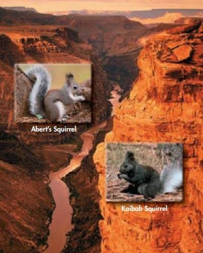

:::

:::

## Ecologia y especiacion {.smaller}

::: {.columns}

::: {.column}

::: {.incremental}
* Ambientes distintos dentro de la misma region
* Seleccion favorece rasgos diferentes
* Flujo genico reducido entre nichos
* Divergencia genetica y fenotipica
* Aislamiento reproductivo
:::

:::

::: {.column}

::: {.fragment}
Ejemplos:  
  - lagos profundos vs someros  
  - hospederos distintos  
  - suelos metalicos vs normales  
  - gradientes altitudinales  

:::

:::

:::

## Whitefish en lagos postglaciales {.smaller}

::: {.columns}

::: {.column}

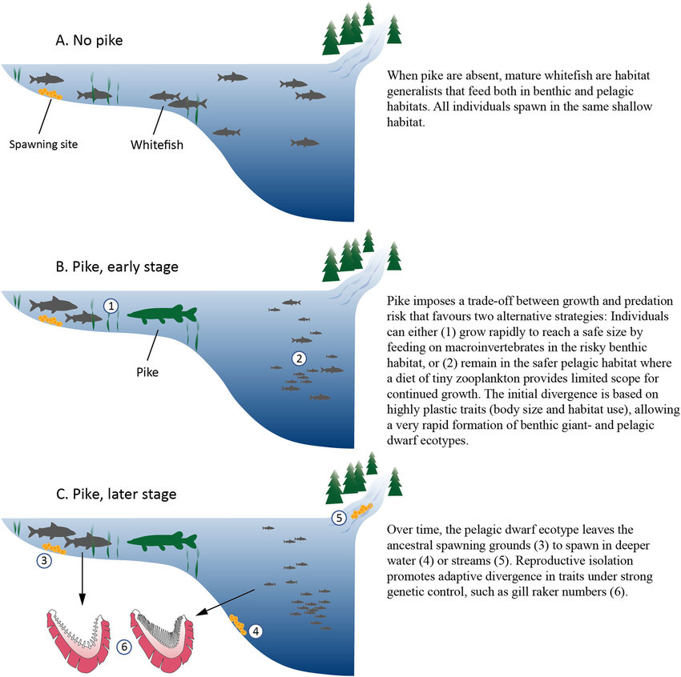

:::

::: {.column}

- Dos ecotipos: limnetico (grande) y bentico (pequeno)
- Normalmente, ambos desovan en la misma profundidad
- Presencia de Pike refuerza divergencia en tamano y comportamiento
- Los benticos desovan en aguas someras
- Los limneticos desovan en aguas profundas o arroyos
- Flujo genico entre ecotipos reducido (aislamiento reproductivo)
- Divergencia genetica y fenotipica

:::

:::

## Whitefish resumen visual

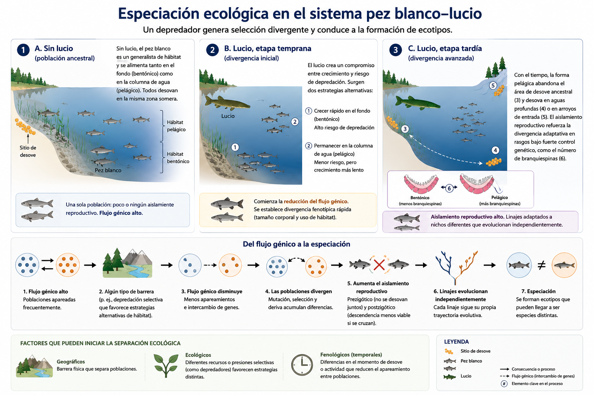{fig-align="center"}

## Mosca de la manzana (Rhagoletis) {.smaller}

::: {.columns}

::: {.column}

- Cambio de hospedero: espino a manzano
- Apareamiento sobre la planta hospedera
- Diferencias de tiempo de emergencia (manzanas antes que espinos)
- Diferencias de comportamiento y fenologia reducen flujo genico (aislamiento reproductivo)

:::

::: {.column}

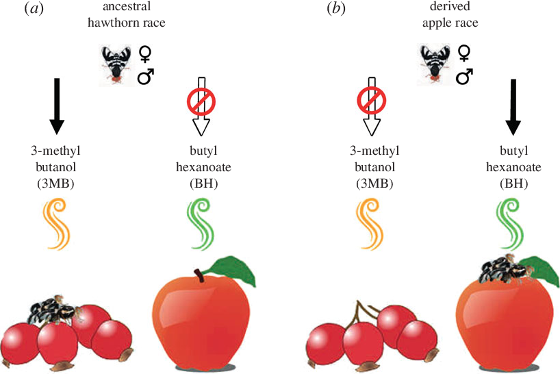

:::

:::

## Mosca de la manzana resumen visual

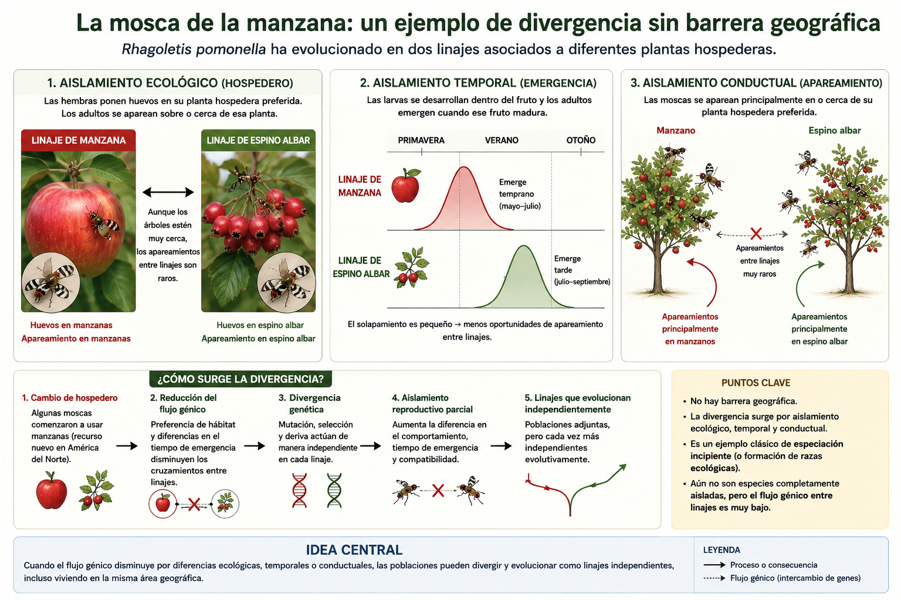{fig-align="center"}

## Aislamiento reproductivo

¿Y exactamente cómo dejan de cruzarse?

> Aislamiento pre y post -zigotico

::: {.columns}

::: {.column}

::: {.fragment}

* Prezigótico
  * no se encuentran
  * no se aparean
  * no se fecundan

:::

:::

::: {.column}

::: {.fragment}

* Postzigótico
  * híbridos inviables
  * híbridos estériles

:::

:::

:::

# Contexto geografico {background-color="#E8F5E9"}

## Antes de ver los modos geográficos

La especiacion suele empezar cuando baja el flujo genico entre poblaciones.

* A veces la causa principal es una barrera geografica.
* Otras veces el separador es el ambiente, el tiempo o el comportamiento.
* En todos los casos, el resultado es el mismo: menos cruce y mas divergencia.

## Especiacion simpatrica

::: {.columns}

::: {.column}

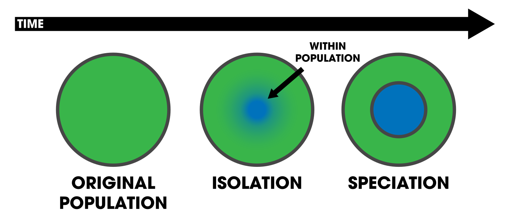

:::

::: {.column}
* Divergencia en la misma region
* Sin barrera geografica clara
* Diferencias ecologicas, de conducta o de hospedero

:::

:::

## Especiacion alopatrica

::: {.columns}

::: {.column}

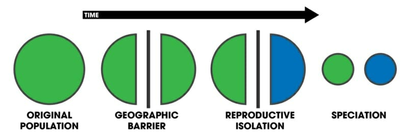

:::

::: {.column}
* Separacion por una barrera geografica
* Flujo genico cortado o muy reducido
* Deriva y seleccion actuan por separado

:::

:::

## Especiacion peripatrica

::: {.columns}

::: {.column}

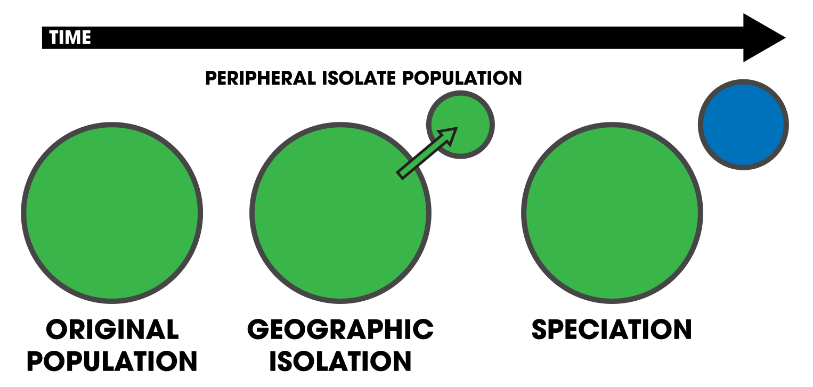

:::

::: {.column}

* Poblacion pequena aislada en el borde
* Efecto fundador y deriva intensos
* Divergencia rapida en poblaciones perifericas

:::

:::

## Refuerzo del aislamiento reproductivo {.smaller}

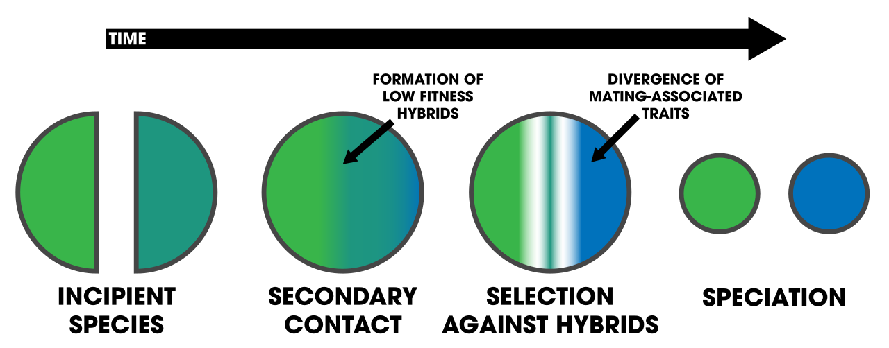{fig-align="center"}

::: {.fragment}

> El refuerzo ocurre cuando linajes previamente separados vuelven a entrar en contacto
>
> La seleccion favorece un aislamiento reproductivo aun mas fuerte para evitar la formacion de hibridos de baja aptitud.

:::

## Refuerzo del aislamiento reproductivo

::: {.columns}

::: {.column}

* Contacto secundario despues de la divergencia
* Hibridos inviables o poco fertiles
* Seleccion favorece mecanismos prezigoticos mas fuertes

:::

::: {.column}

* Resultado: menor flujo genico tras el reencuentro
* Aislamiento reproductivo mas fuerte que antes del contacto
* Puede actuar sobre conducta, fenologia o preferencias de apareamiento

:::

:::

## Especies anillo {.smaller}

::: {.columns}

::: {.column}

* Poblaciones vecinas se cruzan entre si a lo largo de una distribucion continua.
* El flujo genico ocurre localmente, pero disminuye con la distancia.
* La divergencia se acumula gradualmente alrededor de una barrera geografica o ecologica.
* En los extremos del anillo, las poblaciones pueden coexistir y ya no cruzarse.
* Ilustran como la especiacion puede emerger de cambios graduales en un linaje continuo.

:::

::: {.column}

.png)

:::

:::

## California salamanders (Ensatina)

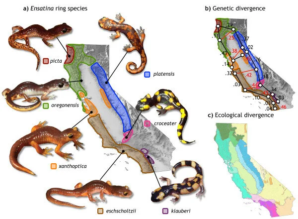

## Resumen

> La especiacion es un proceso gradual impulsado por la reduccion del flujo genico y la acumulacion de diferencias que conducen al aislamiento reproductivo. 

> La geografia, ecologia, fenologia y conducta pueden contribuir a la divergencia de linajes y la formacion de nuevas especies.

---

{fig-align="center"}