## Metas {background-color="#E8F5E9"}

* Conectar microevolucion con patrones macroevolutivos observados en escalas largas.
* Introducir tasas de especiacion, extincion y diversificacion como descripciones probabilisticas.
* Construir intuicion visual sobre como el muestreo y la escala temporal afectan inferencias sobre ritmo evolutivo.
* Distinguir radiaciones y patrones de extincion a lo largo del tiempo geologico.

## Ser capaces de {background-color="#E8F5E9" .smaller} 

* Definir tasa de especiacion, tasa de extincion y tasa neta de diversificacion.
* Explicar por que una tasa no implica un resultado fijo ni un horario de eventos.
* Interpretar graficos de numero de especies vs tiempo en procesos de nacimiento-muerte.
* Evaluar cuando un patron aparente abrupto puede surgir por resolucion temporal de muestreo.
* Diferenciar radiaciones adaptativas y no adaptativas, y reconocer patrones de extincion masiva.

## Repaso

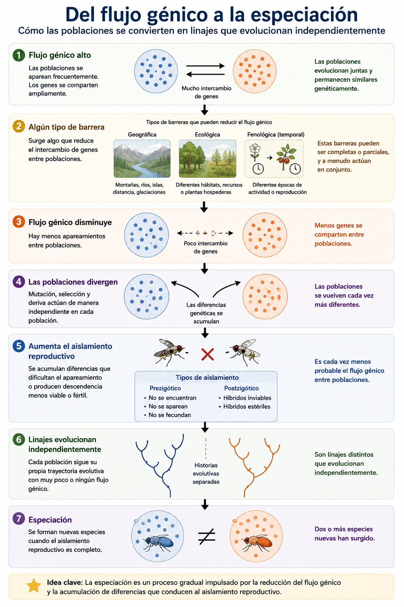{fig-align="center"}

# Macroevolución {background-color="#E8F5E9"}

**Microevolución** explica el cambio dentro de poblaciones o linajes

**Macroevolución** explica los patrones que emergen cuando esos procesos actúan repetidamente a lo largo de millones de años.

## Que estudiamos en macroevolución

::: {.columns}

::: {.column}

Micro:

- generaciones  
- poblaciones  
- frecuencias alélicas  

:::

::: {.column}

Macro:  

- millones de años  
- linajes  
- especies  
- clados  

:::

:::

## Preguntas tipicas de macroevolución

::: {.incremental}
* ¿Cómo se originan nuevas especies?
* ¿Por qué algunas especies se extinguen mientras otras prosperan?
* ¿Cómo se forman grandes patrones de diversidad a lo largo del tiempo?
* ¿Qué factores impulsan la evolución de nuevas formas y funciones?
:::

## Diversidad de plantas

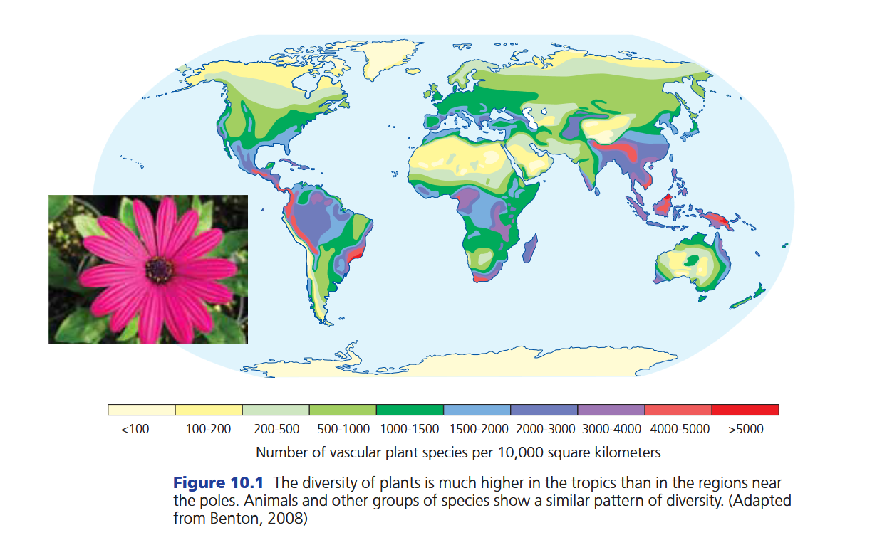{fig-align="center"}

## Diversidad de invertebrados marinos

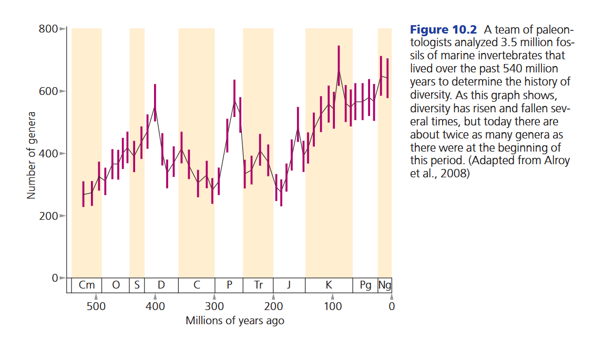{fig-align="center"}

## Resumen macroevolucion

::: {.incremental}

- Macroevolucion conecta procesos microevolutivos con patrones de diversidad a gran escala.
- Las preguntas centrales son origen de especies, extincion y cambios en la diversidad.
- Para estudiar estos patrones usamos tasas y evidencia historica.

:::

# Tasas {background-color="#E8F5E9"}

## Cambio en diversidad

> La **probabilidad** de que un linaje *origine un nuevo linaje* **o** *desaparezca* por unidad de tiempo.

- No significa que cada especie se divide después de cierto tiempo. 
- Significa que, en **promedio**, esperamos cierto numero de eventos por unidad de tiempo.  
- Algunas especies tienen mayor probabilidad de originar nuevas especies que otras.
- Algunas especies tienen mayor probabilidad de extinguirse que otras.

## Analogia con dado

- La probabilidad de obtener un 6 al lanzar un dado es 1/6.
- No significa que si lanzamos un dado 6 veces, obtendremos un 6 exactamente una vez.
- Significa que, en promedio, si lanzamos un dado muchas veces, obtendremos un 6 una vez cada 6 lanzamientos.
- La tasa de obtener un 6 es 1/6, pero el numero de 6s que obtenemos en un numero finito de lanzamientos puede variar.

## Primeras y ultimas apariciones

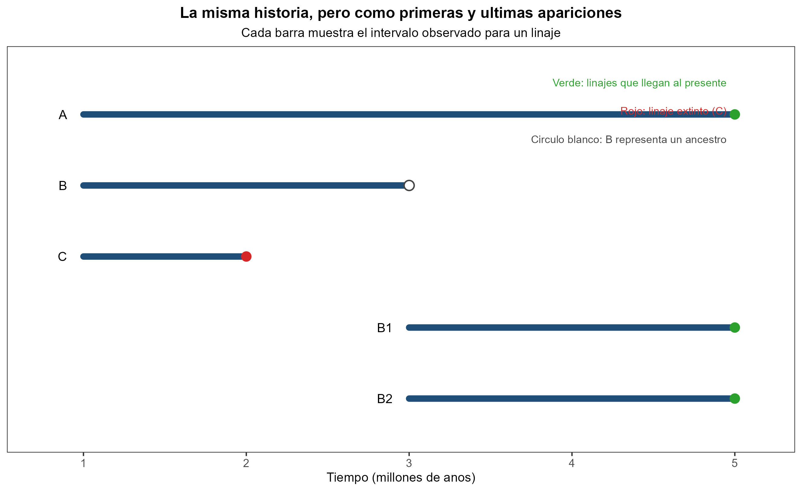{width=100%}

## La misma historia como filogenia

::: {.columns}

::: {.column}

{width=100%}

:::

::: {.column}

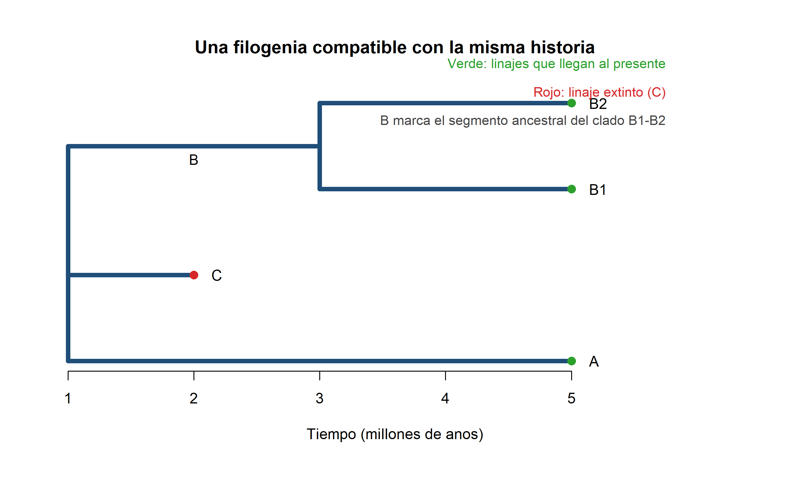{width=100%}

:::

:::

## Definiciones {background-color="#E8F5E9" .smaller}

> Tasa de especiacion ($\lambda$): probabilidad de que un linaje se divida por unidad de tiempo.

> Tasa de extincion ($\mu$): probabilidad de que un linaje desaparezca por unidad de tiempo.

> Tasa de diversificacion neta: diferencia entre especiacion y extincion.

$$r = \lambda - \mu$$

> Unidad: eventos por linaje por unidad de tiempo.

## Contar eventos y derivar tasas {.smaller}

::: {.columns}

::: {.column}

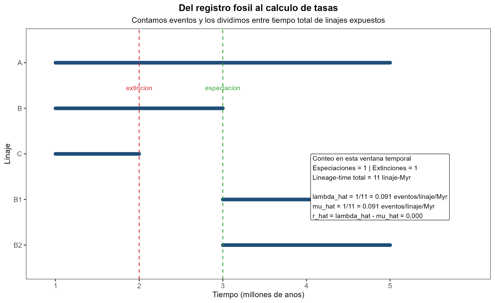{width=100%}

:::

::: {.column}

::: {.incremental}

- En esta ventana temporal: 1 evento de especiacion y 1 evento de extincion.
- Especiacion ($\lambda$): 1 evento en 10 unidades de tiempo. $\lambda = 0.1$ eventos por unidad de tiempo.
- Extincion ($\mu$): 1 evento en 10 unidades de tiempo. $\mu = 0.1$ eventos por unidad de tiempo.
- Tasa neta de diversificacion: $\lambda - \mu = 0.1 - 0.1 = 0$ eventos por unidad de tiempo.

:::

:::

:::

## Cuidado: el registro fosil no es completo

::: {.incremental}

- Las primeras y ultimas apariciones observadas no siempre coinciden con el origen o la extincion reales.
- La preservacion fosil es desigual: algunos ambientes, organismos y periodos dejan mejor registro que otros.
- Por eso, una parte del patron que vemos refleja biologia real y otra parte refleja muestreo y preservacion.

:::

## Una realizacion estocastica

::: {.columns}

::: {.column}

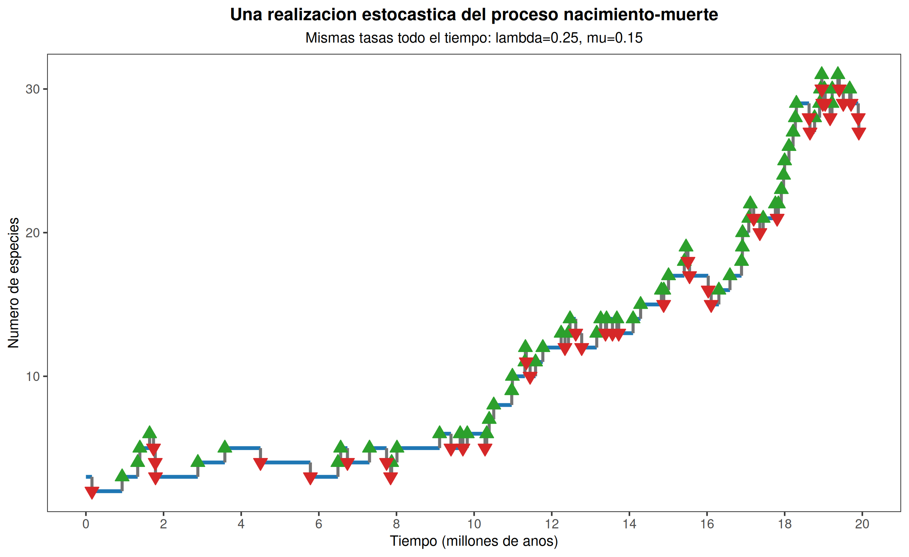{width=100%}

:::

::: {.column}

::: {.incremental}

- Empezamos con 3 especies.
- Triangulo verde: evento de especiacion (+1 especie).
- Triangulo rojo: evento de extincion (-1 especie).
- Misma tasa durante toda la simulacion, pero eventos en tiempos irregulares.

:::

:::

:::

## Mismas tasas, resultados distintos

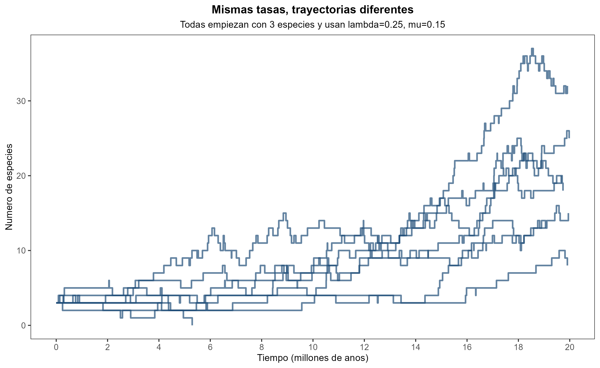{width=100%}

::: {.fragment}

Todas las lineas usan exactamente los mismos parametros ($\lambda = 0.25$, $\mu = 0.15$) y parten de 3 especies.

:::

## Resumen tasas

::: {.incremental}

- Las tasas son probabilidades por linaje y por unidad de tiempo, no resultados fijos.
- No funcionan como un horario: no dicen que "cada X anos" deba ocurrir un evento.
- En ventanas cortas puede no pasar nada, y en otras pueden ocurrir varios eventos seguidos.
- Por eso, dos intervalos con la misma tasa pueden verse muy diferentes.

:::

# Ritmo de evolucion {background-color="#E8F5E9"}

## Rasgos en un especie

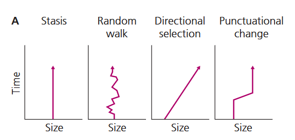

## Rasgos en un especie

::: {.incremental}

- Stasis: rasgos cambian poco durante largos periodos de tiempo.
- Random walk: rasgos cambian de forma acumulativa a lo largo del tiempo.
- Directional change: rasgos cambian consistentemente en una direccion a lo largo del tiempo
- Punctuated change: rasgos cambian poco durante largos periodos de tiempo, pero con cambios grandes en periodos cortos.
:::

## Rasgos en varias especies

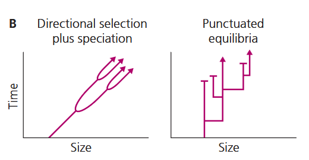

## Rasgos en varias especies {.incremental}

::: {.incremental}

- Selecion direccional: rasgos cambian consistentemente en una direccion a lo largo del tiempo.
- Punctuated change: rasgos cambian poco durante largos periodos de tiempo, pero con cambios grandes en periodos cortos.
- Convergencia: rasgos similares evolucionan independientemente. (Piensan de las aletas de delfines y tiburones)
- Divergencia: rasgos similares evolucionan de forma diferente en varias especies. (Piensan de los picos de pinzones de Darwin)
- Siempre, parte del patron actual refleja historia compartida, no solo adaptacion independiente.

:::

## Tasas de diversificacion

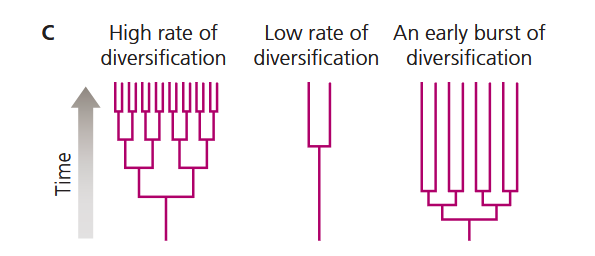

## Tasas de diversificacion

::: {.incremental}

- Los clados no necesariamente acumulan especies al mismo ritmo.
- Un aumento en diversidad puede reflejar mas especiacion, menos extincion, o ambas cosas.
- El patron visible hoy resume procesos que ocurrieron a lo largo de mucho tiempo.
- Tasas altas, tasas bajas, estasis, y early bursts dejan huellas distinctas en las filogenias que vemos hoy.

:::

## Gradualismo vs. saltacion

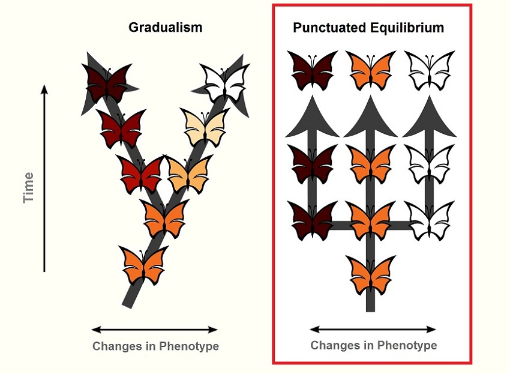

## Misma trayectoria, distinta resolucion temporal de muestreo

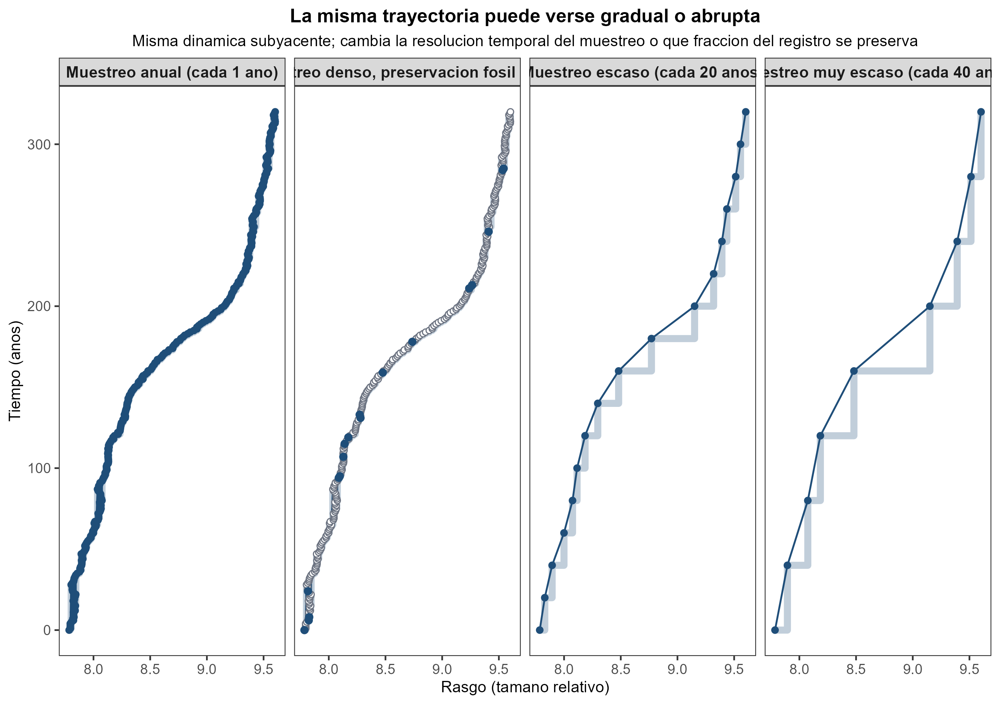{width=95%}

## Pinzones y seqia

* Imaginan si solo tuvieramos datos de picos cada 10,000 años.
* Observariamos cambios grandes en picos de forma abrupta, y podriamos inferir que la evolucion ocurre en saltos.

## Gradualismo vs. saltacion

::: {.incremental}

- El cambio evolutivo puede verse como mas continuo o mas concentrado en ciertos intervalos.
- Estos modelos describen patrones observados, no leyes absolutas que siempre se cumplan.
- La pregunta central es cuando se concentra el cambio, no si la evolucion ocurre o no.
- Depende de la escala temporal y de la escala taxonomica que se considere.

:::

## Resumen ritmo de evolucion

::: {.incremental}

- El mismo proceso puede parecer gradual o abrupto segun la escala temporal de muestreo.
- Los modelos de ritmo son descripciones de patrones, no reglas universales.
- Secuencias fosiles y patrones filogeneticos de rasgos y especies pueden dejar huellas distintas, consistentes con diferentes ritmos evolutivos.

:::

# Radiaciones {background-color="#E8F5E9"}

## Tipos de radiaciones

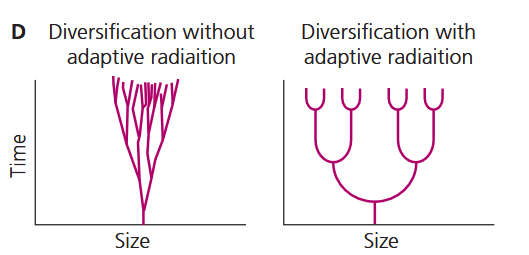

## Tipos de radiaciones

> Adaptativa: cuando un linaje se diversifica en muchas especies con diferentes adaptaciones. El aumento en numero de especies esta acompañado de un aumento en diversidad funcional (variacion grande en el rasgo focal).

> No adaptativa: cuando un linaje se diversifica en muchas especies con adaptaciones similares. El aumento en numero de especies no esta acompañado de un aumento en diversidad funcional (variacion pequeña en el rasgo focal).

## Como distinguirlas?

::: {.incremental}

- Pregunta 1: aumento el numero de especies?
- Pregunta 2: tambien aumento la diversidad de rasgos, nichos o funciones?
- Si aumentan especies y diversidad funcional, pensamos en radiacion adaptativa.
- Si aumentan especies pero los rasgos observables cambian poco, podria ser no adaptativa o adaptativa en otros rasgos que no estamos midiendo.

:::

## Castores de montaña {.smaller}

::: {.columns}

::: {.column}

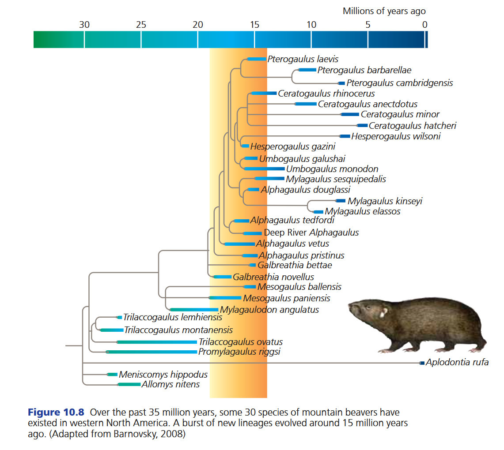

:::

::: {.column}

- En los últimos 35 millones de años, han existido unas 30 especies de castores de montaña en el oeste de América del Norte.
- La majoria de las nuevas líneas evolutivas surgió hace unos 15 millones de años.
- Todos excepto una de estas especies se extinguieron, dejando solo a Aplodontia rufa, la especie que conocemos hoy.

:::

:::

## Cichlidos de Lago Malawi

::: {.columns}

::: {.column}

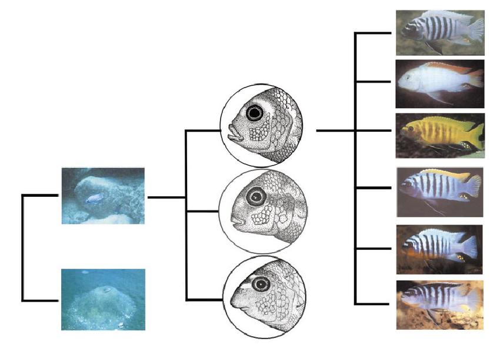

:::

::: {.column}
Radiacion adaptativa en tres etapas:
- Estado I: Habitat (roca/arena); 
- Estado II: Morfología trófica (mandíbulas); 
- Estado III: Preferencia de pareja (color de macho)

:::

:::

## Pinzones de Darwin

::: {.columns}

::: {.column}

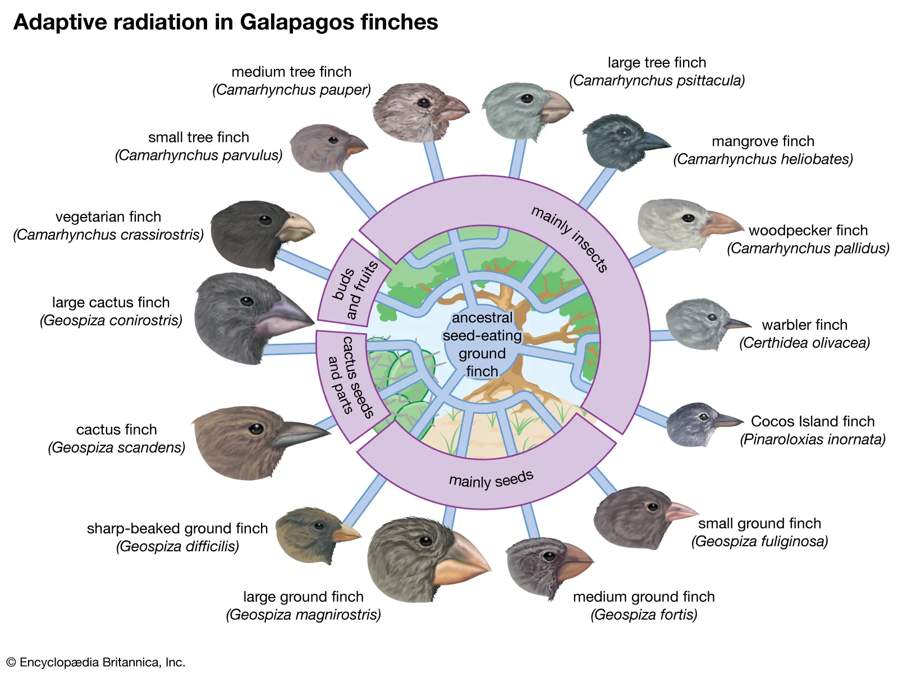

:::

::: {.column}

- Colonización de las islas Galápagos por un ancestro común hace 1-2 millones de años.
- Diversificación en 14 especies con diferentes adaptaciones a la dieta.
- La diversidad de picos refleja la diversidad de nichos ecológicos ocupados por cada especie.

:::

:::

## Resumen radiaciones

::: {.incremental}

- Una radiacion aumenta el numero de especies dentro de un clado.
- Puede ser adaptativa (con diversificacion funcional) o no adaptativa.
- Para distinguirlas hay que mirar especies y rasgos al mismo tiempo.

:::

# Extincion y extinciones masivas {background-color="#E8F5E9"}

## Cuanto tiempo existen las especies?

::: {.columns}

::: {.column}

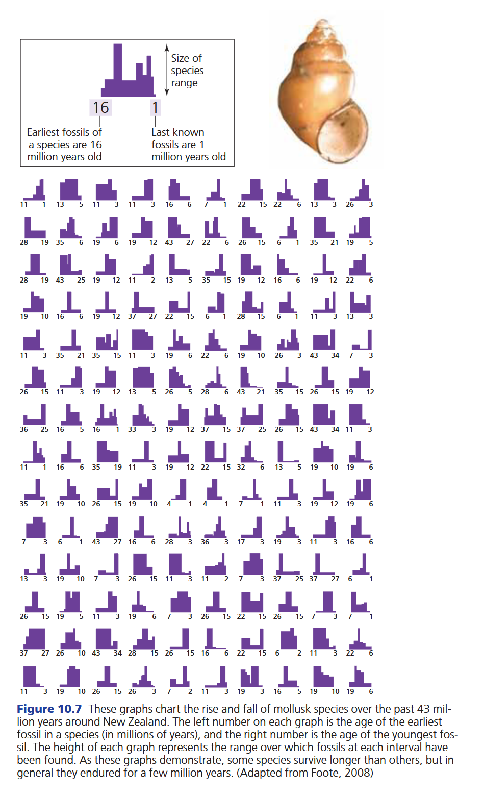

:::

::: {.column}

- Generalmente, las especies extinguen después de unos pocos millones de años.
- Solo algunas especies persisten durante decenas de millones de años.
- La tasa de extinción puede variar a lo largo del tiempo y entre grupos taxonómicos.

:::

:::

## Variacion en la tasa de extincion taxonomica {.smaller}

::: {.columns}

::: {.column}

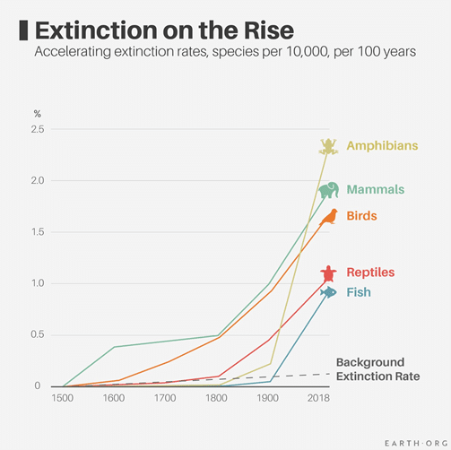

:::

::: {.column}

* Algunos grupos taxonómicos tienen tasas de extinción más altas que otros.
* Por ejemplo, las estimaciones actuales indican que los anfibios tienen una tasa de extinción más alta que los reptiles, los mamíferos, y las aves.
* Esto puede deberse a factores como la sensibilidad a cambios ambientales, la pérdida de hábitat, y la exposición a enfermedades.

:::

:::

## Variacion en la tasa de extincion temporal

::: {.columns}

::: {.column}

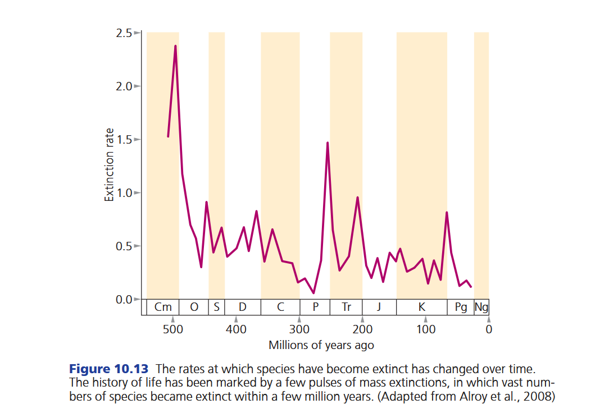

:::

::: {.column}

* La tasa de extinción global ha variado a lo largo del tiempo geológico.
* Periodos de extinción masiva, donde la tasa de extinción fue significativamente más alta que el promedio
* Periodos de relativa estabilidad, donde la tasa de extinción fue más baja.

:::

:::

## Extinciones masivas (The big five)

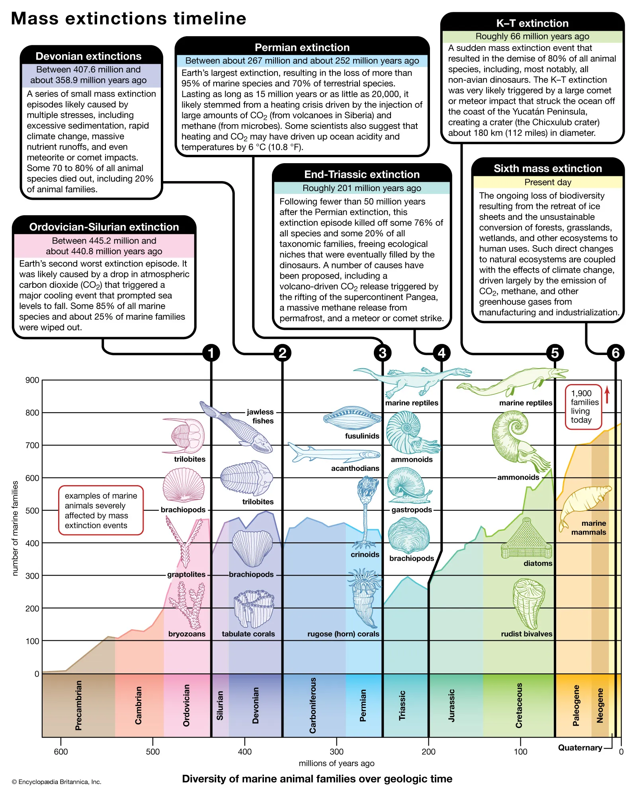

## Extinciones masivas (The big five) {.smaller}

* Generalmente extinction de > 75% de especies en un periodo geologico corto (menos de 2 millones de años).
* Causas: cambios ambientales rapidos, impactos de meteoritos, actividad volcanica intensa, cambios en el nivel del mar, cambios climaticos extremos.
* Ejemplos de grupos afectados: trilobites, braquiópodos, corales, ammonites, dinosaurios, mamíferos marinos.
* Consecuencias: perdida de biodiversidad, cambios en la estructura de los ecosistemas, oportunidades para radiaciones adaptativas de linajes sobrevivientes.
* La más famosa: Cretácico-Paleógeno (KT) hace 66 millones de años, que extinguió a los dinosaurios no avianos y permitió la diversificación de mamíferos y aves.

## Extinción masiva 6 (actualidad)

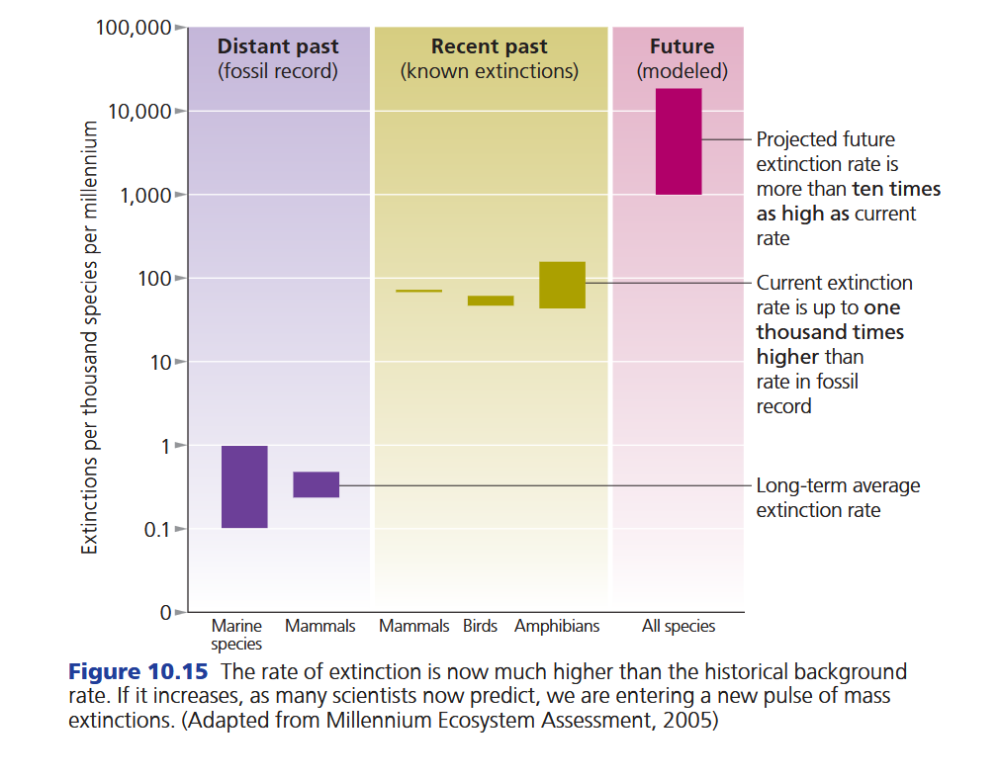

## Extinción masiva 6 (actualidad) {.smaller}

* La tasa actual de extinción es alrededor de 1000 veces mayor que la tasa de fondo promedio.
* Estimada alrededor de 100 especies por 1000 especies por 1000 años.
* En otras palabras, **alrededor del 10% de la diversidad por cada 1000 años**. 
* La tasa en el futuro según modelos de extinción proyectada puede ser 10 veces mayor que la tasa actual.
* Causas: actividad humana, destrucción de hábitat, cambio climático, contaminación, sobreexplotación de especies, introducción de especies invasoras.

## Resumen {background-color="#E8F5E9"}

::: {.incremental}

- La macroevolucion conecta cambios en poblaciones con patrones de diversidad, radiacion y extincion a gran escala.
- Las tasas ayudan a describir esos procesos, pero no funcionan como horarios fijos.
- El patron observado depende de historia real, muestreo, preservacion y escala temporal.
- Entender macroevolucion nos ayuda a interpretar tanto la historia profunda de la vida como los cambios que observamos hoy.

:::

