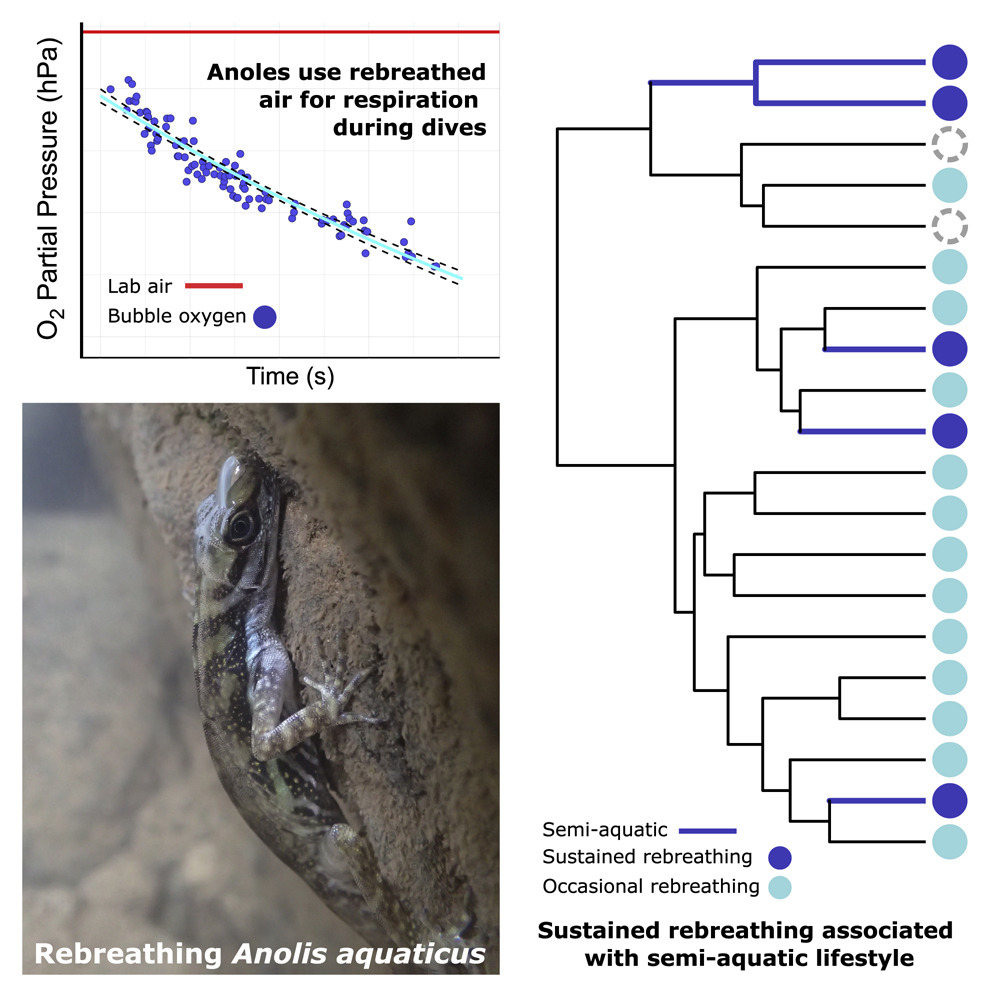

## Objetivo de la actividad

Al finalizar esta actividad, el grupo deberia ser capaz de **interpretar evidencia comparativa y evaluar que explicacion recibe mayor apoyo relativo**.

## Instrucciones generales

1. Lean cada bloque de evidencia.
2. Identifiquen el patron principal.
3. Evalen que tan bien cada evidencia apoya explicaciones alternativas.

Usen respuestas breves pero justificadas con datos.

---

## Contexto biologico

Algunas especies de *Anolis* pueden permanecer sumergidas y re-inspirar aire desde una burbuja alrededor del hocico.

```{=html}
<div style="text-align:center; margin: 1rem 0;">
  
</div>
```

## Que tipo de evidencia se necesita para entender la evolucion de este comportamiento? 

1. Cuales datos son necesarios para evaluar la distribucion del comportamiento entre especies?

\vspace{3cm}

2. Cuales datos son necesarios para entender la funcion fisiologica de la burbuja de aire?

\vspace{3cm}

3. Que tipo de evidencia seria mas util para entender el origen evolutivo del comportamiento? Si el comportamiento se origino una vez o varias veces? 


Pregunta guia:

> Que patron evolutivo sugiere la distribucion de este comportamiento entre especies?

---

## Evidencia 1: Distribucion del comportamiento entre especies

Version simplificada del estudio experimental:

- Se realizaron pruebas de submersion en 32 especies de *Anolis* y 4 lagartijas no anolis.
- Las especies semi-acuaticas mostraron mayor frecuencia de re-inspiracion.
- Las especies semi-acuaticas mostraron mayor frecuencia de re-inspiracion sostenida (5 o mas re-inspiraciones por prueba).

### Interpretacion inicial

1. 

\vspace{3cm}

2. Cual es el patron mas importante respecto a las especies semi-acuaticas?

\vspace{3cm}

---

## Evidencia 2: Dinamica del oxigeno en la burbuja

Version simplificada del resultado fisiologico:

> El pO2 de la burbuja de re-inspiracion inicia parecido al aire ambiente y disminuye de forma monotona durante la prueba.

### Interpretacion fisiologica

1. Que sugiere este patron sobre la funcion respiratoria de la burbuja?

\vspace{3cm}

2. Si el pO2 disminuye con el tiempo, que limite biologico esperarian para la duracion del buceo?

\vspace{3cm}

---

## Parte de razonamiento: construir y evaluar explicaciones

Sin usar todavia terminos tecnicos (por ejemplo, "origen unico" o "convergencia"), formulen dos explicaciones alternativas en sus propias palabras:

- Explicacion A:

\vspace{2cm}

- Explicacion B:

\vspace{2cm}

Ahora evalen apoyo relativo de cada evidencia.

Escala sugerida: ++ (apoyo fuerte), + (apoyo moderado), 0 (neutral), - (debilita).

| Evidencia | Explicacion A | Explicacion B | Justificacion corta |
|---|---|---|---|
| Distribucion entre especies (Evidencia 1) |  |  |  |
| Frecuencia en semi-acuaticas (Evidencia 1) |  |  |  |
| pO2 disminuye durante la prueba (Evidencia 2) |  |  |  |

---

## Cierre: conclusion cientifica provisional

1. Cual explicacion recibe mayor apoyo global con la evidencia disponible?

\vspace{2.5cm}

2. Que dato adicional seria mas util para aumentar confianza en la conclusion?

\vspace{2.5cm}

3. Escriban una conclusion breve (2-3 oraciones), incluyendo una nota de incertidumbre.

\vspace{4cm}

---
## 