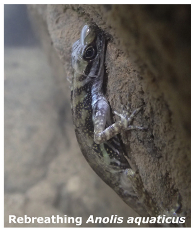
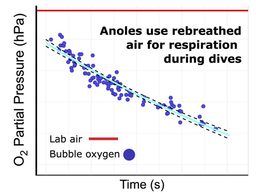
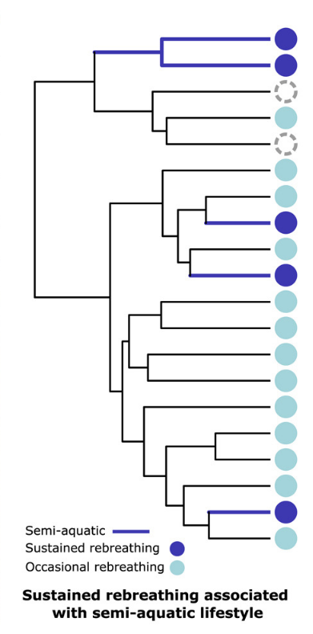

## Objetivo de la actividad

Al finalizar esta actividad, el grupo deberia ser capaz de **interpretar evidencia observacional, fisiologica y filogenetica, y decidir que hipotesis recibe mayor apoyo relativo**.

## Instrucciones generales

1. Lean cada bloque de evidencia.
2. Identifiquen el patron principal en cada caso.
3. Evalen que tan bien cada evidencia apoya las dos hipotesis.

Usen respuestas breves pero justificadas con datos.

## Hipotesis 

- Hipotesis A: la capacidad de re-inspirar aire surgio una sola vez y luego se heredo en el linaje correspondiente.
- Hipotesis B: la capacidad de re-inspirar aire surgio varias veces de forma independiente en distintos linajes.

---

## Contexto biologico

Algunas especies de *Anolis* pueden permanecer sumergidas y volver a inspirar aire desde una burbuja alrededor del hocico.

{fig-align="center" width="50%"}

## Evidencia 1: observacion del comportamiento

Ensayo de comportamiento:

- Se realizaron pruebas de submersion en 32 especies de *Anolis* y 4 lagartijas no anolis.
- Las especies semi-acuaticas mostraron re-inspiracion con mayor frecuencia que las especies no acuaticas.
- Las especies semi-acuaticas tambien mostraron re-inspiracion sostenida en mas ensayos.

### Interpretacion del comportamiento

1. Que te permite inferir esta observacion sobre la funcion del comportamiento?

\vspace{3cm}

2. Con solo esta evidencia, cual hipotesis recibe mas apoyo: A, B, o aun no se puede decidir? Expliquen brevemente.

\vspace{3cm}

---

## Evidencia 2: dinamica del oxigeno en la burbuja

Resultado fisiologico:

- El pO2 de la burbuja de re-inspiracion inicia parecido al aire ambiente y disminuye de forma monotona durante la prueba.

{fig-align="center" width="55%"}

### Interpretacion fisiologica

1. Que sugiere este patron sobre la funcion respiratoria de la burbuja?

\vspace{3cm}

2. Esta evidencia favorece mas a la hipotesis A, a la B, o no distingue bien entre ambas? Justifiquen.

\vspace{3cm}

---

## Evidencia 3: distribucion filogenetica del comportamiento

Patron evolutivo:

{fig-align="center" width="30%"}

### Interpretacion evolutiva

1. Que patron observan en la distribucion de las especies con re-inspiracion sostenida?

\vspace{3cm}

2. Cual hipotesis recibe mas apoyo con esta evidencia, A o B? Expliquen por que.

\vspace{3cm}

3. Esta evidencia sugiere un origen unico, varios origenes independientes, o aun falta informacion? Justifiquen.

\vspace{3cm}

---

## Sintesis

Completen la tabla con un juicio breve para cada evidencia.

Escala: ++ (apoyo fuerte), + (apoyo moderado), 0 (neutral), - (debilita).

| Evidencia | Hipotesis A | Hipotesis B | Justificacion corta |
|---|---|---|---|
| Observacion del comportamiento |  |  |  |
| Disminucion del pO2 en la burbuja |  |  |  |
| Distribucion en el arbol filogenetico |  |  |  |

1. Cual hipotesis recibe mayor apoyo global con la evidencia disponible?

\vspace{2.5cm}

2. Escriban una conclusion breve (2-3 oraciones), incluyendo una nota de incertidumbre.

\vspace{4cm}